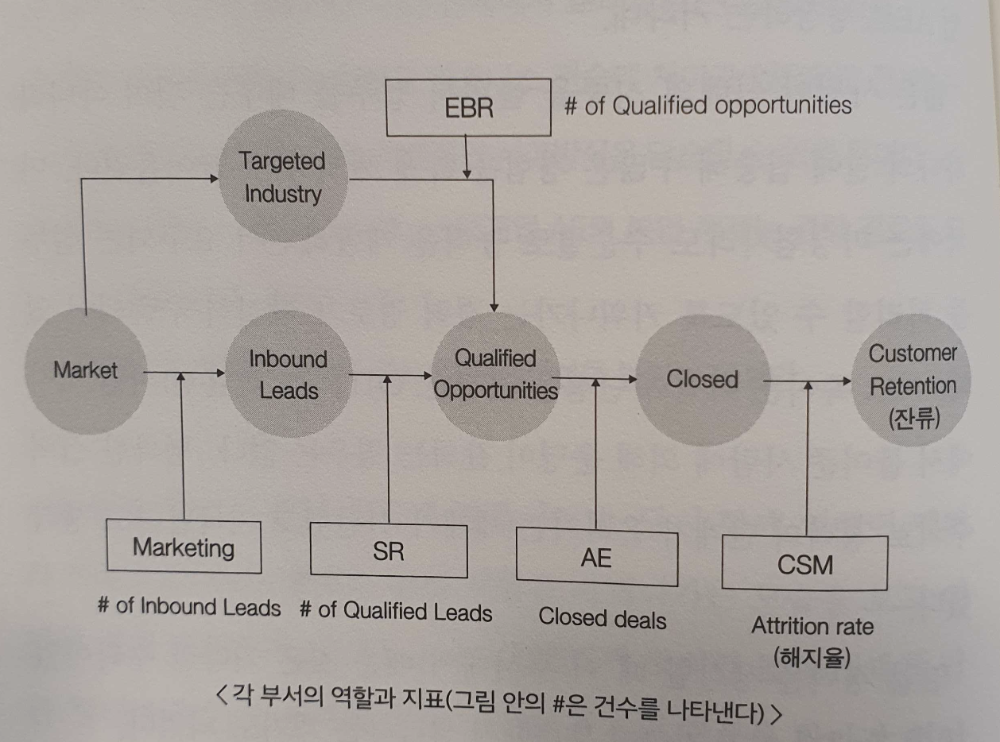

# 도움말

- 이미 움직이고 있는 것을 더 능숙하게 움직이는 일과, 하나에서 어떤 것을 만들어내는 일은 하늘과 땅만큼 다릅니다. 그리고 하나에서 뭔가를 만들어내는 과정에 관여한 사람만이 나중에 그 일을 자신이 했음을 실감할 수 있습니다. 앞으로 더 빠른 속도로 변화와 성장을 이룰 마켕 세계에 자신의 족적을 남기고 싶은 분과 함께 일할 것을 기대하고 있습니다.
  - 엄청나게 공감이 된다. 신규개발하는것과 유지보수하는 것은 하늘과 땅만큼 다르다. (레거시 시스템을 개선하면서 유지보수하는 것은 굉장히 가치있는 일이지만 여기서는 좋은 시스템을 유지보수한다고 가정하겠다.)
- 어느 회사에나 그대로 적용할 수 있는 모델은 존재하지 않는다.
  - 개발도 마찬가지다. 공통으로 사용할 수 있는 부분도 많지만 회사마다 동일한 코드를 적용할 수는 없다. 그 회사에 맞는 코드를 짜야한다.
- 어리석은 사람은 경험으로 배우고 현명한 사람은 역사로 배운다.(나 혼자 할 수 있는 경험에는 한계가 있다.)
  - 기술블로그나 레퍼런스 많이 찾아보자. 내가 하는 경험은 새 발의 피다. 물론 내가 경험하는 것도 중요하다. 내 경험 + 다른 사람의 경험 모두 중요하게 생각하자.

# 1부 미국에서 본 새로운 영업 스타일

## 1장 마크베니오프와의 만남

- 미국과 유럽에서는 중소기업에서 먼저 서비스를 도입해서 성공 사례를 만들고, 이를 바탕으로 대기업으로 사업을 확장하려 합니다.
  - 대부분 b2b saas회사에서는 위와 같은 프로세스를 따를 것 같다. 특히 글로벌로 진출한다거나 할 때도 이와 유사한 프로세스를 따를 것 같다.
- ERP 같은 솔루션은 기업의 업무가 돌아가는 데에 필요하기 때문에 반드시 어딘가의 제품을 도입합니다. 하지만 crm은 없어도 업무가 돌아갑니다. Nice to have이지요. 있으면 좋을지 몰즈미ㅏㄴ Must가 아닌 것은 판매하기 어려워요.
- 있으면 편리하지만 없어도 업무가 돌아가게 되면 그 필요성을 인식하게 하는 것이 시작이다. 최대의 경쟁 상대는 라이벌 기업이 아니라 '아무것도 하지 않는 것'이다.

---

요약

- 저자는 마크베니오프를 만나고 세일즈포스닷컴에 입사하게 됌

## 2장 영업의 프로세스 관리

용어정리

- 리드: 잠재고객
- SR(당시 인사이드 세일즈의 명칭: Sales Representative)
- 인사이드 세일즈(Inside Sales)는 영업 및 마케팅 프로세스 과정에서 얻어진 고객의 정보를 이용해 계약 확률이 높은 고객을 ‘아웃사이드 세일즈(Outside Sales)’ 담당자에게 연결해주는 업무다. 쉽게 말해 전시회, 세미나, 명함, 홈페이지, 콜센터 문의 등 다양한 경로를 통해 잠재 고객을 확보하고 이들을 대상으로 전화 통화나 e메일 등으로 가망 고객 여부를 파악한 다음, 해당 정보를 아웃사이드 영업팀에 전달한다. 이를 통해 영업 담당자는 대면과 협상을 통해 실제 계약 작업까지 완료할 수 있게 된다. 인사이드 세일즈는 주로 B2B(Business to Business) 기업이 진행하는데 최근에는 콜드 콜(Cold Call)을 통해 예상 고객사의 담당자를 찾아주는 일(Profiling)까지도 인사이드 세일즈의 영역으로 간주되고 있다. 그만큼 인사이드 세일즈에 대한 관심이 높고 투자 또한 점점 더 많이 이뤄지고 있다.
- 아웃바운드 세일즈는 영업 담당자나 기업이 먼저 잠재적인 고객을 발굴하고, 구매 가능성이 있는 잠재 고객과 소통을 시작하는 세일즈 프로세스를 의미합니다. 이것은 잠재적인 고객이 먼저 대화를 시작하는 인바운드 세일즈와 반대의 개념입니다. 아웃바운드 세일즈의 경우 영업 담당자가 잠재 고객에게 콜드 콜 또는 콜드 이메일을 보내고, 잠재 고객과의 미팅을 통해 구매 기회를 발굴하고 영업으로 이어지게 합니다.
- EBR(Enterprise Business Representative): 최근에는 ADR(Account Development Representative)이나 BDR(Business Development Representative)이라고 부르는, 타깃으로 설정한 기업에 관해 처음부터 전화로 접근하는 집단
- AE(Account Executive) : 영업 기회를 통해 매출을 만들어내는 역할을 맡고 있습니다. AE는 잠재 고객을 만나 의사결정자를 파악하고 설득합니다. 이 과정에서 필요한 제품 데모, 반대 의견 설득, 가격 협상 등을 진행합니다. 잠재 고객을 설득하는 데 가장 효과적인 방법은 제품이 고객에게 어떤 비즈니스 밸류를 창출하는지 이야기하는 것입니다. AE는 주로 새로운 영업 기회를 클로징하는 것에 집중하고, 계약에 성공하여 고객으로 전환된 경우 Account Manager, 또는 Customer Success Manager에게 고객 관리의 역할을 전달합니다.

- [괜찮은 링크](https://www.relate.kr/docs/wiki/sales-roles)

---

- 고도의 리드 관리와 영업 프로세스
- 저자는 처음에 SR으로 일을 시작
- 관리되지 않은 일본의 리드에 한 바퀴 전화 => 막 설립된 아웃바운드 인사이드 세일즈 집단인 EBR에 대해 공부

저자의 3개월간 배운 내용 정리

1. 마케팅, 인사이드 세일즈, 영업의 분업 체제 모델로 중소기업 시장을 공략하며, 이 모델은 일본에서도 전개할 수 있다.
2. 특히 SR 운영에 대해서는 이른 단계에서 효과가 나온다고 생각한다.
3. EBR 운영에 대해서는 일본과 비즈니스 관습에 차이가 있으므로 전개하는데에 과제가 남는다. 다만 기본적인 사고방식은 답습할 수 있을 것이다.
4. SR => EBR => 중소기업 AE => 대기업 AE의 분업 체제는 경력 경로도 되고, 인재 육성도 겸하고 있다.
5. 각 부서의 역할을 명확히 하는 것이 생산성을 높이는 열쇠다.

4번 추가설명

지금 업계의 톱클래스 영업사원은 좀처럼 우리에게 입사해주지 않아. 그러니 업계의 경험이 없는 사람을 채용해서 먼저 SR(현재의 인사이드 세일즈) 일을 하게 해. 상대는 어느정도 우리 일을 인지하고 있고, 어떤 과제를 가지고 있으니 경험이 없는 사람이라도 이야기하기는 쉬워. 일단 수많은 유망 고객과 이야기하면 제품 지식, 듣기 능력, 반론 대응 등 기본적인 영업 기술을 습득할 수 있어.
EBR이 되면 완전히 흥미가 없는 상대가 관심을 보이게 하는 고객 발굴 기술을 갈고닦는 거야. 다음으로 중소기업의 AE가 되면 SR에서 상담이 넘어오니까 클로징 기술을 철저히 갈고닦는 거지. 그리고 최종적으로 대기업을 대상으로 대규모 상담을 정리해가는 대기업 AE로 성장하는 거라네

마케팅 => 인사이드 세일즈, 영업(필드세일즈)으로 이어지는 치밀한 프로세스 관리

시장에서 리드를 획득하는 것이 마케팅이고, 리드를 상담으로 바꾸는 것이 인사이드 세일즈(SR)이며, 상담에서 수주하는 것이 필드세일즈(AE), 시장 전체 중에 타깃으로 하는 기업과 업종에서 상담을 만드는 것이 아웃바운드 인사이드 세일즈(EBR), 수주한 고객을 유지하는 것이 커스터머 석세스 매니저(CSM)의 역할이 된다. 각 부서는 인바운드 리드, 상담 작성 건수, 수주 상담, 해약률등의 지표로 평가된다. 이런 지표의 달성도에 따라 개개인의 보수가 달라진다.

---
