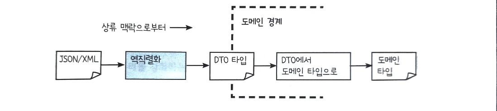
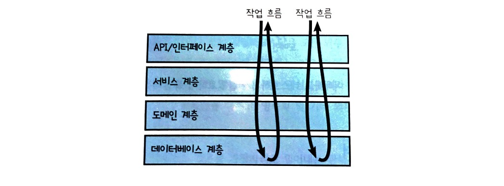
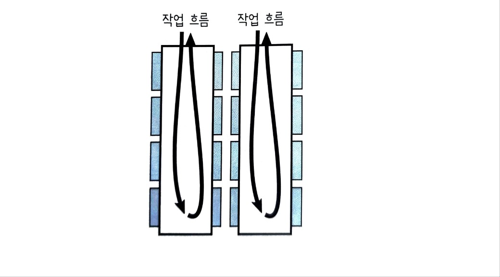

[코드링크](https://github.com/on-the-ground/domain-modeling-made-functional-typescript)

코드실행할 때 경로 이동: `cd ~/Documents/TIL/*책*/*도메일*`
컴파일: `npx tsc`
코드실행: `npx tsx ./code/chapter4/ts-pattern.ts`

# Part1. 도메인 이해하기

## Chapter 1. DDD 소개

- 도메인 주도 설계(domain-driven design, DDD): 명확한 커뮤니케이션과 도메인 지식 공유를 위한 디자인 방법론
- bounded context(경계 진 맥락): 특정 모델이 정확한 의미를 가지는 명시적인 경계
- 문제 공간에서 도메인과 하위 도메인은 솔루션 공간에서 DDD 용어로 경계 진 맥락이라 부르는 솔루션 하부 시스템에 대응한다.

---

- 개발팀과 도메인 전문가가 동일한 모델, 즉 도메인과 솔루션에 대한 공유 모델을 만드는 것이 중요하다. 이를 달성하는데 네 가지 지침은 다음과 같다.
  - 자료구조보다 비지니스 이벤트와 작업 흐름에 집중하라.
  - 문제 도메인을 더 작은 하위 도메인들로 나누어라.
  - 솔류션에 각 하위 도메인별 모델을 만들어라.
  - '공용어'(ubiquitous language) 라 부르는 공통 언어를 개발하여 프로젝트 참여자 모두가 공유하고 코드 모든 곳에서 활용하라.

---

`내 생각`

db table을 설계할 때도 프론트에서 구조를 잡을때도 가장 기본은 비지니스 이벤트와 작업 흐름에서 시작한다.

도메인을 나누는 것도 개발하다보면 자연스러운 흐름이다. 백엔드에서는 controller, service, repository 계층 이외에도 비지니스의 복잡도에 따라 자연스럽게 도메인 레이어를 분리하게 된다고 생각하고 프론트에서도 components, hooks 등의 구조에서 domain 단위의 구조로 변해가고 있다.

공용어도 예전부터 중요하다고 생각했다. 제품, 백엔드, 프론트 이 공용어가 다르면서 생기는 많은 문제들을 실제로 겪었다. 사실 공용어는 바뀌는 경우가 종종 발생한다. 이 경우 db table 마이그레이션이나 코드 마이그레이션이 바로 챙겨지기 어렵기도 하다. 개발자라면 어플리케이션 레벨에서 추상화해서 사용할 수 있지만 DA, PM 등 다른 직군이 table에 직접 접근할 때는 그게 구조적으로 어렵기도 하다. 뭐 요즘은 AI 활용해서 쿼리 뽑는것도 흔하기 때문에 주석만 잘 남겨놓는다면 크게 어렵지 않을것 같다는 생각도 들다.

---

## Chapter 2. 도메인 이해하기

- 도메인을 배우는 가장 좋은 방법은 인류학자가 되어서 어떤 선입견도 갖지 않는 것이다.
- 어느정도 요구사항이 정리되었으면 db 테이블을 떠올리고 테이블 간 관계를 표현하고 싶을 것이다. 하지만 이는 성급한 시도다. 도메인 주도 설계에서는 데이터베이스 스키마가 아니라 도메인이 디자인을 주도합니다.
- 클래스가 디자인을 주도한다는 것은, 데이터베이스가 디자인을 주도하는 것만큼이나 위험성을 내포하고 있다.
- 도메인을 명료하게 문서화해야한다.
- 무엇이 가장 중요한 우선순위인지 판단이 서지 않을 때엔 돈을 따라가자.(주문 > 견적)

---

도메인 전문가와 인터뷰

- 이벤트 스토밍 때 놓쳤던 부분은 메모하기.
- 공용어 뽑아내기.
  - 수량은 정수인가요 실수인가요? => 실수가 머죠? => 숫자를 뭐라고 부르죠? => 주문 수량이요 => `OrderQuantity` 추출
  - 주문 수량에 소수점이 있나요? => 때에 따라 달라요. 위젯은 단위, 키즈모는 킬로그램이에요.
- 하나의 작업 흐름을 깊게 파고들어보니 도메인 모델이 훨씬 복잡해졌다.
- 오히려 좋아. '몇 시간의 계획이 몇 주간의 프로그래밍을 아낄 수 있다'
- WidgetCode(W로 시작 4자리 정수), GizmoCode(G로 시작 3자리 정수)도 공용어에 포함시켰다. 너무 엄격한가? 새로운 유형의 제품이 나타날 경우에는 어떻게 해야하나? 너무 엄격하면 변경하기 어렵고 너무 자유롭다면 디자인이 없는 것이나 매한가지다.
  - 정답은 경계 진 맥락에 달렸다. 보통 도메인 전문가의 관점으로 디자인을 포착하는 것이 중요하다.

---

- 디자인 단계에서는 구현 세부 사항에 깊이 파고들지 않는 것이 중요하다

---

`내 생각`

실제로 회사에서 있을법한 얘기를 기반으로 진행해서 그런지 재밌다. 프론트엔드에서는 이런 깊은 도메인을 다룰일이 비교적 적은데 그래서 좀 아쉽기도 한 것 같다. 그것과 별개로 이런 능력이 생기면 정말 큰 도움이 될 것 같다. DDD를 잘하는 프론트엔드 개발자는 오히려 공급이 적기 때문에 이로 인한 이점도 있을 수 있다. 특히 회사가 점점 커지면서 스파게티 코드가 되는 경우가 많은데 이걸 개선할 수 있는 건 큰 능력이다. 또한, 나는 주로 목적조직에서 일하기 때문에 스쿼드 내에서 팀원들에게 도움을 줄 수도 있다.

---

## Chapter 3. 함수형 아키텍처

- 영속화 무시: 도메인 모델이 도메인 자체 개념에만 기반해야한다.(데이터베이스를 도메인 모델에 반영하면 안됌)

사이먼 브라운의 C4 접근법 > 소프트웨어 아키텍쳐 4가지 계층

- '시스템 맥락'은 최상위 레벨의 전체 시스템을 나타냅니다.
- 시스템 맥락은 웹사이트, 웹서비스, 데이터베이스 등과 같은 배포 단위인 '컨테이너'들로 이뤄집니다.
- 다시 개별 컨테이너는 코드를 구성하는 주요소인 '컴포넌트'들로 이뤄집니다.
- 마지막으로 각 컴포넌트는 일련의 저수준 메서드나 함수를 포함하는 '클래스'(함수형 아키텍처에서는 '모듈')들로 이뤄집니다.

좋은 아키텍처의 목표는 컨테이너, 컴포넌트, 모듈 간의 다양한 경계를 정의하여 새로운 요구사항이 발생에 따른 '변경 비용'을 최소화하는 것입니다.

---

- 시스템을 한 덩어리 배포 단위(단일 컨테이너)로 구현한 경우 가장 간단
- 각 경계 진 맥락을 별도 컨테이너로 배포하면 전통적 서비스 지향 아키텍처
- 개별 작업 흐름별로 독립형 컨테이너를 만들면, 마이크로서비스 아키텍처

프로젝트 초기에는 경계 설정이 어렵고 경계는 도메인을 알아가면서 변하기 때문에 모놀리식으로 구현하는 것이 좋음.

---

`경계 진 맥락 간의 소통`

- 상류 맥락과 하류 맥락은 서로를 인식하지 못하며 이벤트를 통해서만 통신한다.
- 맥락의 완전한 자율성을 보장하려면, 이렇게 이벤트로 분리하는 것이 중요하다.
- 이벤트(OrderPlaced)를 명령(ShipOrder)으로 변환하는 핸들러는 하류 맥락 경계에 있을수도 있고, 별도의 라우터나 인프라의 프로세스 관리자가 수행할 수도 있다.

`경계 진 맥락 간 데이터 전송`

- 맥락 간에 주고받는 데이터 객체는 맥락 내의 도메인 객체와 겉보기에 유사할 수 있지만 서로 다르다.
- 최상위 DTO는 보통 이벤트 DTO다.




- 경계 진 맥락의 테두리는 신뢰 경계 역할을 한다.
- 입구에서는 항상 내부 도메일 모델의 제약을 준수하는지 검증한다.
- 출구에서는 맥락 내부 정보를 외부로 유출하지 못하게 막아서 맥락 간의 결합을 미연에 방지하고 보안을 지킨다.

---

`내 생각`

사실 이 부분은 꼭 도메인 context가 아니라, 클라이언트 서버 구조에도 마찬가지로 해당하는 말이다. 과거 프론트, 서버를 나누지 않은건 bounded context를 굳이 나눌필요가 없기 때문이다. 그리고 필요성에 따라 프론트가 나뉘어졌고, MSA도 생겨났다. 심지어 지금은 프론트에서도 MSA를 한다.

프론트에서 모노레포를 만들고 의존성 그래프가 꼬여서 멀티레포로 분리하고 이런 저런 과정들도 전부 bounded context, layer 분리, isolation과 비슷한 개념이다.

큰 관점에서보면 기본 개념은 거의 동일한 것 같다. 결국엔 하나로 통한다. 이름은 다양하지만 결국 서비스가 커졌을 때 적당한 단위의 추상화 블록을 만드는 것 같다.

---

`경계 진 맥락 간의 계약`

- 공유 커널(shared kernel) 관계: 두 맥락이 도메인 디자인 일부를 공유하는 경우로, 이와 관련된 팀들이 협력해야 한다. 맥락 간 이벤트나 DTO를 변경하려면 영향을 받는 맥락들의 소유자와 합의를 거쳐 진행해야한다.
  - ex) 주문 접수 맥락과 배송 맥락은 두 맥락이 배송 주소를 공유하므로 디자인이 동일해야한다.
- 고객/공금자(customer/supplier) 혹은 소비자 주도 계약(consumer driven contract) 관계: 하류 맥락이 정의한 계약을 상류 맥락이 따르는 관계
  - 청구 맥락이 '고객에게 청구하기 위해 필요한 것'을 정의하면, 주문 접수 맥락이 정확히 그에 필요한 정보를 제공한다.
- 순응(conformist) 관계: 소비자 주도의 반대. 하류 맥락은 상류 맥락이 정한 계약을 수락하고 도메인 모델이 이를 따르도록 조정한다.
  - 주문 접수 맥락이 제품 카탈로그가 정의한 계약에 따라 제품 코드를 맞춰 사용한 경우.

---

`부패 방지 계층(anti-corruption layer,ALC)`

- 맥락 간 분리를 강화하는 것. 앞의 다이어그램의 '입구'는 종종 ALC 역할을 한다.
- 유효성 검사나 데이터 부패 방지 자체가 목적이라기보다 진정한 목적은 상류 맥락의 공용어를 하류 맥락의 공용어로 번역하는 것이다.

---


- 위 방식은 문제가 많다. 특히 중요한 디자인 원칙인 '같이 변경할 코드는 한데 모여 있어야 한다'를 위반한다.


- 이를 '수직' 슬라이스로 모아두면 해당 수직 슬라이스의 코드만 변경하면 된다. 하지만 이 또한 아직 이상적이지는 않다. 계층들이 뒤섞여서 로직을 이해하고 테스트하기가 불필요하게 복잡해졌다.


---

- 모든 의존 방향이 안쪽을 향하는 이 구조를 양파 아키텍처라고 부른다. 이와 유사한 육각형 아키텍처와 클린 아키텍처 접근법도 있다.
- 함수형 프로그래밍의 주요 목표는 내부를 까보지 않고도 예측 가능하며 추론하기 쉬운 함수들로 프로그래밍하는 것이다.
- 데이터를 읽거나 쓰는건 양파의 가장자리로 밀어내면 된다. 예를들면 데이터베이스에 접근하는 것은 작업 흐름의 시작이나 끝에서만 수행하고 작업 흐름 내부에서는 수행하지 않는다.(관심사 분리)
- 코어 도메인 모델은 비지니스 로직만을 다루고, 영속화 및 기타 외부 입출력은 인프라적 관심사다.

# Part2. 도메인 모델링하기

## Chapter 4. 타입 이해하기

- 함수형 언어에서 AND 타입 = 곱 타입(product type) (이 책에서는 레코드라 부름)
- 함수형 언어에서 OR 타입 = 합 타입(sum type)
- Kotlin은 합 타입을 직접 지원하지 않으므로 객체지향의 개념으로 에둘러 구현한다.
- 타입스크립트는 선택 타입(choice type)(tagged union, discriminated union)을 지원하지 않는다. 직접 구현해야한다.
- 대수적 타입 시스템: 더 작은 타입들을 곱 타입과 합 타입으로 연결하여 모든 복합 타입을 구성하는 시스템

---

`내 생각`

코틀린 개발자와 타입 시스템 관련해서 소통할 때 어려움이 있었는데 그 이유를 여기서 알았다. 합 타입의 개념이 없구나..

---

- Typescript로 원시 타입을 감쌀 때 주의할 점이 있다. `[checkNumber]!:nver` 같은 코드는 Typescript의 구조적 서브타입 때문에 생긴 미봉책이다.
- 이렇게 동일한 구조를 가진 타입 간의 정적 호환을 막기 위한 일종의 타입 식별 장치를 추가하는 것을 브랜딩이라고 한다.([링크](./code/chapter4/payment.ts) 참고)

---

- [fp-ts](./code/chapter4/fp-ts.ts), [ts-pattern](./code/chapter4/ts-pattern.ts) 참고.
- 시그니처에 입력이 없거나 출력이 void 혹은 Unit 타입이라면, 명백히 부수 효과(side effect)가 있다는 뜻이다. 일반적으로 함수형 프로그래머는 부수 효과를 없애거나 피할 수 없다면, 적어도 코드 내 제한 구역에 격리하려는 경향이 있다.

---

`내 생각`

진짜 오랜만에 함수형 코드를 봤는데 재밌다. 왜 그렇게 fp에 빠진 사람들은 다시 나오려고 하지 않는지 알 것 같다.

---

## Chapter 5. 타입으로 도메인 모델링하기

- 단순 타입으로 원시 타입을 감싸는 것은 타입 안정성을 보장하고 컴파일 시점에 많은 오류를 방지하는 훌륭한 방법이지만 메모리를 더 쓰는데다가 성능은 낮아진다.
- 만약 성능이 중요한 곳이라면 단순 타입 대신 타입 별칭(type alias)으로 도메인을 문서화할 수 있다. 성능 부담은 없지만 타입 안정성을 포기하는 것이다.
- `type UnitQuantity = number`
- 아래와 같이 하면 두 가지 장점을 모두 얻을 수 있다.(행렬곱은 원시데이터, 고수준에서는 타입안정성)

```
declare const unitQuantities: unique symbol;
class UnitQuantities {
  [unitQuantities]!: never;
  constructor(readonly value: number) {}
}

```

---

`내 생각`

나도 위와 같은 type alias를 사용한 경험이 있다. 사실 단순 타입 방법을 모르고 타입스크립트의 구조적 타입 시스템을 너무 당연하게 받아들여서 그런 것 같다. enum같은 경우는 알고 있었는데 단순 타입은 생각해본적이 없다.

처음에는 type alias를 설정해서 좋았는데 타입 강제화가 안되다보니 여기저기서 어느샌가 원시타입으로 설정된것을 볼 수 있었다. 코틀린은 런타임 오버헤드 없이 타입 안정성을 보장한다던데 역시 언어의 차이가 아직도 조금씩은 존재하는 것 같다.

---

- 이전에 작성한 도메인 데이터를 코드로 옮기다보니 알 수 없는 타입이 보인다. 이때는 다음과 같이 작업하면 좋다.

```
type Undefined = never;
type CustomerInfo = Undefined;
type ShippingAddress = Undefined;
class Order {
  constructor(readonly customerInfo: CustomerInfo, readonly shippingAddress: ShippingAddress) {}
}
```

- 여러 입력을 받는다면 두 가지 방법 중 하나를 선택할 수 있다.

```
가격 계산:
  입력: 주문서, 제품 카탈로그
  출력: 가격이 계산된 주문서
```

가장 간단한 방법은 개별 매개변수로 전달

```
type CalculatePrices = (i: OrderForm) => (j: ProductCatalog) => PriceOrder;
```

새로운 레코드를 매개변수로 전달

```
class CalculatePricesInput {
  constructor(readonly order: Order, readonly productCatalog: ProductCatalog) {}
}
type CalculatePrices = (i: CalculatePricesInput) => PriceOrder;
```

- ProductCatalog가 '실제' 입력이 아닌 의존이라면 별도의 매개변수로 전달하는 방식이 더 좋다. 이는 함수형에서 의존 주입과 같은 역할을 한다.
- 반면에 두 입력이 항상 필요하고 서로 밀접하게 관련되어 있다면, 레코드로 명확하게 나타내는 것이 좋다.

---

`내 생각`

왜 함수형에서 커링을 그렇게 많이 사용하는지 조금은 알 것 같다.

---

- 앞서 ValidateOrder 프로세스를 작성했는데 실제로는 실패할 수도 있으므로 Either 타입을 사용해 실패 가능성을 나타내는 것이 더 좋다.
- 함수형 프로그래밍에서 effect는 함수가 기본 출력 외에 수행하는 다른 작업을 말한다.
- 마찬가지로 비동기 프로세스를 문서화하고 싶을 때도 있다.
- Task를 사용하면 된다.(Kotlin은 suspend를 사용한다.)

```
type ValidateOrder = (i: Order) => TaskEither<OrderValidationError[], ValidatedOrder>;
```

---

`내 생각`

보통 실패처리는 try cath문도 많이 사용한다. 어떤 개발자들은 try catch를 사용하지 않고 명확한 타입을 선호한다.(특히 rust) 이것도 그런 맥락인걸까?

catch문에서도 명확한 에러타입이 정의되어 있다면 에러처리를 제대로 할 수 있긴한다. 물론 catch문은 기본적으로 unknown type이기 때문에 에러 타입 validation을 한 번 더 해야한다. catch자체가 에러를 던져버리는거라서 어쩔 수 없는 구조긴하다. 하지만 에러와 성공의 관심사를 분리할 수 있다는 장점이 있다.

둘 다 장단점이 있는 방식 같다.

---

- 엔티티(entity): 값이 변해도 정체성을 지속하는 데이터
- 값 객체(value object): 정체성이 없는 데이터
- 많은 경우 우리가 다루는 데이터 객체는 정체성이 없으며, 서로 교환 가능하다.

```
const address1 = new Address('123 Main st', 'New Yor', '9001');
const address2 = new Address('123 Main st', 'New Yor', '9001');
assert.deepEqual(address1, address2); // true
```

- 값 객체가 같은지 비교하려면 모든 하위 속성들의 값이 동일한지 비교해야한다. 이를 구조적 동등(structural equality)라고 한다.
- 언어마다 지원하는 방식이 다르다. ts는 지원하지 않는다.

- 값 객체, 엔티티는 맥락에 따라 변한다.
- 엔티티는 값이 변경되더라도 안정적인 정체성을 유지해야하므로 id같은 식별자를 부여해야 한다.
- [링크](./code/chapter5/entity.ts) 참고

---

집합체

- Order와 OrderLine은 모두 자체 id를 가진 엔티티다. 이때 OrderLine을 수정하면 해당 항목을 품고있는 Order도 바뀌어야한다. 함수형에서는 불변이기 때문에 OerLine을 수정하려면 OrderLine 수준이 아니라 Order 수준에서 변경해야한다. [링크](./code/chapter5/집합체.ts) 참고
- 최상위 엔티티가 여러 엔티티들을 포괄하는 못브은 매우 전형적이다.
- 이 엔티티들을 집합체(aggregate)라 부르고, 최상위 엔티티를 집합체 루트(aggregate root)라고 한다.
- Order에 고객 정보를 추가해야한다고 가정해보자. Customer필드를 추가하고 싶을 수 있지만 이렇게 되면 고객 정보를 변경할 때 Order의 변경도 필요하다. 더 나은 디자인은 Customer 자체가 아닌 참조(customerId)만 저장하는 것이다.
- Customer와 Order는 별도의 집합체고 내부 일관성은 따로 유지하며, 이들 간의 연결은 루트 객체의 ID로 이루어진다.
- 각 데이터베이스 트랜잭션은 단일 집합체만 처리해야 하며, 여러 집합체를 포함하거나 집합체를 넘어서서는 안된다.
- 집합체는 단순히 엔티티 모음이 아니다.
- 집합체 정의는 디자인 과정에서 정말 중요하다. OrderLine과 Order처럼 같은 집합체에 속할 수도 있고, Customer와 Order처럼 다른 집합체일 수도 있다. 도메인 전문가와 함께해야만 한다.

---

`내 생각`

최근에 많은 서비스들은 db foreign key를 사용하지 않는다는 것을 들었고 새벽에 gemeni랑 많은 이야기를 했었다. 생각해보니 위 집합체 내용과 연관이 있는 내용이다. 결국 이런 패턴들은 마이크로서비스를 만들기 위해 많이 사용하는 패턴이고 DDD는 마이크로서비스와 어울리는 패턴이다보니 자연스러운 흐름인 것 같다. 모놀리식에서도 집합체 기준으로 나눈다면 fk의 사용여부를 유연하게 결정할 수 있을 것 같다.

---

## 6. 도메인의 무결성과 일관성

- 이 장에서는 신뢰할 수 있는 도메인의 두 가지 측면인 무결성(integrity)과 일관성(consistency)을 모델링하는 방법을 살펴본다.

무결성

- 스마트 생성자: 기본 생성자를 비공개로 만든 다음 값이 유효할 때만 생성자를 호출해주고, 그렇지 않으면 오류를 반환하는 별도 함수(simple-types.ts) 참고
- 측정 단위(시간, 초, 밀리초, 타임아웃, x축 y축 등등)에 브랜드를 달기: kg과 meter에 브랜드를 달아서 비교할 수 없게 막는 것도 가능하다.
- 타입 시스템으로 불변성 강제하기: NonEmptyArray같은거 사용
- 타입 시스템에 비지니스 규칙 녹이기
  - 인증된 타입이 필요한 경우 타입 나누고 인증된 타입의 생성자를 private으로 막아서 오직 인증된 타입 확인 서비스만이 생성할 수 있게 만들기
  - 여러 타입이 옵셔널일 경우 선택 타입 사용하기 `type ContactInfo = | EmailContactInfo | PostalContactInfo | BothContactMethods;`

일관성

- 단일 aggregate내의 일관성: 주문 총액을 예로 들어보면 항목 수준이 아니라 주문 수준에서 수행해야한다. 주문이 일관성 경계를 보장하는 aggregate root다.
- 다른 맥락 간의 일관성: 두 시스템간 업데이트를 하는 것은 까다롭고 실무에서 이를 필요로 하는 경우는 드물다. 메시지를 사용해 비동기적으로 조정하면 된다. 때때로 오류가 발생하지만 오류를 처리하는 비용이 모든 것을 동기화하는 비용보다 적다.
- 같은 맥락의 aggregate 간 일관성: 상황에 따라 트랜잭션, 결과적 일관성(eventual consistency)을 유연하게 따라야한다. 일반적으로 유용한 지침은 '한 트랜잭션당 하나의 aggregate만 업데이트하라'
- 동일한 데이터를 다루는 여러 집합체: 여러 aggregate가 제약 조건을 공유할 수 있으며, 이를 타입으로 모델링할 수 있다. 계좌 잔액이 0미만이 불가능이라면 NonNegativeMoney 타입으로 모델링, or 공통 검증 함수를 사용할 수 있다.

(맹기완 강사님: 개발자만 transaction이 필요하다고 생각한다. Eventual Consistency로 생각하는게 중요하다.)
