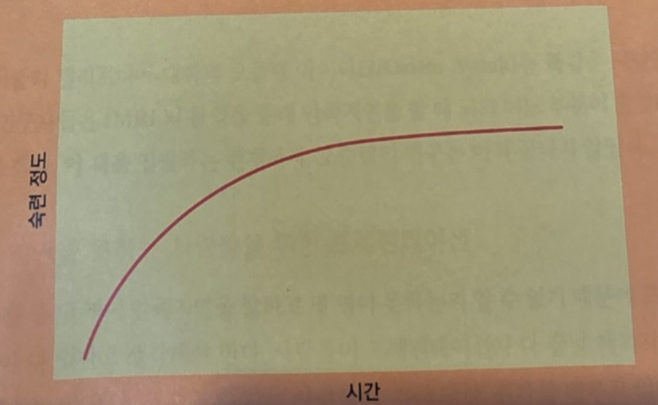

# 사람들은 어떤 방식으로 생각하고 학습할까

1. 사람들은 너무 많은 정보가 주어지면 잘 처리하지 못한다.

- 단계적 공개 기법
- 한 번에 하나의 정보만 제시
- 누가 무엇을, 언제 필요로 하는지

```
개발 발표에서도 이런 기법이 엄청 많이 보인다.
코드 전부를 보여주는 경우에 지금 슬라이드에서 집중할 부분은 검정색, 그 외는 회색으로 표시하는 경우가 많다.
```

2. 사람들에게는 앞뒤 맥락이 필요한다.

- 선행 조직자(슬라이드 제목, 도표, 개요)를 이용해 맥락을 제공

```
너무 과하게 앞뒤 맥락을 설명하는 경우는 오히려 지루해진다. 이것도 주의하자.
```

3. 사람들은 정보를 걸러서 듣는다.

청중의 정보 거르기가 심하면 아이디어를 전할 기회조차 없다.(아이폰 유저는 안드로이드에 관심이 없을 수 있다.)

- 청중이 믿고 있는 것에서부터 시작하라
- 청중에게 놀랑무을 안겨주라
- 인지 부조화의 상황을 연출하라

```
인지 부조화는 진짜 좋은 것 같다.
내가 회사 소개할 발표를 할 기회가 있을것같지는 않지만 기회가 된다면 인지 부조화 기법을 사용해보고 싶다.
```

4. 사람들은 자기 생각에 확신이 없을수록 더 방어적인 태도를 취한다.

인지 부조화 연구에서 사람들은 자신이 믿지 않는 의견을 방어하도록 강요받았다.

- 사람들이 새로운 의견을 지지하도록 강요하는게 효과가 있다.
- 불확실하면, 사람들은 더 강하게 우긴다.
- 실용적이고 현실적으로 작은 변화라도 일으킬 수 있는 방법을 모색하라.
- 찬반 의견을 손들라고 하면 사람들의 생각이 움직일지도 모른다.
- 무조건 기존 의견을 비판하기보다는 다른 의견의 이점을 제시하라.

```
회사 생활을 하면서 크게 느꼈다. 심지어 내가 방어적인 태도를 취하는 것도 느꼈다.
내 태도에 대한 건 일단 이 책의 주제와 다르니 넘어가고..
발표에서는 정말 100명중 1명의 의견만 바꿔도 성공이라고 생각하는 마인드를 갖는 것도 좋을 것 같다.
회사에서는 조금 다르다. 처음에 방어적인 태도를 취하더라도, 조금씩 천천히 설득할 수 있다. 또한 언젠가 설득력을 얻을 수 있는 상황이 반드시 온다. 처음에 방어적인 태도를 취하더라도 스트레스받지 않고 작은 씨앗을 뿌렸다고 생각하면 좋다.
```

5. 사람들은 정신 모델을 갖고 있다.

> 정신 모델(mental model): 무엇이 어떻게 작용하는가에 대한 한 사람의 사고 과정을 나타낸다. 정신 모델은 불완전한 사실, 과거 경험, 심지어 직감에 근거한다. 정신 모델은 행동 결정에 도움을 주고, 복잡한 상황에서 사람들이 무엇에 집중할지에 영향을 미치며, 문제에 어떻게 접근하고 해결할지를 정해준다.

- 주최자와 참석 예정 청중에 대한 이야기를 나눠라
  - 참석자들의 직책은 무엇인가?
  - 참석자들은 웹사이트 설계 경력이 어느 정도 되는가?
  - 참석자들은 심리학에 대해 어느 정도 알고 있는가?

```
최근 온라인 스터디를 했는데 강사님이 시작하기전 설문을 돌렸다. 그리고 강의를 할 때 설문에서 답한 내용을 참고해서 강의 자료를 준비하고 강의했다. 나도 이후에 발표할일이 있으면 참고해봐야겠다.
발표가 아니더라도 상대방의 멘탈 모델에 대한 이해는 정말 중요한 것 같다. 결국 말이 잘 통한다는건 서로의 멘탈모델에 대해 이해하고 공감하는게 아닐까?
```

6. 사람들은 이야기 형식일 때 정보 처리를 가장 잘한다.

- 여러분께 이야기를 하나 해줄게요 => 이목 집중
- 이야기는 인과관계를 암시한다.
  - 버튼이 빨간색이였다. 사람들이 잘 누르지 않았다. => 버튼을 누르지 않은 이유는 빨간색 때문이다.
- 이야기는 모든 커뮤니케이션에서 중요하다.
  - 의료용품 관련 주주총회: 수백명이 사용합니다 => 그림을 보여주고 해당 환자가 회복되었다

```
스피치 학원에서 스토리텔링에 대해 배운적이 있다.
이때 해당 내용에 대해 직접 발표했었는데 내 개인적인 경험을 말할 때 사람들이 집중하고 웃는 모습을 볼 수 있었다.
사람마다 강점이 다른데 나는 솔직함에 강점이 있다. 그리고 이거에 대해 얘기할 때 많은 사람들이 공감하고 집중하는걸 볼 수 있었다.
```

7. 사람들은 예를 통해 가장 잘 배운다.

```
최근 스터디에서도 sudo code 예시를 보여줬는데 확실히 더 잘 와닿았다. 예시가 없으면 발표자의 생각을 100% 공감하기 어렵다.
```

8. 단기 기억은 한계가 있다.

- 프레젠테이션은 작업 기억에 과도한 부담을 지우기 쉽다.
- 새로운 정보를 소개할 때는 이야기, 사례, 활동을 넣어서 작업 기억에서 장기 저장으로 넘어갈 수 있게 하라.
- 프레젠테이션에 정말 중요한 몇 가지를 골라 거기에 집중하라.

9. 사람들이 한 번에 기억하는 것은 4개에 불과하다.

- 전화번호가 3,4자리씩 끊어져있는 것은 우연이 아니다.
- 프레젠테이션에서 의미 덩어리 만들기
  - 주요 주제는 각각 하부에 3~개의 주제로 나뉘고, 또 각 주제는 3~4개로 다시 더 나뉠 수 있다.

```
결국 중요한건 얼마나 덜어낼 수 있는지다.
```

10. 정보를 기억하려면 정보를 이용해야한다.

- 반복은 물리적으로 뇌를 바꾼다.
- 스키마
  - 심리학에서 스키마: 과거의 경험과 지식이 뇌 속에 구조화된 틀(db 스키마랑 본질적으로 동일)
  - 사람들이 새로운 정보를 기존에 저장된 정보와 연결한다면 기억하기, 즉 장기 기억에 머무르기가 더 쉽다.
  - 전문가는 정보를 스키마로 저장한다. 체스 전문가는 하나의 스키마, 비전문가는 여러개의 스키마가 필요하다.
  - 사람들이 이미 당신이 제공하는 정보와 관련된 스키마를 갖고 있다면 반드시 그것을 짚고 가라.

```
스키마에 대한 얘기는 결국 예시드는거랑 좀 비슷한 느낌같다.
```

11. 정보를 기억해 내기보다 인식하기가 더 쉽다.

- 앞에서 몇개의 단어를 기억하라고 했었는데 모두 사무실관련 단어였다. 몇몇은 사무실과 관련된 다른 단어를 떠올렸을지도 모른다. 이걸 산입 오류(inclusion error)라고 한다.
- 사람들에게 정보를 회상하도록 요구하지 마라.
- 청중의 기억력을 믿지 말고 중요한 정보는 반복하라.
- 설명과 정보가 담긴 유인물이나 슬라이드를 제공하라.
- 발표후에 요약본이나 참고 자룔를 제공하라.

```
최근에 사내에서 발표를 듣기도 하고, 하기도 했는데 확실히 슬라이드를 제공하는건 도움이 된다고 느꼈다.
```

12. 기억은 많은 정신 자원을 필요로 한다.

- 기억은 끊어지기 쉽기 때문에 강한 오프닝, 강한 엔딩이 필요하다.
- 여러개의 작은 프레젠테이션으로 나눠서 시작, 중간, 끝을 나누면 더 많은 정보를 기억한다.
- 추상적인 단어보다는 구체적인 단어, 말보다 보는 것을 사용하자.
- 정보를 기억하게 하려면 쉴 시간(잠잘 시간)을 주는 것이 좋다.

```
나도 이런 경험이 있다. 세미나를 듣다보니 무슨 얘기를 했는지 잊어버렸는데 마지막에 강조한 덕분에 조금은 기억에 더 많이 남았던 것 같다.
```

13. 사람들은 기억할 때마다 기억을 재구성한다.

- 기억은 변한다. 나중의 경험이 기억을 바꾸기도 한다.
- 기억에 의존하지말고, 중요한 정보는 유인물로 나눠주자. 기록과 녹화물을 남겨도 좋다.

```
회사에서 1년 피드백을 할 때 팀장님과 내 기억이 다른 경우가 있었다. 누구 말이 정답이였는지는 그다지 중요한게 아닌 것 같고 기억보다는 기록을 남기는게 중요한 것 같다.
```

14. 망각을 감안하라

- 모든걸 기억하면 당신은 아무것도 할 수 없다. 두뇌는 무엇을 기억하고 잊어야 할지 끊임없이 결정을 내린다.

```
예전에는 망각하는 내가 싫기도 하고, 망각하는 동료들이 아쉽기도 했지만 요즘은 크게 개의치않는다.
```

15. 사람들은 범주로 묶기를 좋아한다.

- 누가 정리하느냐보다는 얼마나 잘 정리됐는가가 중요하다. 즉, 시간을 들여 정보를 범주로 잘 묶어야한다.

```
이게 어려울때가 있다.. 특히 이력서 정리할때. 애매하게 조금씩 다른데 이걸 범주로 묶어도 되는건지, 오히려 헷갈리진 않을지 이런 고민들이 많이 드는데 뭐 어쨋든 범주로 묶는건 중요하다.
```

16. 시간은 상대적이다.

- 프레젠테이션이 너무 많은 정신 작업을 요구하면 청중은 많은 시간이 흘렀다고 여긴다.
- 진행정도를 청중이 알 수 있게 구성하라. 예를들면 5가지 논점 중 지금 3번째 진행중.
- 프레젠테이션마다 시간을 비슷하게 구성하는 것도 좋다.
- 사람들에게 생각할거리를 주지 마라. 그러면 오래 걸리는 것처럼 보인다.

```
프레젠테이션마다 시간을 비슷하게 구성하는건 꽤 많이 신경을 써야 가능한일 같다. 나도 몇번의 프레젠테이션 발표를 한적이 있는데 전체 시간은 신경썼어도, 이렇게 세부적으로 한적은 없다.
생각할 거리는 주는건 꽤 좋은 방식이라고 생각하는데 프레젠테이션 발표에서는 좀 애매한 것 같다. 가끔 여러분 떠올려보세요 하면서 상상을 유도하는 경우가 있는데 이건 좋은 경험이기도 했다. 근데 이건 발표 참여나 공감을 위해 생각할거리를 주는거고, 여기서 말하는 생각할거리는 그냥 내용자체가 추상적이고 어려운걸 얘기하는 것 같기도 하다.
```

17. 4가지 창의성이 있다.

- 계획적 & 인지적 창의성
  - 해당 창의성이 일어나려면 하나 이상에 주제에 관해 사전에 지식의 모체를 갖고 있어야한다. 기존 정보를 새로운 방식으로 결합하는 것이다. ex) 에디슨
  - 높은 수준의 지식과 많은 시간을 요구한다. 이런 유형의 창의성을 촉진하고 싶다면 충분한 사전지식을 보유하고 있는지 확인해야 한다. 정보를 완전히 이해하도록 사전에 자료를 연구해야 하고 프레젠테이션에 충분한 시간을 투자해야 한다. 프레젠테이션 중에 청중이 창의적인 활동을 하길 기대한다면 필요한 정보를 제공하고 활동을 위한 많은 시간을 줘야 한다.
- 계획적 & 감정적 창의성
  - 어떤 특정 분야의 지식에 관심을 집중하기보다는 기분과 감정과 관련이 있는 "아!"하는 순간을 포착한다.
  - 조용한 시간이 필요하다. 자료를 모아서 심사숙고할 수 있지만 빨리 답을 찾을 수 있을 거라고 기대하지는 마라. 프레젠테이션 중에 청중이 이런 유형의 창의적인 작업을 하기를 원한다면 그룹으로 돌아와서 자기의 통찰력을 함께 나누기 전에 혼자서 작업할 수 있는 조용한 시간을 줘야 한다.
- 즉흥적 & 인지적 창의성
  - 길을 걷다가 번뜩 아이디어가 떠오르는 경우. 해당 창의성은 뇌의 기저핵(도파민 저장)과 관련이 있다. 즉흥적, 인지적 창의성이 발휘되는 동안, 의식적인 두뇌는 문제에 대한 활동을 멈춘다. 대신에 뇌의 무의식 부분이 활동할 기회를 얻는다. 단, 사전에 지식의 모체가 있어야 한다.
  - 작업을 멈추고 문제에서 떠나 있는게 필요하다. 프레젠테이션을 준비중이랑면 뭔가 다른 일을 할 수 있는 휴식시간을 많이 가져라. 아니면 하룻밤 자면서 생각해 보고 다음날 계속 하라. 프레젠테이션 청중들이 해 볼 창의적 활동이 있다면 청중이 풀어야 할 문제를 제시한 다음, 다른 일을 하고 다시 돌아와서 문제 해결을 한다.
- 즉흥적 & 감정적 창의성
  - 뇌의 편도체(기본적인 감정이 처리되는 곳)에서 나온다. 특별한 지식이 필하지는 않다. ex)화가, 음악가
  - 전제조건이 되는 기술(미술, 음악)을 배우는 것 말고는 설계 혹은 계획할 수 없다.

```
나는 즉흥적 인지적 창의성이 있는 사람 같다. 회사 일을 항상 생각하고 있어서 그런지 몰라도, 새벽에 누워서 핸드폰을 하다가 좋은 생각이 나면 회사 메신저에 글을 올리는 경우가 종종 있다. 꿈에서 생각이 나기도 하고, 아침에 생각이 나기도 한다.
```

18. 사람들은 몰입상태에 빠질 수 있다.

- 프레젠테이션이 몰입상태를 유도한다면 청중은 즐거운 경험을 하게 될 것이다.
- 프레젠테이션 중에 활동을 넣어라. 몰입상태에 들어가려면 사람들이 깊이 몰두해야 한다. 아무리 훌륭한 프리젠터라도 말로 청중을 몰입상태로 유도할 수 없다. 사람들이 몰입상태에 들어가려면 직접 하는 활동이 있어야 한다.
- 활동을 할 때는 자기 행동에 관한 통제권을 청중에게 줘라. 통제는 몰입상태의 중요한 요인이다.
- 집중을 방해할 요소를 최소화하라.
- 도전적인 활동을 하되 너무 어려우면 안된다.
- 사람들에게 지금 하는 활동에 대한 피드백을 줘라. 몰입상태에 들어가고 유지하기 위해서는 지속적인 피드백이 필요하다.

```
예전에 회사에서 워크숍?같은걸 한적이 있는데 게임 활동이 있었다. 그때 모두가 몰입해서 열정적으로 했던 경험이 있었는데 나에게는 좋은 기억으로 남아있다.
가끔 몰입하고 있는데 집중을 깨는 경우가 있는데 항상 아쉽다고 느꼈다. 집단마다 느끼는게 다를거라서 사람들이 행동이나 표정을 관찰하면서 유연하게 조절해야될 것 같다.
```

19. 문화는 사람들의 사고방식에 영향을 미친다.

- 지역과 문화적 출신이 다른 사람들은 정보와 사진에 다르게 반응한다.
- 동아시아 사람들은 서양 사람들보다 배경과 맥락을 더 많이 알아보고 기억한다.
- 문화에 따라 다른 프레젠테이션 사용을 고려하라.

20. 20분 단위로 학습할 때 가장 효과가 좋다.

www.ted.com 참고하면 좋다.

- 프레젠테이션을 20분 단위로 나눌 방법을 모색하라.
- 20분 지점에 실습이나 활동이 들어가도록 계획하라.
- 한 번의 긴 휴식보다 짧은 여러 번의 휴식이 좋다.

21. 학습양식은 사람마다 다르다.

- 여러 학습양식에 맞는 프레젠테이션을 작성하라.
  - 시각적 학습자라면 도표, 텍스트
  - 청각적 학습자라면 슬라이드보다는 말을 많이
  - 운동감각적 학습자라면 실습과 활동
- 자기의 학습양식이 프레젠테이션 방식에 지나치게 영향을 미치지 않도록 주의하라

22. 사람들은 실수를 통해 배운다.

- 위압적이지 않은 환경을 조성하라. 사람들이 실수를 해도 괜찮다고 느낄 수 있는 기회를 마련하라.
- 실수한 사람에게 피드백을 주어라. 그리고 비슷한 과제를 다시 한 번 해 볼 기회를 주어라.

```
이전 독서토론에서 논의를 하고 발표를 한적이 있다. 그 과정에서 의도적으로 실수를 유도했다. 그리고 나는 보기좋게 걸렸고 나중에서야 알아차렸다. 책에서도 읽은 기법인데 알아차리지 못했다. 이 경험을 통해 나는 이와 같은 실수를 하지 않게 되었다?(솔직히 절대 실수하지 않는다고는 말하지 못하겠다.)
```

# 청중의 주의를 끌고 유지하는 방법

23. 주의집중 지속 시간은 약 10분이다.

- 프레젠테이션을 10분 단위로 계획을 세워라.
- 매 10분마다 뭔가 다른 것을 하라. 짧은 휴식, 이야기, 실습 혹은 양방향 활동, 청중에게 질문하기, 다른 위치로 움직이기, 주제 바꾸기 등

24. 무의식이 의식을 지휘한다.

- 사람들은 음식, 섹스, 그리고 위험에 주의를 기울이지 않을 수 없다.
  - 구뇌: 먹을 것이 없으면 죽고, 짝짓기가 없으면 멸종하고, 죽어버리면 아무것도 소용이 없다 라는 질문에 답한다.
  - 그리고 이건 저항할 수 없는 본능이다.
  - 들어가고 나가는 모습이 청중의 시야에 들어오지 않게 한다. 음식 사진은 삼가자. 잘생긴 사람, 위험한 상황의 사진을 사용해도 좋다.

25. 발생 빈도를 예측하는 것은 주의집중에 영향을 준다.

- 보안요원은 로션은 발견하면서 권총은 놓치는 경우가 있다.
- 청중의 주의를 잃지 않으려면 예측할 수 없게 하라. 질문을 하고, 자리를 옮기고, 이야기를 하고, 주제를 바꾸고, 조금 다른 간격으로 휴식시간을 마련하라.
- 일시정지: 방금 한 말, 혹은 이제 할 말을 강조하는 효과가 있다.

26. 사람들은 멀티태스킹을 할 수 없다.

- 사람들은 멀티태스킹하는 게 아니라 작업 전환을 한다.
- 프레젠테이션 중에 노트필기 정도는 괜찮지만 그 외에는 안된다.
- 프레젠테이션이 끝난 후 참고자료를 제공할 예정이라고 말해주면 청중들도 마음 편하게 노트 필기를 안 하고 집중한다.

27. 30%의 시간은 잡념에 쓴다.

- 발표 내용이 재미있을수록, 주의를 끌고 붙잡아 둘 방법이 많을수록, 잡념은 줄어든다.
- 청중이 잡념에서 벗어나도록 앞서 논의했떤 짧은 휴식시간을 마련하라.

```
스타강사들은 진짜 중간중간 재밌는 얘기로 환기시키는걸 잘한다. 진짜 이건 엄청난 능력이다.
```

# 사람들이 행동하도록 동기부여 하는 방법

28. 사람들은 목표에 가까이 다가갈수록 더 동기부여를 받는다.

- 목표구배 효과: 목표에 가까이 갈수록 행동을 가속화하는 것
- 진행의 착시를 이용하면 동기부여를 얻을 수 있다.
- 중간중간 진행도를 알려주자.

```
이거는 진짜 개발에서도 중요한듯하다. 에자일하게 스프린트 단위로 일하기도 하지만, 어떤 작업들은 명확하게 긴 호흡을 가지고 진행해야하는 작업들도 있다. 이런 경우에도 스콥을 자르고, 진행도를 측정한다. 그리고 마지막이 가까워지면 지쳐있던 인원들이 다시 한번 힘을 내서 끝까지 완주한다. 나도 이런 경험이 있었기 때문에 공감한다.
```

29. 가변적 보상은 큰 효과를 발휘한다.

- 사람들이 토의에 참여하기를 원한다면 사람들이 큰 소리로 말할 때 강화를 제공한다.
- 참여를 많이 끌어내려면 말할 때 가끔 상품을 준다.
- 당신이 원하지 않는 행동은 무시하고, 당신이 원하는 행동은 강화한다.

30. 사람들의 행동은 인위적으로 조성될 수 있다.

- 대화형 프레젠테이션을 하는데 청중들이 잘 따르지 않는다고 가정하자.
  - 이때 나를 쳐다보는 참가자에게 미소를 짓거나 고개를 끄덕여준다.
  - 다음 질문을 하고 비슷한 행동을 반복하면 참여자들이 아무때나 자유롭게 말하는 시점이 온다.

31. 도파민은 사람들을 정보 탐색에 중독시킨다.

- 도파민은 쾌락을 경험하게 해 주는 게 아니라 실제로 원하고 소망하며, 찾아내고 검색하게 하는 물질임을 발견했다.
- 도파민 뉴런이 손상된 쥐는 걷기, 씹고 삼키기는 여전히 할 수 있지만 먹이가 바로 옆에 있어도 굶어 죽고 만다.
- 재미없는 나열식 팩트 전달으로 시작 => 시간을 낭비하고 있습니다 등의 관심을 이끄는 시작

```
나는 도파민이 별로 없는 사람이라고 생각했었는데 최근에는 꼭 그렇지만은 않다고 느꼈다.
꼭 지나치게 자극적인 것만이 도파민이 아니다. 회사에서 문제를 해결하는 것에서도 도파민이 나오고, 요리하는데도 도파민이 나온다.
그리고 안정적인 상태가 되기 위해서는 초반에는 어느정도의 도파민이 어쩔 수 없이 필요하다는 것도 최근에 느꼈다
```

32. 사람들은 주변 환경의 신호에 반응한다.

- 휴식시간에는 음악 틀기, 휴식시간 끝나면 문 닫기, 참여자들과 소통하고 싶을 때는 플립차트로 걸어서 기대에 찬 표정으로 쳐다보기 등등

33. 사람들은 외적인 보상보다 내적인 보상에 더 큰 동기부여를 받는다.

```
확실히 보상을 바라고 하는 행동과 실제 내가 원하는 행동은 차이가 날 수 밖에 없다.
```

34. 사람들은 진보, 숙련, 통제에 동기부여 받는다.

- 숙련은 점근선으로, 결코 완전히 도달할 수 없다.
  
- 긴 세션이라면 이런 숙련 욕구를 자극하고 반응하는 프레젠테이션을 설계할 수 있다.
- 개념과 실습을 숙련하는 방향으로 설계하기.
- 실습에서는 남들에게 그리고 스스로에게 숙련했음을 보여주는 기회를 마련하기.

35. 사람들의 만족지연 능력은 어릴 때 시작된다.

- 어릴 때 만족을 지연시킬 수 있었던 어린이들이 학업성적도 더 우수하고, 스트레스와 좌절에 더 잘 대처해 나간다.
- 반면에, 만족을 지연시키지 못했던 어린이들은 어른이 되어서도 약물 중독을 포함해서 문제가 있는 경우가 더 많았다.
- 청중들 중 몇 명은 만족지연 능력이 없기 때문에, 중간중간 "아!" 하고 깨닫는 순간을 줘야한다.

36. 사람은 선천적으로 게으르다.

- 게으르다라는건 효율적이라고도 볼 수 있다.
- 만족시키기(SATISFY) + 충분하게 하기(SUFFICE) = 만족하기(SATISFICE)
  - 최적의 선택보다는 적정한 선택을 한다는 의사결정 전략
  - 최적의 혹은 완벽한 해법을 찾으려 애쓰기보다는 '무엇이면 충분할까' 혹은 뭉서이 '괜찮을까'에 따라 결정하는 것이 더욱 합리적이다.
- 너무 많이 기대하지 마라

```
만족하기 > 개발에서도 똑같다. 최고의 해결책보다는 최선의 해결책이 좋은 경우가 많다. 최근엔 CI CD 최적화를 하고 있는데 적절한 수준을 고려하는게 가장 중요하다. 가끔은 최고의 해결책을 시도해보고 싶을때도 있지만 그건 시간이 날 때 내 로컬호스트에서 해야겠다.
나도 남에게 너무 많이 기대하지 않는다. 기대가 크면 실망만 커진다. 기대감을 너무 낮추는게 동기부여 저하를 일으킬 수도 있지만 어느정도는 낮추는게 좋다.
```

37. 습관을 형성하려면 오랜 시간이 걸리고 작은 단계들을 거쳐야 한다.

- 습관을 형성하는 데 걸리는 시간은 평균 66일
- 새로운 습관 형성은 점근곡선 형태
  - TODO: 사진
- 행동이 복잡할수록 습관이 되는 데 더 오랜 시간이 걸렸다.
- 당신이 바꾸고 싶은 행동이 복잡하다면 작은 단계로 시작하고, 최초의 작은 단계로부터 프레젠테이션 혹은 회의를 여러 번 계속해야 한다.

38. 경쟁자가 적을수록 경쟁하려는 동기가 강해진다.

- 경쟁이 포함된 활동은 작은 그룹 단위로 계획하기

39. 사람들은 자율성에 동기부여 된다.

- 활동에서 세부사항에 대한 선택권은 청중들에게 주기
- 자기 팀을 스스로 만들게 한다.
- 몇몇 활동은 개인별로 하게 한다.
- 사람들이 취할 행동을 직접 선택하게 한다.

# 사람들은 어떻게 듣고 어떻게 보는가

프레젠테이션은 공연이다. 내용도 훌륭해야하지만 반드시 사람들의 눈과 귀를 고려해야 한다.

```
예전에 인턴할 때 비슷한 말을 들은적이 있다. 동영상으로 데모 영상을 찍는 일을 했는데 음량, 화면 확대 등도 신경써야 한다고 했다. 사실 너무나도 당연한 말이지만 개발 공부만 해온 무경력자들은 이런일에 너무나도 취약했다. 사실 나는 지금도 취약하다..
```

40. 여러 감각기관이 경쟁한다.

- 슬라이드를 사용한다면 간단한 사진, 도표, 그림을 넣어라
- 슬라이드 한 장에 2~3단어 이상 글자를 넣지 마라.

41. 집중해서 들으려면 소리가 들려야한다.

- 마이크를 사용을 고려하고 음향도 체크하라.(음향 기술자, 친구에게 물어보기)
- 녹음기로 미리 연습해 보고 자기 목소리를 들어봐라.

```
나도 몇 번 녹음을 한 경험이 있다. 확실히 도움이 된다. 특히 나는 넓은 공간에서 발표할 때 잘 안들려서 힘든 경험들을 자주 봤기 때문에 마이크가 없다면 최대한 크게 말해서 모두에게 내 목소리를 전달하려고 하는 편이다.
```

42. 시각이 모든 감각에 우선한다.

- 사람들이 당신의 말에 집중하게 하려면 시각적 자료를 줄여야 한다.
- 슬라이드를 만드는 데 너무 많은 에너지를 쏟지 말고, 메시지의 내용과 말하는 방법을 모색하는 데 쏟아라.
- 비디오로 촬영해서 확인해봐라.

43. 사람들은 글을 읽는 방향이 있다.

- 왼쪽 => 오른쪽으로 읽는 청중일 경우 발표자는 왼쪽에 있어야한다.
- 장소를 미리 확인하자.

44. 대문자가 읽기 어렵다는 것은 잘못된 고정관념이다.

- 모두 대문자로 된 텍스트는 꼭 필요할 때만 써라.

45. 타이틀과 헤드라인은 결정적인 맥락을 제공한다.

- 목표는 단어 수를 최소로, 단어가 있는 슬라이드 수도 최소로, 슬라이드의 개수를 최소로 하는 것이다

46. 읽기 어렵다 = 하기 어렵다.

- 일반적인 폰트는 가독성 면에서 똑같다.
- 특이하거나 지나치게 장식적인 폰트는 패턴 인식을 방해해서 읽는 속도가 떨어진다.

47. 글꼴 크기가 중요하다.

- 되도록 큰 글씨로 넣어라.

48. 요지 파악에는 주변시야가 중양시야보다 더 많이 사용된다.

- 진화론 관점에서 주변시야가 나쁜 사람들은 살아남아서 유전자를 전수하지 못했다.

49. 얼굴 인식만 담당하는 두뇌의 특별한 부위가 있다.

- 얼굴 사진이나 그림을 이용해 주의를 끌고 감정을 전달하라.
- 얼굴이 청중을 향해 정면으로 보이게 하라.
- 청중이 스크린에 집중하게 하고 싶을 때만 스크린을 쳐다보라.

50. 빨간색과 파란색이 함께 있으면 눈이 피로하다.

51. 빨간색 배경에 파란색 혹은 초록색 텍스트, 그리고 파란색 배경에 빨간색 혹은 초록색 텍스트를 쓰지 마라.

52. 색깔의 의미는 집단과 문화에 따라 다르다.

# 사람들은 환경에 어떻게 반응하는가

청중이 반만 차 있는 발표장은 지옥이다.

53. 발표회장이 가득 찰수록 사람들은 강한 에너지를 느낀다.

54. 발표회장이 어두우면 사람들은 잠이 든다.

- 슬라이드를 좀 더 잘 보이게 하려고 발표회장의 조명을 어둡게 하지 마라. 청중이 발표자를 볼 수 있는 것이 더욱 중요하다.

55. 눈에서 안 보이면 마음에서도 멀어진다.

- 연회용 원탁 같은 경우는 발표를 보기 힘들다. 고칠 수 있다면 미리 배치를 고치자.

56. 사람들은 가구 배치에 영향을 받는다.

- 그룹 활동을 계획중이라면 4~8명이 둘러앉을 수 있는 테이블 몇 개를 놓는 것이 좋다.

57. 온라인 프레젠테이션은 사람들이 흥미를 잃기 쉽다.

- 가능하면 캠을 키자.
- 짧게 하자. 최대 한시간 반. 분량이 많다면 짧은 세션 여러 회로 나누기.
- 중간 중간 피드백 요청하기.
- 여론 조사, 퀴즈, 토론 코너 넣기.

58. 사람들은 피곤하고 배고파진다.

- 밥먹기 전, 후는 피하자.
- 식시시간이 가깝다면 음식 얘기는 하지 않는다.
- 오후 늦게 하면 피곤해 한다.

59. 사람들은 실내 온도에 영향받는다.

- 실내 온도를 당신에게 맞추지 마라. 당신은 돌아다니기 때문에 더 덥다.
- 참여자들에게 얇은 옷을 여러 겹 입도록 권장하라.

```
나는 발표하면 열이 나는 스타일이라 얇은 가디건과 반팔을 입고 가야겠다.
```

60. 사람들은 불편하면 집중하지 못한다.

- 청중의 입장이 되어 미리 확인해봐라. 가능하면 바꿔라.

61. 사람들은 인터넷 접속이 가능할 거라고 기대한다.

- 당신의 책임은 아니지만 인터넷 접속이 안되면 프레젠테이션에 부정적인 영향을 준다.

# 사람들은 어떻게 감정적으로 반응하는가

사람들은 당신이 말한 내용은 잊어버릴지 몰라도 어떤 기분이 들게 했는지는 절대 잊지 않는다.

```
진짜 무서운 말이다... 나는 이미 누군가에게 부정적인 기분을 들게한 사람이다. 물론 그러지 않으려고 노력한다. 하지만 과거는 바꿀 수 없다. 같이 오랫동안 지내온 사람들은 내 변화된 모습을 봤다. 하지만 여전히 나를 부정적으로 생각할지도 모른다. 또 누군가는 내 변화된 모습을 보지 못한채 여전히 부정적으로 평가할지도 모른다.
```

62. 사람들은 데이터보다 일화에 더 크게 반응한다.

```
데이터 기반으로 대화하는건 꽤 유의미하게 설득할 수 있는 수단이라고 생각했는데.. 둘 다 적재적소에 활용하면 좋을 것 같다.
예시를 인터뷰한 고객들의 75퍼센트는 이런식으로 들었는데 변경하고 나서 매출이 150% 늘었다. 이런식으로 얘기하면 아마 임팩트가 있을 거다.
```

63. 이야기는 사람들을 감정적으로 연결시킨다.

- 주의집중을 유지하고 감정적인 연결을 위해 프레젠테이션 중간 중간에 이야기를 사용하라.
- 일 또는 개인 생활 중에 재미있는 이야기를 적어놓거나 녹음해 둬라.
- 감정적 연관을 극대화하려면 이야기를 생생하고 현실감 있게 하라.

64. 사람들은 원래 의외의 놀람을 즐긴다.

65. 사람들은 상황이 예측 가능할 때 안전하다고 느낀다.

66. 사람들은 안전하다는 느낌이 들어야 참여한다.

- 사람들에게 상효작용이나 실습 혹은 그룹 활동을 요청할 때는 천천히 시작하라. 사람들에게 작은 활동 하나부터 시작해서 차츰차츰 더 길고 복잡한 활동을 요구하라.
- 사람들에게 안전한 느낌이 들게 하라. 불편한 일을 하라고 요구하지 마라.
- 유머는 긴장을 풀어주는 데 좋지만 유머라는 형태로 사람들을 놀리거나 전체 청중들이 안정감을 위협받지 않게 하라.

67. 사람들은 바쁠 때 더 행복하다.

- 청중에게 질문을 한다. 그저 답을 생각하고 손을 드는 게 전부라 하더라도 그냥 앉아서 듣기만 하는 것보다 낫다.

68. 사람들은 아름다움에 반응한다.

- 슬라이드에 전원 풍경 그림을 사용하면 사람들의 기분이 좋아진다.(이건 본능이다.)

```
나는 좀 감성적이지 않은 사람이다. 그래서 그런 자연 풍경을 보러가는걸 선호하지 않았었는데 최근에는 나도 어느정도 이런걸 좋아하는 사람이라는 생각이 들었다. 학습에서 오는 효과도 있겠지만 본능적인 요소도 있는 것 같다. 특히 강남 고시원에서 약 1년간 살면서 삭막한 강남 풍경을 보다보니 이런 본능이 일깨워진걸지도 모른다.
```

69. 음악을 들으면 뇌에서 도파민이 나온다.

- 프레젠테이션 시작 전, 휴식시간에 음악 사용하는거 고려하기

```
전 회사에서 밤이 되면 복도(화장실인가?)에서 특정 음악이 들렸다. 어떤 음악인지는 기억나지 않지만 뭔가 오늘도 수고했다. 마음이 평온해지는 그런 음악이였다.
```

70. 사람들은 슬프거나 무서울 때 친숙한 것을 원한다.

- 슬프거나 무서울 때는 늘 사던 시리얼을 산다.

```
나도 가끔 슬플 때 신라면을 먹는다. 요리할힘이 없어서 그렇기도 하지만 그냥 평소에 자주 먹는
```

71. 희소성이 높을수록 더 소중하게 여긴다.

- 10개 있는 쿠키, 2개 있는 쿠키를 비교하니 2개 있는 쿠키가 높은 점수를 받았다.
- 프레젠테이션은 유료여도 좋다. 사람들은 유료로 얻은 정보를 더 소중히 여긴다.

# 사람들은 프리젠터에게 어떻게 반응할까

위대한 연설가들도 처음에는 모두 서툴렀다.

72. 사람들은 권위자에게 복종한다.

- 복종의 심리학 실험: 학습자가 틀리게 말할 때 마다 참가자들에게 전압을 높이는 실험을 했다. 최고 전압까지 올리는 사람은 약 1~2퍼센트정도라고 예상했지만, 3분의 2가 최고 전압까지 올렸다.
- 프레젠터는 자동적으로 권위자가 된다.
- 프리젠터로서 자동적으로 얻게 된 권위를 유지하기 위해 할 수 있는 모든 일을 하라. 프레젠테이션을 하는 동안 주도적인 역할을 내내 유지한다면 청중들은 당신의 말에 더 많이 주의를 집중하고 더 많이 설득될 것이다.

73. 사람들은 즉각적이고 무의식적으로 다른 사람을 '읽는다'

- 사람들은 당신을 즉각적으로 판단한다. 처음부터 강한 리더라는 인상을 주어야한다.
- 말을 시작하기 전에 여유를 가져라. 허리를 쭉 펴고 똑바로 서라.

```
첫 인상이라는게 참 중요하다. 나라는 사람은 크게 변하지 않았는데 처음에 다르게 행동함으로 인해 다른 평가를 받은 경험이 있다.
```

74. 정직하고 진실하라.

- 어쩔 수 없이 유능한 리더 이미지가 훼손됐을 때 몇 가지 선택이 있다.
  1. 무시하고 다른 사람이 아무도 그것을 보거나 알아차리지 않기를 바란다.
  2. 일어난 일을 인정하고 이해를 구한다.
  3. 일어난 일을 인정하고 농담 아니면 겸손한 멘트, 혹은 둘 다를 한다.
- 일이 잘못될 수 있는 상황을 예측해서 문제를 최소화할 계획을 세우고 대비하라.
- 유머를 사용하고, 진실하고 정직하라.

```
언제나 일이 잘못될 수 있다. 나도 알고는 있는데 발표에서 이로 인해 발표가 망한 경험이 있다. 알고 있는 것 만으로는 부족하고 직접 행동해야 내꺼가 된다.
```

75. 사람들은 몸의 위치와 움직임에도 의미를 부여한다.

- 정면은 권위와 자신감
- 45도 각도는 협력
- 장애물을 제거하자
- 고개를 기울이면 복종을 표현. 권위를 전달하려면 고개를 똑바로 들어가
- 양쪽 다리에 체중을 고르게 싣고 선다.
- 꼼지락거리지 마라.
- 초조함을 잘 다뤄라.
  - 연설자는 두 부류가 있는데, 떨리는 사람과 거짓말하는 사람
- 목적을 갖고 움직인다. 중요한 포인트 말하기 전에 청중에게 다가가기.

```
나는 다리가 약간 불균형이라서 짝다리를 짚을 때가 있는데 주의해야겠다.
```

76. 손동작에도 의미가 있다.

생략.. 아직 나에게는 이것까지 알기는 너무 이르다.

77. 어조에도 의미가 있다.

- 훌륭한 프리젠터는 목소리를 조절한다.
- 훌륭한 프리젠터는 목소리가 들린다.
- 훌륭한 프리젠터는 또박또박 말한다.
- 훌륭한 프리젠터는 일시 정지한다.

```
수학 선생님을 보면서 크게 느꼈다. A라는 선생님은 정말 똑똑하고 모든 문제를 막힘없이 풀었는데 항상 목소리의 음량이 동일했다. 그러다보니 발성이 좋음에도 불구하고 뭐가 어려운건지, 중요한건지 이런게 잘 와닿지 않았다. 반면에 B라는 선생님은 "야 이거 중요해." 라고 말하면서, 음량 조절을 자유자재로 했고 중간중간 말을 멈추기도 했다. 동일한 문제 해설을 들어도 와닿는게 달랐다.
```

78. 얼굴 표정과 눈의 움직임에도 의미가 있다.

- 주의해야 할 표정과 눈의 움직임
  - 잦은 눈 깜빡임: 불안함의 표시. 또 누군가에게 매력을 느낀다는 의미로 해석되기도 함.
  - 똑바로 쳐아보기: 관심이 있고 주의를 기울이고 있다는 의미. 청중을 쳐다보는건 중요하다. 하지만 한 사람을 너무 오래 쳐다보면 위협을 느낀다.
  - 시선을 자주 옮기기: 초조하거나 거짓말하고 있다는 느낌을 준다.
  - 아래 입술 깨물기 혹은 입술 물기: 걱정, 불안, 두려움을 나타낸다.

79. 사람들은 당신의 감정을 흉내 내고 당신의 기분을 느낀다.

- 상대방의 보디랭귀지를 따라하면 그가 당신을 더 좋아한다.
- 기분과 감정은 전염된다. 당신이 느끼는 기분은 모두 청중에게 전달된다.

```
옛날에 하트시그널? 그런 프로그램에서 행동을 따라하면 호감이 있는거라는 얘기를 들은적이 있다.
기분이 전달된다는게 참 부담스럽게 느껴질때가 있다. 꼭 프레젠테이션이 아니더라도 일상 대화를 할 때 내 감정이 상대방에게 전달된다. 항상 행복한 상태면 좋겠지만 그렇지 않은 경우도 있다. 티내지 않으려고 사무적으로 대할때도 있지만 이게 좋다고는 생각하지 않는다.
```

80. 옷이 날개다.

- 청중들과 비슷하게 보이고 싶으면 청중과 비슷한 옷차림을 하라.
- 권위를 세우고 싶다면 청중보다 한 단계 높은 수준의 옷을 입어라.
- 직업상 유니폼을 입는 사람이라면(예: 의사, 군인)유니폼을 입는 게 권위를 높인다.
