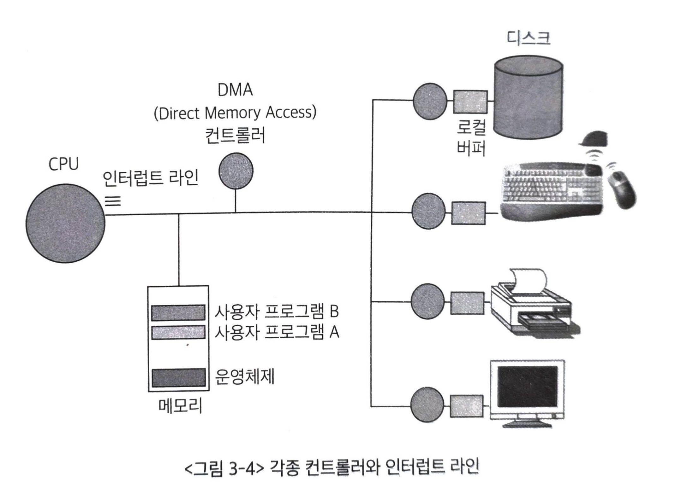
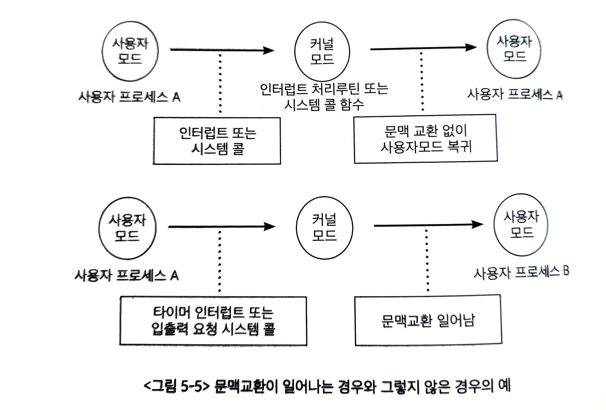
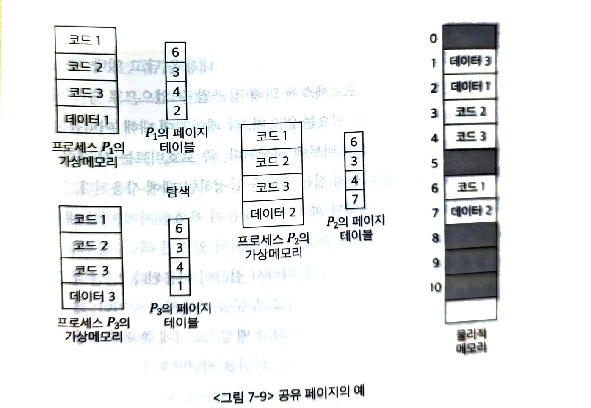

# [인강](http://www.kocw.net/home/search/kemView.do?kemId=1046323)

## 컴퓨터 구조 용어 정리(책X)

- CPU(Central Processing Unit, 중앙처리장치): 컴퓨터 시스템의 두뇌 역할
  - CPU의 구조는 다음과 같습니다.
  - ALU(Arithmetic Logic Unit): 계산하는 장치
  - 레지스터: 임시 저장 장치
  - 제어장치: 제어 신호를 발생시키고 명령어를 해석하는 장치
  - 캐시 메모리
    - 과거: CPU와 RAM 사이에 위치한 고속 메모리
    - 현대: CPU 내부에 위치한 고속 메모리
- 주기억장치(메모리)
  - CPU가 처리할 데이터와 명령어를 임시로 저장하는 물리적 장치.
  - CPU가 접근하여 데이터를 처리할 수 있는 메모리
  - 빠르지만 용량이 작음. 휘발성임.
  - RAM(Random Access Memory): 현재 작업중인 데이터와 프로그램을 일시적으로 저장(현대에는 DRAM, SDRAM, DDR SDRAM 등으로 사용)
  - ROM(Read Only Memory) : 영구적 저장. 비휘발성(메인보드에 BIOS, UEFI 형태로 내장)
- 보조기억장치
  - 1. 파일 시스템용
    - 주기억장치의 용량 한계와 휘발성을 보완하기 위한 저장 장치
    - 비휘발성, 고용량, 저렴, 느림
    - HDD, SSD, USB, CD/DVD, 테이프
  - 2. 메모리의 연장 공간인 스왑영역
    - 당장 사용하지 않는 부분은 디스크의 스왑 영역에 내려놓는다.(스왑 아웃)
    - 필요할때 다시 메모리 영역으로 올린다.

# 1장. 컴퓨터 및 정보 기술의 역사

# 2장. 운영체제 개요

## 1. 운영체제의 정의

- 운영체제(operating system): 컴퓨터 하드웨어 바로 윗단에 설치되는 소프트웨어
- 운영체제가 없으면 컴퓨터는 고철 덩어리에 불과하다. 이 고철 덩어리(하드웨어)를 동작시키기 위해서 필요한 기본적인 소프트웨어가 운영체제다.
- 컴퓨터의 전원을 켜면 운영체제는 이와 동시에 실행된다.
- 운영체제도 소프트웨어이기 때문에 메모리에 올려야한다. 하지만 운영체제는 큰 규모의 프로그램이기 때문에 메모리 이슈가 존재한다.
- 이를 막기 위해서 필요한 부분만 메모리에 올려서 사용한다. 이때 메모리에 상주하는 운영체제의 부분을 **커널(kernel)**이라고 한다.

## 2. 운영체제의 기능

- 운영체제는 하드웨어를 위한 역할과 사용자를 위한 역할 두가지가 존재한다.
- = 컴퓨터 시스템 내의 자원(resource)를 효율적으로 관리하는 것과 컴퓨터 시스템을 편리하게 사용할 수 있는 환경을 제공
- 후자는 결국 복잡한 컴퓨터를 유저에게 추상화시켜서 보여줌을 의미한다.
- 전자의 이유로 운영체제를 자원관리자(resource manager)라고 부른다. 즉, CPU, 메모리, 하드디스크 등 하드웨어 자원뿐 아니라 소프트웨어 자원까지 효율적으로 관리해 가장 좋은 성능을 내도록 하는 역할을 담당한다. 그와 동시에 형평성있게 분배해야하기 때문에 균형자 역할도 수행한다. + 보안도 담당한다.

## 3. 운영체제의 분류

- 단일작업(single tasking)용 운영체제: 한 번에 하나의 프로그램만 실행(예전)
- 다중작업(multi tasking)용 운영체제: 2개 이상의 프로그램 처리 가능

- 시분할 시스템(time sharing system): CPU의 작업시간을 여러 프로그램들이 조금씩 나누어 쓰는 시스템

- 다중 프로그래밍 시스템(multi-programming system): 메모리 공간을 분할해 여러 프로그램들을 동시에 메모리에 올려놓고 처리하는 시스템
  (CPU와 달리 메모리는 여러 프로그램을 올릴 수 있다.)

- 대화형 시스템(interactive system): 각 프로그램에 대한 키보드의 입력의 결과를 곧바로 화면에 보여줌.

> 우리가 사용하는 PC는 위 시스템을 모두 사용하고 있다.

- 다중처리기 시스템(multi-processor system): 하나의 컴퓨터 안에 CPU가 여러 개 설치된 경우
  (현대의 일반 PC에서는 사용할 일 없음. 처리가 빨라지지만 운영체제 입장에서는 복잡한 메커니즘이 필요함)

- 단일 사용자용 운영체제: 한 번에 한 명의 사용자만이 사용하도록 허용하는 운영체제
- 다중 사용자용 운영체제: 여러 사용자가 동시에 접속해 사용할 수 있게 하는 운영체제

> 요즘은 단일 사용자용 운영체제에서 서버 기능을 지원해 다중 사용자용 운영체제로 사용된다.

- 일괄처리(batch processing): 요청된 작업을 일정량씩 모아서 한꺼번에 처리하는 방식 => 응답시간이 느림
- 시분할 방식: 여러 작업을 수행할 때 컴퓨터의 처리 능력을 일정한 시간 단위로 분할해 사용하는 방식(현대 컴퓨터에서 사용)
  (대화형 시스템은 시분할 방식의 대표적인 특징이다.)

- 실시간(real-time) 운영체제: 정해진 시간 안에 어떠한 일이 반드시 처리됨을 보장해야하는 시스템
  - 경성 실시간 시스템(hard realtime system): 시간을 지키지 못했을 때 매우 위험한 결과(로켓, 원자로 제어)
  - 연성 실시간 시스템(soft realtime system): 멀티미디어 스트리밍 시스템과 같이 데이터가 정해진 시간 단위로 전달되어야 올바른 기능을 수행할 수 있는 시스템

## 4. 운영체제의 예

- 윈도우는 초기에는 MS-DOS 위에서 수행되는 프로그램이라는 한계가 있었지만 점점 발전해서 온전한 운영체제로 제작되었다.
- 유닉스는 프로그램 개발 환경을 위해 설계된 운영체제로서 이식성(portability)이 좋고, 운영체제 커널의 크기가 작으며, 소스 코드가 공개되었다는 점 등으로 인해 가장 널리 사용되는 운영체제가 되었다.
- 이식성: 해당 소프트웨어를 다른 기종의 기계로 옮기는 것이 얼마나 용이한가를 나타내는 지표

## 5. 운영체제의 자원 관리 기능

- 운영체제의 가장 핵심적인 기능은 자원을 효율적으로 관리하는 것.(하드웨어, 소프트웨어 자원)
- 하드웨어 자원: CPU, 메모리, 주변장치, 입출력 장치
- CPU: 여러 프로세스들이 효율적으로 나누어 사용할 수 있게 관리
- 메모리: 시스템 내에 한정된 용량. 여러 프로세스들이 나누어 쓸 수 있도록 해야함
- 보조기억장치(하드): 전원이 꺼지면 정보가 모두 지워지기 때문에 보조기억장치에 파일 형태로 저장해야함.

- CPU가 하나밖에 없는 구조에서도 프로세스는 여러 개가 동시에 수행될 수 있다.
- CPU 스케줄링: 매 시점 어떠한 프로세스에 CPU를 할당해 작업을 처리할지 결정하는일.
- 1. 효율, 2. 공평
- CPU 스케줄링 종류: 선입선출, 라운드로빈, 우선순위
- 라운드로빈: CPU를 한 번 할당받아 사용할 수 있는 시간을 일정하게 고정된 시간으로 제한

- 물리적 메모리를 관리하는 방식: 고정분할 방식, 가변분할 방식, 가상메모리 방식
- 고정분할방식: 물리적 메모리를 몇 개의 분할로 미리 나누어서 관리. 융통성이 없음. 분할의 크기보다 큰 프로그램은 적재 불가능
- 내부조각(internal fragmentation): 고정된 메모리에 프로그램을 올리고 남은 메모리(분할의 크기보다 작은 프로그램이 적재되는 경우 남는 영역)
- 가변분할 방식: 매 시점 프로그램의 크기에 맞게 메모리를 분할해서 사용하는 방식. 물리적 메모리의 크기보다 더 큰 프로그램의 실행은 여전히 불가능
- 외부조각(external fragmentation): 전체 남은 메모리는 충분하지만 연속된 공간이 아니라 작은 조각들로 흩어져 있어 새 프로그램을 올릴 수 없는 상황(프로그램에 할당되지는 않았지만 그 크기가 작아 프로그램을 올리지 못하는 메모리 영역)
- 가상메모리: 현대에 가장 많이 사용됌. 물리적 메모리보다 더 큰 프로그램이 실행되는 것을 지원. 모든 프로그램은 가상 메모리 주소를 가지고 매핑하는 기술을 이용해 물리적 메모리 주소로 변환 후 물리적 메모리에 올림. 프로그램의 전체 크기가 2gb라고 해도 전체가 항상 동시에 사용되지는 않는다. 현재 사용되고 있는 부분만 메모리에 올리고 나머지는 하드디스크와 같은 보조기억장치에 저장해두었다가 필요할 때 적재한다.
- 스왑 영역: 위 설명의 보조장치의 영역
- 가상메모리공간은 페이지라는 동일한 크기의 작은 단위로 나뉘어 물리적 메모리와 스왑 영역에 일부분씩 저장된다. 이러한 기법을 페이징 기법이라고 한다.

  - 페이지 폴트(책에 없음): 프로그램의 페이지가 물리적 메모리에 없는것
  - 비어있는 프레임을 찾거나 (없다면 교체 알고리즘을 통해 희생될 페이지를 선택)
  - 필요한 페이지를 디스크(스왑 영역)에서 메모리로 로드하고
  - 페이지 테이블을 업데이트하여 가상 주소와 물리 주소 간의 매핑을 갱신합니다

- 인터럽트: 주변장치 및 입출력 장치는 CPU의 서비스가 필요한 경우에 신호를 발생시켜 서비스를 요청하는데, 이때 발생시키는 신호를 인터럽트라 한다.
- 주변장치들은 작은 CPU를 가지고 있다. 이를 컨트롤러라고 부른다.
- 운영체제는 인터럽트가 발생하면 직전에 수행하던 작업의 상태를 저장해둔다.

> 3장과 4장은 전체적인 흐름을 아는 것이 중요하다. 위의 인강을 듣는게 도움이 된다.(3, 4장은 이해를 돕기위해 중복된 내용이 계속 나오는데 중복된 내용은 생략함)

# 3장. 컴퓨터 시스템의 동작원리

## 1. 컴퓨터 시스템의 구조

- 컴퓨터 시스템 구조
  - 내부장치: CPU, 메모리
  - 외부장치(입출력장치): 디스크, 키보드, 마우스, 모니터, 네트워크 장치 등
- 메모리 및 입출력장치 등의 각 하드웨어 장치에는 컨트롤러가 붙어 있다. 이는 작은 CPU다.
- 프로그램이 수행되려면 프로그램이 메모리에 올라가있어야한다.

## 2. CPU 연산과 I/O 연산

- 입출력장치와 메인 CPU는 동시 수행이 가능하다.
- 로컬버퍼: 장치 컨트롤러에 있는 장치로부터 들어오고 나가는 데이터를 임시로 저장하기 위한 작은 메모리
- 디스크나 키보드에서 데이터를 읽어오는 경우, 우선 로컬버퍼에 데이터가 임시로 저장된 후 메모리에 전달된다. 이때 장치에서 로컬버퍼로 읽어오는 일은 컨트롤러가 담당한다.
- ex) 프로그램 B 실행 => B에서 디스크 데이터를 읽어오라는 명령(시스템콜) => 디스크 컨트롤러가 디스크에서 내용을 읽어 로컬버퍼에 저장 => 디스크(장치) 컨트롤러가 CPU에 (하드웨어)인터럽트를 발생시켜 보고
- 기본적으로 CPU는 매 시점 메모리에서 명령(instruction)을 하나씩 읽어와서 수행한다. 이때 CPU 옆에 있는 인터럽트 라인이 있어서 인터럽트 라인에 신호가 들어오면 하던일을 멈추고 인터럽트와 관련된 일을 먼저 처리한다.
  - 더 정확히 설명하면, CPU는 명령 하나를 수행할 때마다 인터럽트가 발생했는지를 확인한다.(인터럽트 라인 확인) 발생했다면 인터럽트 처리를 먼저 한다.

## 3. 인터럽트의 일반적 기능

- 운영체제 커널에는 인터럽트가 들어왔을 때 해야 할 일이 미리 프로그래밍 되어 있다.
- 운영체제는 하드웨어, 소프트웨어 자원 관리 뿐만 아니라 사용자 프로그램에 필요한 서비스도 제공한다. 그 중 하나가 인터럽트처리루틴이다.
- 인터럽트처리루틴이 하는일: (인터럽트가 발생했을 때 ~~)디스크의 로컬버퍼에 있는 내용을 사용자 프로그램의 메모리로 전달하고, 해당 프로그램이 CPU를 할당받을 경우 다음 명령을 수행할 수 있음을 표시(현재 실행중인 상태를 스택에 저장 등등)(책 설명 좀 빈약함. 뒤에 추가설명나올듯)
- 인터럽트에는 하드웨어 인터럽트와 소프트웨어 인터럽트가 있다.
  - 하드웨어 인터럽트: 컨트롤러 등 하드웨어 장치가 CPU의 인터럽트 라인을 세팅한다.(일반적인 인터럽트)
  - 소프트웨어 인터럽트(트랩. trap): 소프트웨어가 그 일을 수행한다.
    - 예외상황(exception): 비정상적인 시도
    - 시스템 콜(system call): 사용자 프로그램이 운영체제 내부에 정의된 코드를 실행하고 싶을 때 운영체제에 서비스를 요청하는 방법.
      - 인터럽트 라인 세팅을 통해 CPU 제어권을 운영체제로 넘겨 실행
      - ex) 애플리케이션 개발자가 프로그램 작성 중 키보드 입력이나 화면 출력 등의 입출력 작업이 필요한 경우 직접 입출력 코드를 작성하는 것이 아니라 이미 존재하는 커널의 코드를 호출해서 처리
- 인터럽트 백터: 인터럽트 종류마다 번호를 정해서, 번호에 따라 처리해야할 코드가 위치한 부분(메모리 주소)을 가리키고 있는 자료구조
- 실제 처리해야 할 코드는 인터럽트 처리루틴(interrupt service routine) 또는 인터럽트 핸들러라고 불리는 다른 곳에 정의된다.

## 4. 인터럽트 핸들링

- 인터럽트 핸들링: 인터럽트가 발생한 경우에 처리해야 할 일의 절차
- CPU에서 명령이 실행될 때에는 CPU 내부에 있는 임시 기억장치인 레지스터에 데이터를 읽거나 쓰면서 작업을 한다.
- ex) 프로그램 A 실행 => 인터럽트 발생 => A의 현재 상태 저장(상태: CPU에서 실행중인 메모리 주소, 부가정보)(인터럽트가 발생하면 기존 레지스터가 사라짐) => 이것을 모두 저장한 후에야 인터럽트 처리가 가능함
- 운영체제는 현재 시스템 내에서 실행되는 프로그램을 관리하기 위해 프로세스 제어블록(Process Control Block: PCB)이라는 자료구조를 둔다.
- PCB는 각각의 프로그램마다 하나씩 존재. 해당 프로그램의 어느 부분이 실행 중이었는지를 저장. 구체적으로는 실행중이던 코드의 메모리 주소, 레지스터값, 하드웨어 상태 등이 저장
- ex) 프로그램이 실행 => 인터럽트 발생 => 프로그램의 실행 상태를 PCB에 저장 => CPU의 제어권이 인터럽트 처리루틴으로 넘어감 => 인터럽트 처리가 끝나면 저장된 상태를 PCB로부터 CPU상에 복원해 인터럽트 당하기 직전의 위치부터 실행이 이어짐

## 5. 입출력 구조

- 동기식 입출력(synchronous I/O): 어떤 프로그램이 입출력 요청을 했을 때 입출력 작업이 완료된 후에야 그 프로그램이 후속 작업을 수행할 수 있는 방식
- IO연산은 CPU보다 느리다. 그렇기 때문에 입출력이 완료될때까지 CPU를 기다리면 자원이 낭비된다.
- 따라서 일반적으로 프로그램이 입출력을 수행 중인 경우 CPU를 다른 프로그램에게 이양해 CPU가 계속 쉬지 않고 일할 수 있도록 관리한다.
- 입출력이 완료될때까지는 해당 프로그램에 CPU를 할당하지 않는다.
- 운영체제는 프로그램을 몇 가지 상태로 나누고 입출력 중인 프로그램의 경우 봉쇄 상태(blocked state)로 전환시킨다.
- blocked state: CPU를 할당하지 않고, CPU 할당 시 곧바로 명령을 수행할 수 있는 프로그램에게만 CPU를 할당한다.
- 입출력 요청의 동기화를 위해 입출력 장치별로 큐를 두어 요청한 순서대로 처리할 수 있도록 한다.
- 비동기식 입출력: 입출력 연산을 요청한 후에 연산이 끝나기를 기다리는 것이 아니라 CPU의 제어권을 입출력 연산을 호출한 그 프로그램에게 곧바로 다시 부여하는 방식
- 예시를 생각해보고 생각안나면 p79 읽기.

동기식 I/O (await 사용)

```
async function programA() {
    const data = await readDisk();  // 여기서 멈춤 (blocked)
    console.log(data);  // 읽기 완료 후에야 실행
}
```

비동기식 I/O (await 없이)

```
function programB() {
    readDisk().then(data => {
        console.log(data);  // 나중에 처리
    });

    // I/O 기다리지 않고 바로 다음 코드 실행
    doOtherWork();
    calculateSomething();
}
```

## 6. DMA

- 메모리는 원칙적으로 CPU에 의해서만 접근 가능
- 그런데 모든 메모리 접근 연산이 CPU에 의해서만 이루어지면 효율성이 떨어짐
- 비효율을 극복하기 위해 CPU 이외에 메모리 접근이 가능한 장치를 하나 더 두는 경우가 많음. 이를 DMA(Direct Memory Access)라고 한다.
- byte 단위가 아니라 block이라는 큰 단위로 메모리 읽어온 후 CPU에게 인터럽트를 발생시켜 작업 완료를 알려줌



## 7. 저장장치의 구조

- 컴퓨터 시스템을 구성하는 저장장치는 주기억장치와 보조기억장치로 나뉜다.
- 주기억장치: 메모리라고 불림. 전원이 나가면 사라지는 휘발성. RAM
- 보조기억장치: 전원이 나가도 사라지지 않는 비휘발성. 마그네틱 디스크, 플래시 메모리, CD, 마그네틱 테이프
  - 첫번째 용도. 파일 시스템용
  - 두번째 용도. 메모리의 연장 공간인 스왑 영역(가상메모리)
    - 당장 사용하지 않는 부분은 디스크의 스왑 영역에 내려놓는다.(스왑 아웃)
    - 필요할때 다시 메모리 영역으로 올린다.
    - 주로 하드디스크가 사용됌
    - 비휘발성 용도와는 역할이 구분됌

## 8. 저장장치의 계층 구조

--- Primitive(Executable)

- 레지스터(가장 빠름, 비쌈, 용량 적음)
- 캐시 메모리
- 메인 메모리

--- Secondary

- 마그네틱 디스크
- 광디스크
- 마그네틱 테이프

---

- 캐싱 기법사용하면 적은 용량의 캐시 메모리를 사용해서도 메인 메모리와 같이 큰 용량을 가진 것처럼 효율적으로 동작하도록 관리할 수 았다.

## 9. 하드웨어의 보안

- 하드웨어적인 보안을 유지하기 위해서 운영체제는 커널모드와 사용자모드의 두 가지 모드를 지원한다.
- 커널모드: 운영체제가 CPU의 제어권을 가지고 운영체제 코드를 실행하는 모드. 모든 명령 가능
- 사용자모드: 일반 사용자 프로그램이 실행되면 제한적인 명령만을 수행할 수 있다.
- CPU 내부에 모드비트(mode bit)를 두고 0이면 커널모드, 1이면 사용자모드로 간주해서 검증한다.
- 특권명령(Privileged Instruction): 시스템의 보안과 관련된 명령. 모드비트가 0일때에만 수행 가능
- ex) 입출력은 특권명령이다. 사용자모드에서 입출력이 필요하면 시스템콜로 운영체제에 요청해야한다. 그러면 운영체제가 CPU를 할당받고 인터럽트 벡터의 특정 위치를 통해 해당 인터럽트 처리루틴으로 이동한다. 이때 인터럽트 하드웨어에 의해 모드비트가 0으로 세팅되어 운영체제는 입출력을 수행할 수 있게 된다.

## 10. 메모리 보안

- 여러 프로그램이 메모리에 동시에 올라가서 실행되기 때문에 다른 사용자 프로그램에 접근을 하면 안돼. 그래서 메모리 보안이 필요
- 기준 레지스터(base register), 한계 레지스터(limit register)를 사용해서 메모리 보호
  - base register는 메모리상의 가장 작은 주소, limit register는 base register값부터 접근할 수 있는 메모리의 범위
  - 잘못된 범위의 주소에 접근하면 소프트웨어 인터럽트 > 예외상황(exception) 일으킴.
  - 단, 이건 하나의 프로그램이 메모리의 한 영역에 연속적으로 위치하는 단순화된 메모리 관리 기법에만 해당됌. 페이징은 다른 방법이 필요함
- 메모리 접근 연산은 특권명령은 아니지만, base register와 limit register 값을 세팅하는 연산은 특권명령이다.
- 사용자모드는 제한, 커널모드에서는 메모리에 무제한 접근가능

## 11. CPU 보안

- CPU를 독점하면 다른 프로그램 및 운영체제가 빼앗을 방법이 없다.
- 그래서 타이머라는 하드웨어 사용
- 정해진 시간이 지나면 인터럽트 발생시켜 운영체제가 CPU 제어권 획득
- 타이머는 클럭 틱(clock tick) 때마다 1씩 감소. 0이되면 인터럽트
- 로드타이머(load timer): 타이머의 값을 세팅하는 명령. 특권명령에 속함
- 타이머는 시분할 시스템에서 현재 시간을 계산하기 위해서도 사용

## 12. 시스템 콜을 이용한 입출력 수행

- IO는 특권명령이므로 사용자 프로그램에서 수행 불가능.
- 시스템콜 => 제어권 운영체제로 넘김 => 인터럽트 처리 루틴
  - 즉 처음에는 소프트웨어 인터럽트(시스템콜) DMA완료에는 하드웨어 인터럽트 발생

# 4장. 프로그램의 구조와 실행

## 1. 프로그램의 구조와 인터럽트

- 프로그램의 내부 구조는 결국 함수들로 구성된다. 호출된 함수의 수행이 끝나면 다시 원래 호출했던 함수의 위치로 돌아가 프로그램을 계속 실행한다.
- 이때 위치로 돌아가려면 주소 영역이 메모리에 올라가 있어야 한다.
- 주소영역(RAM): 코드(code), 데이터(data), 스택(stack)
  - 코드: 코드가 CPU에서 수행할 수 있는 기계어 명령어 형태로 변환되어 저장
  - 데이터: 전역 변수 등 프로그램이 사용하는 데이터를 저장하는 부분
  - 스택: 함수가 호출될 때 호출된 함수의 수행을 마치고 복귀할 주소 및 데이터를 임시로 저장하는데 사용되는 공간
- 함수가 호출되면 다음에 실행할 명령(instruction)의 메모리 위치가 바뀐다. 함수를 모두 실행하면 원래 함수의 위치로 돌아가는데, 이때 스택에 저장되어 있는 복귀 주소를 사용한다.
- 인터럽트도 함수 호출과 원리가 비슷하다.
  - 함수의 복귀 주소는 스택 영역에 저장되지만, 인터럽트 때문에 CPU를 빼앗긴 위치는 운영체제가 관리하는 프로세스 제어블록(PCB)에 저장된다.

## 2. 컴퓨터 시스템의 작동 개요

- CPU를 컴퓨터의 두뇌라고 불지만 스스로 생각하고 판단하는 능력이 없다. 단순히 빠르게 처리하는 계산능력만 가지고 있을 뿐이다.
- 매 시점 메모리의 특정 주소에 존재하는 명령을 하나씩 읽어와 그대로 실행할뿐이다.
- 프로그램 카운터(Program Counter PC): CPU가 수행해야 할 메모리 주소를 담고 있는 레지스터

## 3. 프로그램의 실행

- 프로그램이 실행된다는 것은 컴퓨터 시스템 차원에서 크게 두 가지 의미를 가진다.
  - 1. 디스크에 존재하던 실행파일이 메모리에 적재
  - 2. 프로그램이 CPU를 할당받고 명령(instruction)을 수행하고 있는 상태
- 운영체제도 하나의 프로그램이므로 운영체제의 커널 역시 코드, 데이터, 스택의 주소 공간 구성을 가지고 있다.
- 커널은 CPU, 메모리 등의 자원을 관리하기 위한 부분과 사용자엑 편리한 인터페이스를 제공하기 위한 부분이 주를 이루고 있다. + 시스템 콜, 인터럽트를 처리하기 위한 부분
- 프로세스(process): 현재 수행중인 프로그램
  - 더 정확히는 독립적인 메모리 공간을 가진 실행 단위. 왜냐하면 멀티 프로세스 프로그램도 있잖아.
- 커널의 데이터 영역에는 현재 수행중인 프로그램을 관리하기 위한 자료구조도 있다. 각 프로세스의 상태, CPU 사용 정보, 메모리 사용 정보 등을 유지하기 위해 PCB사용
- 커널의 스택은 현재 수행 중인 프로세스마다 별도의 스택을 두어 관리한다.
  - 프로세스가 자기 주소 영역의 함수를 호출하면 자신의 스택에 복귀 주소를 저장하지만, 인터럽트(ex 시스템 콜)가 발생하면 그 복귀 주소는 커널에서 저장된다.
  - 모든 사용자 프로그램이 시스템 콜을 통해 커널의 함수를 접근할 수 있으므로, 일관성 유지를 위해 별도의 스택이 필요함.
- 주의점. 프로그램내의 함수 호출 시 해당 프로그램의 스택에 복귀 주소를 저장하지만, 시스템 콜이나 인터럽트 발생으로 CPU의 수행 주체가 운영체제로 바뀌는 순간에는 복귀 정보를 스택이 아닌 PCB에 저장한다.(PCB 자체가 스택은 아니지만, 커널 스택의 위치 정보를 포함하고 있습니다.)

## 4. 사용자 프로그램이 사용하는 함수

- 크게 사용자 정의함수, 라이브러리 함수, 커널함수 세가지
  - 사용자 정의함수: 프로그래머 본인이 직접 작성한 함수
  - 라이브러리 함수: 프로그래머 본인이 직접 작성하지는 않았지만 이미 누군가 작성해놓은 함수를 호출만 하여 사용
  - 커널함수: 운영체제 커널의 코드에 정의된 함수
- 단, 라이브러리 함수를 사용해도 내부에서 커널함수를 사용할 수 있음.(ex printf)

## 5. 인터럽트

- 기본적인 인터럽트, 인터럽트 라인, 인터럽트 처리루틴은 생략
- 인터럽트 처리 중에 또 다른 인터럽트가 발생하는 경우는 기본적으로는 허용하지 않는다.
  - 우선순위가 같은 인터럽트가 발생한다면 기다렸다가 순차적으로 실행한다.
- 다만, 중요도가 더 높은 인터럽트가 발생하면현재 처리 중이던 인터럽트 코드의 수행 지점을 저장하고 우선순위가 높은 인터럽트를 처리한다.
- 인터럽트 처리가 끝나면 저장된 주소로 복귀해 이전에 수행하던 인터럽트 처리 코드를 마저 수행한다.

## 6. 시스템콜

- 기본적인 시스템 콜은 생략
- ~~ 입출력 작업이 완료되면 CPU는 사용자 프로세스의 수행을 잠시 멈추고 인터럽트 처리루틴으로 그 제어권이 넘어간다.
- 이때 발생한 인터럽트는 하드웨어 인터럽트. 처리 내용은 디스크로부터 로컬버퍼로 읽어온 내용을 컴퓨터 내의 메모리로 복사한 후 디스크 입출력을 요청했던 프로세스에서 다시 CPU를 획득할 수 있는 권한을 준다.
- 그러면 해당 프로세스는 CPU를 기다리는 큐에 삽입되고 CPU의 제어권은 다시 인터럽트를 당한 프로세스로 넘어가 하던 작업을 계속 수행하게 된다.
- 위 프로세스가 헷갈려서 claude랑 무물
  - A 프로세스의 io작업이 끝났다고 A프로세스로 바로 돌아가는게 아니라 Ready Queue에 추가를 함.(레디큐에 추가되는건 io작업이 발생하자마자가 아니라 io작업이 끝난이후임)
  - 즉, 이미 레디큐에 있는 프로세스가 다 실행이 되고 나서야 실행이 된다.
  - 인터럽트가 발생하면 다음 instruction을 실행하지 않고 인터럽트처리루틴을 실행하는건맞지만 해당 프로세스의 작업으로 바로 돌아가는건 아님.

```
1. A 프로세스 실행 중
   ↓
2. I/O 요청 (시스템 콜)
   ↓
3. A는 Blocked Queue로 이동 (Ready Queue 아님!)
   ↓
4. 다른 프로세스(B, C 등)가 CPU 사용
   ↓
5. I/O 작업 완료 → 하드웨어 인터럽트 발생
   ↓
6. 인터럽트 처리: 데이터 메모리 복사 + A를 Ready Queue에 추가
   ↓
7. A는 Ready Queue에서 차례 기다림
   ↓
8. A의 차례가 되면 CPU 할당받아 실행
```

## 7. 프로세스의 두 가지 실행 상태

- 사용자모드에서의 실행 상태(user mode running): 프로세스에서 자신의 주소 공간에 정의된 코드를 실행하는 것
- 커널모드에서의 실행 상태(kernel mode running): 커널의 시스템 콜 함수를 실행하는 것
- 주의점: 비록 시스텤 콜을 통해 실행되는 것이 프로세스 A의 코드가 아닌 운영체제 커널의 코드이지만, 시스템 콜이 수행되는 동안 커널이 실행 상태(running state)에 있다고 하지 않고 프로세스 A가 실행 상태에 있다고 말한다.(프로세스 A가 커널모드에서 실행중)

# 5. 프로세스 관리

## 1. 프로세스의 개념

- 프로세스(process): 실행 중인 프로그램(program in execution)
  - 디스크에 실행파일 형태로 존재하던 프로그램이 메모리에 올라가서 실행되기 시작하면 비로소 생명력을 갖는 프로세스가 된다.
- 시분할 시스템 환경에서는 CPU를 사용하고 뺏기는 과정이 많다. 그래서 정확한 재현을 위해 프로세스 문맥이 필요하다.
- 프로세스 문맥: 하드웨어 문맥, 프로세스의 주소 공간, 커널상의 문맥
  - 하드웨어 문맥: CPU의 수행 상태(프로그램 카운터(메모리 주소), 각종 레지스터에 저장하고 있는 값들)
  - 프로세스 주소 공간: 프로세스의 문맥을 결정짓는 중요한 요소 중 하나
  - 프로그램이 수행되어 프로세스가 되면 운영체제는 프로세스를 관리하기 위한 자료구조를 유지한다. PCB, 커널스택이 이에 해당한다.

## 2. 프로세스의 상태

- 프로세스 상태: 실행(running), 준비(ready), 봉쇄(blocked, wait, sleep)
  - running: CPU를 보유하고, 기계어 명령을 실행하고 있는 상태
  - ready: CPU만 보유하면 명령을 실행할 수 있지만 CPU를 할당받지 못한 상태
  - blocked, wait, sleep: CPU를 할당받더라도 당장 명령을 실행할 수 없는 상태
    - ex) IO 진행중
- 이 밖에 시작(new), 완료(terminated) 상태라고 부르기도 함
  - new: 프로세스가 시작되어 각종 자료구조는 생성되었지만 아직 메모리 획득을 승인받지 못한 상태
  - terminated: 프로세스가 종료되었으나 운영체제가 그 프로세스와 관련된 자료구조를 완전히 정리하지 못한 상태
- 문맥 교환(context switch): 실행시킬 프로세스를 변경하기 위해 원래 수행 중이던 프로세스의 문맥을 저장하고 새로운 프로세스의 문맥을 세팅하는 과정
- CPU 디스패치: 준비 상태에 있는 프로세스들 중에서 CPU를 할당받을 프로세스를 선택한 후 실제로 CPU의 제어권을 넘겨받는 과정

## 3. 프로세스 제어블록

- 프로세스 제어블록(Process Control Block: PCB): 운영체제가 시스템내의 프로세스들을 관리하기 위해 프로세스마다 유지하는 정보들을 담은 커널 내의 자료구조
  - 프로세스의 상태
  - 프로그램 카운터의 값: 다음에 수행할 명령의 위치
  - CPU 레지스터의 값
  - CPU 스케줄링 정보
  - 메모리 관리 정보
  - 자원 사용 정보
  - 입출력 상태 정보

## 4. 문맥교환

- 문맥교환(context switch)이란 하나의 사용자 프로세스로부터 다른 사용자 프로세스로 CPU의 제어권이 이양되는 과정이다.
- 타이머인터럽트나 실행중이던 프로세스가 입출력 요청이나 다른 조건을 충족하지 못해 CPU를 회수당하고 봉쇄 상태가 되는 경우에 발생한다.
- 시스템콜이나 인터럽트가 발생하는 경우는 context switch라고 하지 않는다. 이는 프로세스의 실행모드가 사용자모드에서 커널모드로 바뀌는 것 뿐이다.
- 문맥교환에 소요되는 시간은 오버헤드다. 타이머 시간을 작게 세팅하면 문맥교환이 빈번해서 오버헤드가 커지고 cpu 할당시간을 크게 설정하면 시분할 시스템의 의미가 퇴색된다.
- 헷갈리는 부분 정리
  - 시스템콜 자체 ≠ context switch
  - 시스템콜의 결과로 프로세스가 blocked되고 다른 프로세스가 실행될 때 context switch 발생
  - 하드웨어 인터럽트 자체도 context switch가 아니라, 그 결과로 스케줄링 결정이 바뀔 때 context switch 발생
  - 따라서 "시스템콜 → 프로세스 blocked → 다른 프로세스 실행"의 과정에서 context switch가 일어나는 것이 맞습니다.



## 5. 프로세스를 스케줄링하기 위한 큐

- 재밌네. 생각보다 큐를 많이 쓰는구나. 결국 시스템을 다루기 위해서는 운영체제, 웹, 백엔드 상관없이 큐가 많이 사용될 수 밖에 없는 것 같다.
- 준비 큐(ready queue)외에도 자원별로 장치큐(device queue)를 둔다.
- ex) 디스크 입출력 큐, 키보드 입출력 큐 등등(하드웨어)
- 하드웨어 이외에 소프트웨어 자원을 기다리는 경우에도 큐가 필요하다.
- ex) 공유 데이터를 기다리는 큐
- 프로세스의 상태 관리는 커널의 주소 영역 중 데이터 영역에 다양한 큐를 두어 수행한다.
- 운영체제는 준비 큐(ready queue), 장치큐(device queue) 외에 작업큐(job queue)를 추가로 유지한다.
- 작업큐는 시스템 내의 모든 프로세스를 관리하기 위한 큐. 프로세스의 상태와 무관하게 현재 시스템내에 있는 모든 프로세스가 작업 큐에 속하게 된다.
- 준비 큐에 속한 프로세스들은 준비 상태, 장치큐에 속한 프로세스들은 봉쇄상태.

## 6. 스케줄러

- 스케줄러: 어떤 프로세스에게 자원을 할당할지를 결정하는 운영체제 커널의 코드
- 장기 스케줄러(long term scheduler): 작업 스케줄러(job scheduler). 어떤 프로세스를 준비 큐에 진입시킬지 결정하는 역할(메모리 할당 문제에 관여)
  - 느리다.
  - 메모리에 동시에 올라가 있는 프로세스의 수를 조절한다.
  - 현대의 시분할 시스템에서 사용하는 운영체제에는 거의 사용하지 않는다. 대신 중기 스케줄러를 둔다.
- 단기 스케줄러(short term scheduler): CPU 스케줄러. 준비 상태의 프로세스들 중에서 어떠한 프로세스를 준비 큐에 삽입할 것인지 결정하는 역할. 준비 큐에 있는 여러 프로세스들 중 어떠한 프로세스에게 cpu를 할당할 것인가를 단기 스케줄러가 결정. 시분할 시스템에서는 타이머 인터럽트가 발생하면 단기 스케줄러가 호출된다.
  - 빠르다.
  - 궁금점(나중에 책 읽고 알게되면 적기): 준비 큐는 말그대로 큐인데 순서대로 아닌가? 우선순위가 다른 케이스를 결정한다는건가?? 아마 우선순위말고도 복잡한 뭔가가 있을듯. 우선순위하나가지고 스케줄러라는 이름을 붙이지는 않을듯 => 이름이 미스매치다. 준비 상태 프로세스들의 집합이라고 보면 쉽다... 아니 큐가 아니잖아.... => 원래는 큐였는데 지금은 큐가 아니게 되었다. 내부 구현은 Red-Black Tree(자가 균형 이진 탐색 트리) 같은 자료구조를 사용한다. 그냥 레거시라고 생각해.
- 중기 스케줄러(medium term scheduling): 너무 많은 프로세스에 메모리를 할당해 시스템의 성능이 저하되는 경우 프로세스의 수를 동적으로 조절한다.
  - 일부 메모리를 통째로 빼앗아 디스크의 스왑 영역에 저장해둔다. 이를 스왑 아웃(swap out)이라고 부른다.
  - 즉, 프로스세스 당 보유 메모리양이 지나치게 적어진 경우 일부 프로세스를 메모리에서 디스크로 스왑 아웃시킨다.
  - 어떤 프로세스가 스왑 아웃되는지
    - 0순위는 봉쇄상태
    - 그 다음은 타이머 인터럽트가 발생해 준비 큐로 이동하는 프로세스들
  - 중기 스케줄러 등장으로 인해 프로세스의 상태에는 중지(suspended, stopped) 상태가 추가되었다. (실행, 준비, 봉쇄, +중지)
  - 중지 상태는 중지준비 중 상태와 중지봉쇄 상태로 세분화할 수 있다.
  - 중지준비(suspended ready) 상태: 준비 상태에 있던 프로세스가 디스크로 스왑아웃되었을 때의 상태
  - 중지봉쇄(suspended block) 상태: 봉쇄 상태에 있던 프로세스가 중기 스케줄러에 의해 스왑 아웃되었을 때의 상태
  - 중지봉쇄 상태이던 프로세스가 봉쇄되었던 조건을 만족하게 되면 중지준비 상태로 변경

## 7. 프로세스의 생성

- 시스템이 부팅된 후 최초의 프로세스는 운영체제가 직접 생성하지만 그 다음부터는 기존 프로세스가 다른 프로세스를 복제 생성한다.
- 부모 프로세스 > 자식 프로세스
- 프로세스의 세계에서는 자식이 먼저 죽고, 이에 대한 처리는 부모가 한다.
- 프로세스가 생성되면 자신만의 독자적인 주소 공간을 갖는다.
- 처음 주소 공간을 생성할 때에는 부모 프로세스의 주소 공간 내용을 그대로 복사해서 생성한다. ex) 유닉스 fork() 시스템콜로 새로운 프로세스 생성 (프로세스 id 제외하고 모두 동일)
- 프로세스 종료는 두가지다.
  - 1. 자발적 종료. 프로세스가 마지막 명령을 수행한 후 운영체제에게 이를 알려줌
    - 프로그램 마지막 코드에 exit() 시스템콜. 개발자가 명시적으로 호출하지 않아도 프로그램 종료시에 컴파일러가 자동으로 삽입
  - 2. 비자발적 종료. 부모 프로세스가 자식 프로세스의 수행을 강제로 종료
    - abort() 함수를 통해 이루어짐.
    - 1. 프로세스가 할당 자원의 한계치를 넘어서는 많은 양의 자원을 요구
    - 2. 자식 프로세스에게 할당된 작업이 더이상 필요하지 않을 때
    - 3. 부모 프로세스가 종료되는 경우
      - 이 경우는 자식 프로세스를 계속 실행시키기 위해서 종료되지 않을 다른 프로세스의 양자로 보내는 과정이 필요함.
- fork()
  - fork()하면 현재 그 라인까지 수행했다는 기억조차도 똑같은 자식 프로세스가 생성된다. 즉, 복제인간이다. 그 복제인간은 복제되었다는 기억을 가지고 있지 않고 자기 자신을 복제했다는 기억을 가진다.
  - 복제여부를 알 수 있는 방법은 fork()함수의 결과값이 원본은 양수, 복제본은 0이라는 것이다.
- exec()
  - 프로세스의 주소 공간에 새로운 프로그램을 덮어씌우는 시스템콜
  - 즉 새로운 프로그램을 수행시키기 위해선는 fork(); exec(); 실행
- 당연히 fork, exec는 특권명령
- wait() 시스템콜은 자식 프로세스가 종료되기를 기다리며 부모 프로세스가 봉쇄 상태에 머무르도록 할 때 사용
- 위 방식으로 부모 프로세스와 자식 프로세스 간의 동기화 가능

## 8. 프로세스간의 협력

- 프로세스는 각자 자신만의 독립적인 주소 공간을 가지고 수행되며 프로세스가 다른 프로세스의 주소 공간을 참조하는 것은 허용되지 않는다.(부모 자식도 마찬가지)
- 경우에 따라 독립적인 프로세스들이 협력할 때 업무 효율성이 증진될 수 있다. 대표적인 협력 메커니즘이 IPC(Inter-Process Communication: 인터프로세스 커뮤니케이션)다.
- IPC: 하나의 컴퓨터 안에서 실행 중인 서로 다른 프로세스간에 발생하는 통신. 이 때 **동기화**가 중요하다.
- 메시지 전달(message passing) 방식 vs 공유 메모리(shared memory) 방식
  - 공유 데이터(shared data)를 사용하는지 여부에 따라 갈림

### 메시지 전달 방식

- 주소 공간이 다르므로 커널이 메시지 전달을 한다.
- send, receive 연산. 시스템콜로 운영체제에 요청. 특권명령
- 통신하기를 원하는 두 프로세스는 커뮤니케이션 링크를 생성한 후 send()와 receive()를 이용해서 메시지를 주고받게 된다.
- 커뮤니케이션 링크 구현 방법은 물리적인 방법과 논리적인 방법이 있다.
- 메시지 전달을 통해 통신하는 방식은 메시지의 전송 대상이 다른 프로세스인지 아니면 메일박스라는 일종의 저장공간인지에 따라 직접 통신(direct communication)과 간접통신(indirect communication)으로 나뉜다.(사실 연산의 인터페이스 차이일 뿐 내부 구현은 커널의 중재로 동일한 방식이다.)
- 직접통신
  - 통신하려는 프로세스의 이름을 명시적으로 표시한다.
  - send(P, message): 프로세스 P에게 메세지 전송
  - receive(Q, message): 프로세스 Q로부터 메시지를 전달받음
  - 링크는 자동적으로 생성되고, 하나의 링크는 정확히 한 쌍의 프로세스에게 할당된다. 단방향, 양방향 모두 가능. 대부분은 양방향
- 간접통신
  - 메시지를 메일박스(mail box) 또는 포트(port)로부터 전달받는다.
  - 메일박스에는 고유의 ID가 있으며 공유하는 프로세스들만 서로 통신을 할 수 있다.
  - 간접통신에서는 메일박스를 공유하기 때문에 의문 상황이 발생할 수 있다.
    - P1이 메시지를 보냈다면 P2와 P3 중 어느 프로세스가 메시지를 받게 되는가?
    - 이때 2개의 프로세스에게만 링크를 할당하는 방법이 사용될 수 있다.
    - 또는 링크에 대한 receive() 연산을 매 시점 하나의 프로세스만 수행할 수 있도록 하는 방법이 있다.

### 공유 메모리

- 공유 메모리 방식에서는 프로세스들이 주소 공간의 일부를 공유한다.
- 운영체제는 공유메모리를 사용하는 시슥템 콜을 지원해, 서로 다른 프로세스들이 그들의 주소 공간 중 일부를 공유할 수 있도록 한다.
- 서로의 데이터에 일관성 문제가 발생할 수 있는데 이에 대해서는 커널이 책임지지 않기 때문에 프로세스들끼리 직접 공유메모리 접근에 대한 동기화 문제를 책임져야 한다.

<!-- 커널주소공간 > data > A프로그램의 PCB
디스크 IO끝나면 메모리에 알려주는것뿐만아니라 process state도 변경.
degree of multiprograming: 한번에 몇개 프로그램 올리는지. -->

# 6. CPU 스케줄링

- CPU 버스트(burst): 사용자 프로그램이 CPU를 직접 가지고 빠른 명령을 수행하는 일련의 단계
- I/O 버스트: I/O 요청이 발생해 커널에 의해 입출력 작업을 진행하는 비교적 느린 단계
- 프로그램의 수행은 서로 다른 두 단계(CPU 버스트, I/O 버스트)의 조합으로 이루어진다.
- 각 프로그램마다 CPU 버스트와 I/O 버스트가 차지하는 비율이 균일하지 않다. => 그래서 효율적인 CPU 스케줄링이 필요하다.
- I/O 바운드 프로세스: I/O 요청이 빈번해 CPU 버스트가 짧게 나타나는 프로세스(대화형 프로그램)
- CPU 바운드 프로세스: I/O 작업을 거의 수행하지 않아 CPU 버스트가 길게 나타나는 프로세스(계산 위주의 프로그램)
- 대부분 I/O 버스트가 차지하는 비율이 크다. => I/O 바운드 프로세스의 우선순위를 높여주는 것이 바람직하다.

## 1. CPU 스케줄러

- CPU 스케줄러: 준비 상태에 있는 프로세스들 중 어떠한 프로세스에게 CPU를 할당할지 결정하는 운영체제의 코드
- 호출되는 경우
  - 1. 실행 상태에 있떤 프로세스가 I/O 요청 등에 의해 봉쇄(blocked) 상태로 바뀌는 경우
  - 2. 실행 상태에 있던 프로세스가 타이머 인터럽트에 의해 준비 상태로 바뀌는 경우(프로세스가 CPU를 할당받고 기계어 명령을 수행하다가 타이머 인터럽트가 발생하면 CPU 스케줄러가 호출된다. 그러면 스케줄러는 준비 큐에서 CPU를 기다리는 프로세스 중 하나를 선택해 CPU를 할당한다.)
  - 3. I/O 요청으로 봉쇄 상태에 있던 프로세스의 I/O 준비 작업이 완료되어 인터럽트가 발생하고 그 결과 프로세스의 상태가 준비 상태로 바뀌는 경우
  - 4. CPU에서 실행 상태에 있는 프로세스가 종료되는 경우
- 비선점형(nonpreemptive) 방식: CPU를 획득한 프로세스가 스스로 CPU를 반납하기 전까지는 CPU를 빼앗기지 않는 방법(1, 4)
- 선점형(preemptive) 방식: 프로세스가 CPU를 계속 사용하기를 원하더라도 강제로 빼앗을 수 있는 스케줄링 방법(2, 3)

## 2. 디스패처

- 디스패처(dispatcher): 새롭게 선택된 프로세스가 CPU를 할당받고 작업을 수행할 수 있도록 환경설정을 하는 운영체제의 코드
- 현재 수행 중이던 프로세스의 문맥을 그 프로세스의 PCB에 저장하고, 새롭게 선택된 프로세스의 문맥을 PCB로부터 복원한 후 그 프로세스에게 CPU를 넘기는 과정을 수행한다.
- 복원시킨 후에는 시스템의 상태를 사용자모드로 전환해 사용자 프로그램에게 CPU의 제어권을 넘긴다.
- 디스패치 지연시간(dispatch latency): 디스패처가 하나의 프로세스를 정지시키고 다른 프로세스에게 CPU를 전달하기까지 걸리는 시간. 이 시간의 대부분은 문맥교환 오버헤드에 해당된다.

## 3. 스케줄링의 성능 평가

- 시스템 관점의 지표: CPU 이용률, 처리량
- 사용자 관점의 지표: 소요시간, 대기시간, 응답시간

- CPU 이용률(CPU utilization): 전체 시간 중에서 CPU가 일을 한 시간의 비율.
  CPU는 고비용의 자원이므로 최대한 휴먼(idle) 상태에 머무르지 않게 해야한다.
- 처리량(throughput): 주어진 시간 동안 준비 큐에서 기다리고 있는 프로세스 중 몇개를 끝마쳤는지(CPU 버스트를 완료한 프로세스의 개수)
- 소요시간(turnaround time): 프로세스가 CPU를 요청한 시점부터 자신이 원하는 만큼 CPU를 다 쓰고 CPU 버스트가 끝날 때까지 걸린시간, 즉 준비 큐에서 기다린 시간과 실제로 CPU를 사용한 시간의 합
- 대기시간(waiting time): CPU 버스트 기간 중 프로세스가 준비 큐에서 CPU를 얻기 위해 기다린 시간의 합
- 응답시간(response time): 프로세스가 준비 큐에 들어온 후 첫번재 CPU를 획득하기까지 기다린 시간
  타이머 인터럽트가 빈번히 발생할수록 응답시간이 향상된다. 대화형 시스템에 적합함.

예시
중국집에 주방장과 손님이 있다.
이용률과 처리량은 중국집 입자에서 척도이고 소요시간, 대기시간, 응답시간은 손님 입장에서의 척도다.

- 이용률: 전체 시간 중 중방장이 일한 시간의 비율
- 처리량: 주방장이 주어진 시간 동안 몇 명의 손님에게 요리를 만들어주었는지

- 소요시간: 손님이 중국집에 들어와서 주문한 음식을 다 먹고 나가기까지 소요된 총 시간
- 대기시간: 음식을 먹은 시간을 제외한 순수하게 기다린 시간. 음식이 조금씩 여러 번에 걸쳐 나왔다면 음식을 먹은 시간을 제외하고 각각의 음식이 나오기까지 기다린 시간을 합한 시간.
- 응답시간: 최초의 음식이 나오기까지 기다린 시간

## 4. 스케줄링 알고리즘

1. 선입선출 스케줄링(First-Come First-Served: FCFS)

- 프로세스가 준비 큐에 도착한 시간 순서대로 CPU를 할당하는 방식
- 콘보이 현상(Convoy effect): CPU 버스터가 긴 프로세스가 먼저 도착하면 이후 CPU 버스트가 짧은 프로세스들이 실행되지 않기 때문에 평균 대기시간이 길어진다.

2. 최단작업 우선스케줄링(Shortest-Job Fist: SJF)

- CPU 버스트가 가장 짧은 프로세스에게 제일 먼저 CPU를 할당하는 방식
- 평균 대기시간을 가장 짧게 하는 최적 알고리즘
- 비선점형(nonpreemptive) 방식: CPU를 획득하면 자진 반납하기 전까지는 CPU를 빼앗지 않는 방식
- 선점형(preemptive) 방식: 준비 큐에서 CPU 버스트가 가장 짧은 프로세스에게 CPU를 할당했다 하더라도, CPU 버스트가 더 짧은 프로세스가 도착할경우 CPU를 빼앗아 더 짧은 프로세스에게 부여하는 방식. SRTF(Shortest Remaining Time First)
- 현실적으로 어려운건 프로세스의 CPU 버스트 시간을 미리 알 수 없다.
- τₙ₊₁ = α·tₙ + (1-α)·τₙ
  (tₙ: n번째 실제 CPU 버스트 시간
  τₙ: n번째 CPU 버스트 예측 시간,
  α: 0과 1 사이의 상수. 어느정도 반영할지 조절하는 매개변수
  더 오래된 과거일수록 영향력이 적어짐)
- 평균 대기시간을 줄이는게 항상 좋은건아니다.
- 기아 현상(starvation):CPU 버스트가 짧은 프로세스가 계속 도착할경우 기존 프로세스는 영원히 CPU를 할당받지 못한다.

3. 우선순위 스케줄링(priority scheduling)

- 준비 큐에서 기다리는 프로세스들 중 우선순위가 가장 높은 프로세스에게 제일 먼저 CPU를 할당하는 방식
- 우선순위는 CPU 버스트 시간 등 다양한 값을 정의할 수 있음.
- 비선점형, 선점형 방식 모두 존재
- 기아현상이 발생할 수 있기 때문에 노화(aging) 기법을 사용할 수 있다.
- 노화 기법: 시간이 길어지면 조금씩 우선순위를 높여서, 언젠가는 가장 높은 우선순위가 된다.

4. 라운드 로빈 스케줄링(Round Robin scheduling)

- 지금까지와 달리 시분할 시스템의 성질을 가장 잘 활용한 새로운 의미의 스케줄링
- 각 프로세스가 CPU를 연속적으로 사용할 수 있는 시간이 특정 시간으로 제한되며, 이 시간이 경과하면 CPU를 회수해 다음 준비 큐의 프로세스에게 CPU를 할당한다.
- 공정하다는 장점
- 할당시간(time quantum): 각 프로세스마다 한 번에 CPU를 연속적으로 사용할 수 있는 최대시간
- 할당시간이 너무 길면 FCFS와 같다.
- 할당시간이 너무 짧으면 프로세스가 빈번하게 교체되어 문맥교환의 오버헤드가 커진다.
- 일반적으로는 수십 밀리초 정도로 설정한다.
- 기본적인 목적: CPU 버스트 시간이 짧은 프로세스가 빨리 CPU를 얻을 수 있도록 하는 것과 동시에,
  CPU 버스트 시간이 긴 프로세스가 불이익을 당하지 않도록 하는 것.

5. 멀티레벨 큐(multi-level queue)

- 준비 큐를 여러 개로 분할해 관리하는 스케줄링 기법
- 일반적으로 성격이 다른 프로세스들을 별도로 관리하고, 프로세스의 성격에 맞는 스케줄링을 적용하기 위해 준비 큐를 별도로 둔다.
- 일반적으로 준비큐는 대화형 작업을 담기 위한 전위 큐(foreground queue), 계산 위주의 작업을 담기 위한 후위 큐(background queue)
- 전위 큐에서는 응답시간을 짧게 하기 위해 라운드 로빈, 후위 큐에서는 응답시간이 중요하지 않기 때문에 FCFS 스케줄링
- 큐 자체에 대한 스케줄링: 여러개의 준비 큐에 대해 어느 큐에 먼저 CPU를 할당할것인지.
  - ex) 고정 우선순위 방식(fixed priority scheduling): 큐에 고정적인 우선순위 부여
  - 타임 슬라이스 방식. 기아 현상을 해소. 각 큐에 CPU 시간을 적절한 비율로 할당

6. 멀티레벨 피드백 큐(Multilevel Feedback Queue)

- 멀티레벨 큐와 거의 동일한데, 프로세스가 하나의 큐에서 다른 큐로 이동 가능하다는 점이 다르다.
- ex) 노화 기법을 사용할 수 있다. 우선순위가 낮은 큐에서 오래 기다렸으면 우선순위가 높은 큐로 승격
- 라운드 로빈(할당시간 5) > 라운드 로빈(할당시간 10) > FCFS

  - CPU 사용시간이 짧은 대화형 프로세스들은 우선순위가 가장 높은 큐에서 서비스 받고 작업 완료
  - CPU 버스트 시간이 긴 프로세스들은 할당시간이 10인 하위큐로 내려감.
  - 이후에도 완료되지 않으면 CPU를 오래사용하는 계산 위주의 프로세스로 간주 FCFS 적용

  ```
  강등(하위 큐로 이동):

  프로세스가 할당된 time quantum을 다 사용하면 → 하위 큐로 강등
  즉, CPU를 오래 사용하는 프로세스로 판단되어 우선순위가 낮아집니다

  승격(상위 큐로 이동):

  주로 aging 기법을 사용 → 하위 큐에서 너무 오래 기다린 프로세스를 상위 큐로 승격
  또는 I/O 작업 후 다시 CPU를 요청하는 프로세스를 상위 큐로 승격 (대화형 프로세스 특성)
  ```

- 라운드 로빈 스케줄링을 한층 더 발전.
  프로세스의 CPU 작업시간을 다단계로 분류.
  작업시간이 짧은 프로세스일수록 더욱 빠르게,
  작업시간이 긴 프로세스는 문맥교환 없이 CPU 작업에만 열중할 수 있는 FCFS 방식 채택

7. 다중처리기 스케줄링(multi-processor system)

- CPU가 여러 개인 시스템
- CPU가 하나인 시스템에서보다 더욱 복잡하다.
- 프로세스를 준비 큐에 한 줄로 세워서 CPU가 알아서 꺼내어가도록 할 수 있다.
  - 그런데 반드시 특정 CPU에서 수행되어야하는 프로세스가 있는 경우 더 복잡해진다.
- 위 경우에는 여러 줄로 줄 세우기를 할 수 있다.
  - 이때 작업이 편중되는 현상이 발생할 수 있다.
  - 부하균형(load balancing) 매커니즘이 필요하다.
- 대칭형 다중처리(symmetric multi-processing): 각 CPU가 각자 알아서 스케줄링 결정
- 비대칭형 다중처리(asymmetric multiprogramming): 하나의 CPU가 다른 모든 CPU의 스케줄링 및 데이터 접근을 책임지고 나머지 CPU는 거기에 따라 움직이는 방식

8. 실시간 스케줄링(real-time system)

- 각 작업마다 주어진 데드라인이 있어 정해진 데드라인 안에 반드시 작업을 처리해야 한다.
- 경성 실시간 시스템(hard rea-time system): 미사일 발사, 원자로 제어 등 시간을 정확히 시켜야하는 시스템
- 연성 실시간 시스템: 데드라인이 존재하지만 지키지 못해도 위험하지는 않음. ex)멀티미디어 스트리밍
- 빠른것도 중요하지만 데드라인을 지키는게 더 중요하다. 데드라인이 얼마 남지 않은 요청을 먼저 처리하는 EDF(Earliest Deadline First) 스케줄링 사용

## 5. 스케줄링 알고리즘의 평가

- 큐잉모델: 주로 이론가들이 수행. 확률분표로 프로세스들의 도착률, CPU 처리율을 입력값으로 주면 복잡한 수학적 계산을 통해 각종 성능지표인 CPU 처리량, 프로세스 평균 대기시간 등을 구함.
- 구현 및 실측: 이론가와 정반대인 구현가들이 수행. 커널의 CPU 스케줄링 코드를 수정해서 컴파일 한 후 시스템에 설치 + 동일한 프로그램을 이전 커널과 현재 커널에서 수행시켜서 실행시간 측정
- 시뮬레이션: 가상으로 CPU 스케줄링 프로그램을 작성한 후 프로그램의 CPU 요청을 입력값으로 넣어 어떠한 결과가 나오는지를 확인
  - 트레이스(trace): 실제 시스템에서 추출한 입력값. 몇 초에 어떤 프로세스가 도착하고, 각각 CPU 버스트 시간을 얼마로 하는지에 대한 정보를 시간 순서대로 적어놓은 파일

# 7. 메모리 관리

- 보통 4kb(2^12 byte) 단위로 묶어서 페이지(page)라는 행정 구역을 만든다.
- 페이지 하나의 크기가 2^12바이트이므로 페이지내에서 바이트별 위치 구분을 위해 12비트가 필요하다.
- 총 32비트의 주소 중 하위 12비트는 페이지 내에서의 주소를 나타낸다.

```
12비트가 왜 필요한가?
4096개의 위치를 구분하려면:

0 = 000000000000 (12비트)
1 = 000000000001 (12비트)
...
4095 = 111111111111 (12비트)

즉, 0~4095를 표현하려면 정확히 12비트가 필요해요.
```

## 1. 주소 바인딩

- 프로그램이 실행을 위해 메모리에 적재되면 그 프로세스를 위한 독자적이 주소 공간이 생긴다. 이걸 논리적 주소(logical address) 또는 가상 주소(virtual address)라고 부른다.
- 물리적 주소(physical address)는 물리적 메모리에 실제로 올라가는 위치를 말한다.
- 주소 바인딩의 방식은 프로그램이 적재되는 물리적 메모리의 주소가 결정되는 시기에 따라 세 가지로 분류할 수 있다.
  - 1. 컴파일 타임 바인딩(compile time binding)
    - 물리적 메모리 주소가 컴파일할 때 결정
    - 물리적 메모리 위치 변경할 때마다 컴파일 다시 해야되는 수고 필요. 현대에는 잘 사용하지 않음.
  - 2. 로드 타임 바인딩(load time binding)
    - 프로그램의 실행이 시작될 때에 물리적 메모리 주소가 결정되는 주소 바인딩 방식
    - 로더의 책임하에 물리적 메모리 주소가 부여되며 프로그램이 종료될 때까지 물리적 메모리 위치 고정.
    - 로더: 사용자 프로그램을 메모리에 적재시키는 프로그램
    - 컴파일러가 재배치 가능 코드(relocatable code)를 생성한 경우에만 가능
  - 3. 실행시간 바인딩(execution time binding or run time binding)
    - 프로그램이 실행을 시작한 후에도 그 프로그램이 위치한 물리적 메모리상의 주소가 변경될 수 있는 바인딩 방식
    - 주소 매핑 테이블, 기준 레지스터, 한계 레지스터, MMU(Memory Management Unit: 메모리 관리 유닛. 논리적 주소 물리적 주소 매핑 장치) 필요
      
    - 다중 프로그래밍 환경에서는 MMU 방식을 이용해서 주소 변환했을 때 메모리 보안을 신경써야한다. 이때 한계 레지스터를 통해 메모리 주소를 넘어선다면 트랩을 발생시킨다.

## 2. 메모리 관리와 관련된 용어

1. 동적로딩(dynamic loading)

- 여러 프로그램이 동시에 메모리에 올라가서 수행되는 다중 프로그래밍 환경에서 메모리 사용의 효율성을 높이기 위해 사용하는 기법
- 프로세스가 시작될 때 주소 공간 전체를 메모리에 올리지 않고 필요한 부분만 불릴때만 메모리에 적재
- 사용하지 않는 많은 양의 코드가 메모리에 올라가는 것을 막아 메모리를 좀 더 효율적으로 사용할 수 있게 한다.
- 운영체제가 라이브러리를 통해 지원하기도 하고, 프로그램 자체에서 구현이 가능하기도 하다.

2. 동적연결(dynamic linking)

- 연결(linking): 프로그래머가 작성한 소스 코드를 컴파일하여 생성된 목적 파일(object file)과, 이미 컴파일된 라이브러리 파일들을 묶어 하나의 실행파일을 생성하는 과정
- 동적연결: 컴파일을 통해 생성된 목적 파일과 라이브러리 파일 사이의 연결을 프로그램의 실행 시점까지 지연시키는 기법
- 동적연결을 가능하게 하기 위해 실행파일의 라이브러리 호출 부분에 해당 라이브러리의 위치를 찾기 위한 스텁(stub)이라는 작은 코드를 둔다.
- 라이브러리 호출 시 스텁을 통해 해당 라이브러리가 메모리에 이미 존재하는지 확인하고 존재하면 그 주소의 메모리 위치에서 직접 참조(메모리 상의 실제 주소로 바로 점프), 없다면 디스크에서 동적 라이브러리 파일을 찾아 메모리로 적재한 후 수행
- 운영체제의 지원이 필요하다.

3. 중첩(overlays)

- 프로세스의 주소 공간을 분할해 실제 필요한 부분만을 메모리에 적재하는 기법
- 동적로딩과 유사하지만 다름.
- 중첩은 물리적 메모리의 크기 제약으로 인해 하나의 프로세스조차 메모리에 한꺼번에 올릴 수 없을 때, 프로세스의 주소 공간을 분할해서 당장 필요한 일부분을 메모리에 올려 실행하고 해당 부분에 대한 실행이 끝난 후에 나머지 부분을 올려 실행.
- 초창기 시스템에서 프로그래머들이 손수 구현함. 하지만 이런 중첩 구현은 상당히 복잡하다.

4. 스와핑(swapping)

- 메모리에 올라온 프로세스의 주소 공간 전체를 디스크의 스왑 영역에 일시적으로 내려놓은 것
- 휘발성이고 충분히 커야하고 어느정도의 접근속도가 보장되어야한다.
- 주의할점: 프로세스가 종료되면 디스크로 내쫓는 것이 아니라, 특정한 이유로 수행 중인 프로세스의 주소 공간을 일시적으로 메모리에서 디스크로 내려놓는 것.
- 스왑 인(swap in): 디스크에서 메모리로 올리는 작업
- 스왑 아웃(swap out): 메모리에서 디스크로 내리는 작업
- 일어나는 과정: 중기 스케줄러에 의해 스왑 아웃시킬 프로세스 선정
- 가장 중요한 역할: 메모리에 존재하는 프로세스의 수를 조정
- 컴파일 타임 바인딩, 로드 타임 바인딩 방식에서는 스왑 아웃된 프로세스가 다시 스왑 인될 때에는 원래 존재하던 메모리 위치로 다시 올라가야 한다.
- 반면 실행시간 바인딩 기법에서는 추후 빈 메모리 영역 아무 곳에나 프로세스를 올릴 수 있다.
- 스와핑에 소요되는 시간은 디스크의 탐색시간이나 회전지연시간보다는 실제 데이터를 읽고 쓰는 전송시간이 대부분을 차지한다.
- ex) 워드프로세서와 웹 브라우저가 모두 실행중인데 웹 브라우저를 사용할 때 메모리가 부족하면 워드프로세서에 할당된 메모리 공간을 통째로 빼앗아 디스크의 스왑 영역으로 스왑 아웃시키고 웹 브라우저 프로그램 주소 공간을 스왑인 시킨다.

## 3. 물리적 메모리의 할당 방식

- 물리적 메모리는 운영체제 상주 영역과 사용자 프로세스 영역으로 나뉘어 사용된다.
  - 운영체제 상주 영역: 인터럽트 벡터와 함께 물리적 메모리의 낮은 주소 영역을 사용하며, 운영체제 커널이 이곳에 위치하게 된다.
  - 사용자 프로세스 영역: 물리적 메모리의 높은 주소 영역을 사용하며 여러 사용자 프로세스들이 이곳에 적재되어 실행된다.
- 프로세스를 메모리에 올리는 방식에 따라

  - 연속할당(contiguous allocation)

    - 프로세스를 메모리에 올릴 때 그 주소 공간을 여러 개로 분할하지 않고 물리적 메모리의 한 곳에 연속적으로 적재하는 방식
      - 고정분할방식
        - 물리적 메모리를 주어진 개수만큼의 영구적인 분할(partition)로 미리 나누어두고 각 분할에 하나의 프로세스를 적재해 실행시킬 수 있게 한다.
        - 하나의 분할에는 하나의 프로그램만을 적재할 수 있다.
        - 융통성 떨어짐.
        - 외부조각(external fragmentation), 내부조각(internal fragmentation)문제 존재.(설명은 위에 참고)
      - 가변분할방식
        - 메모리에 적재되는 프로그램의 크기에 따라 분할의 크기, 개수가 동적으롱 변하는 방식
        - 내부조각 문제는 없지만 외부조각 문제는 발생
        - 가장 중요한 쟁점 중 하나. 주소 공간의 크기가 n인 프로세스를 메모리에 올릴 때 물리적 메모리 내 가용 공간 중 어떤 위치에 올릴 것인지 결정하는 문제.
          - 동적메모리할당문제(dynamic storage-allocation problem)이라고도 부름.
          - 1. first-fit(최초적합) 방식: 크기가 n 이상인 가용 공간 중 가장 먼저 찾아지는 곳에 프로세스 할당
            - 시간적인 측면에서 효율적
          - 2. best-fit(최적적합) 방식: 크기가 n 이상인 가장 작은 가용 공간을 찾아 그곳에 새로운 프로그램을 할당하는 방식
            - 가용 공간 리스트가 크기순 정렬되어있지 않은 경우 시간적 오버헤드가 발생하고 다수의 매우 작은 가용 공간들이 생성될 수 있다는 단점.
            - 공간적인 측면에서 효율적
          - 3. worst-fit(최악적합): 가용 공간 중에서 가장 크기가 큰 곳에 새로운 프로그램을 할당
            - best-fit과 마찬가지로 탐색 오버헤드 발생
            - 상대적으로 큰 프로그램을 담을 수 있는 가용 공간을 빨리 소진하는 문제점
          - 이름대로 worst-fit보다는 나머지가 속도와 공간 이용률 측면에서 효과적이다.
        - 외부조각 문제를 해결하기 위해 compaction을 사용하기도 함.
          - compaction: 물리적 메모리중에서 사용중인 영역을 한쪽으로 모아서 하나의 큰 가용 공간을 만드는 방법.
          - 비용이 매우 많이 드는 작업임. 이론적으로도 복잡. 실행도중에 프로세스 주소가 바뀌어야하므로 실행시간 바인딩 방식이 지원되는 환경에서만 가능함.

  - 불연속할당(noncontiguous allocation)
    - 하나의 프로세스가 물리적 메모리의 여러 위치에 분산되어 올라갈 수 있는 메모리 할당 기법
    - 동일한 크기로 나누어 메모리에 올리는 페이징 기법
    - 크기는 일정하지 않지만 의미 단위로 나누어 메모리에 올리는 세그먼테이션 기법
    - 세그먼테이션을 기본으로 하되 이를 다시 동일 크기의 페이지로 나누어 메모리에 올리는 페이지드 세그먼테이션 기법 등등

## 4. 페이징 기법

- 페이징(paging) 기법: 프로세스의 주소 공간을 동일한 크기의 페이지 단위로 나누어 물리적 메모리의 서로 다른 위치에 페이지들을 저장하는 방식
- 물리적 메모리를 페이지와 동일한 크기의 프레임(frame)으로 미리 나누어둔다.
- 논리적 주소를 물리적 주소로 변환하는 작업이 필요하다.
  - 따라서 모든 프로세스가 각각의 주소 변환을 위한 페이지 테이블을 가지며,
    이 테이블은 프로세스가 가질 수 있는 페이지의 개수만큼 주소 변환 엔트리를 가지고 있게 된다.
- 외부조각 문제가 발생하지 않지만, 프로세스 주소 공간 중 제일 마지막에 위치한 페이지에서는 내부조각이 발생할 가능성이 있다.

### 1. 주소 변환 기법

- CPU가 사용하는 논리적 주소를 페이지 번호(p)와 페이지 오프셋(d)으로 나누어 주소 변환(address translation)에 사용한다.
  - 페이지 번호는 페이지 테이블 접근 시 인덱스, 인덱스의 항목(entry)에는 그 페이지의 물리적 메모리상의 기준 주소(base address), 즉 시작 위치가 저장된다.
  - 페이지 오프셋은 변위(displacement)다. 즉, 기준 주소값에 변위를 더해서 물리적 주소를 얻는다.

### 2. 페이지 테이블의 구현

- CPU에서 실행 중인 프로세스의 페이지 테이블에 접근하기 위해서 페이지 테이블 기준 레지스터(page-table base register)와 페이지 테이블 길이 레지스터(page-table length register)를 사용한다.
  - 페이지 테이블 기준 레지스터: 메모리 내에서의 페이지 테이블의 시작 위치
  - 페이지 테이블 길이 레지스터: 페이지 테이블의 크기
- 메모리 접근 연산: 주소 변환을 위해 페이지 테이블에 접근, 변환된 주소에서 실제 데이터에 접근
  - 메모리에 두 번 접근해야하는 오버헤드가 있다.
  - 이를 막기 위해 TLB(Translation Look-aside Buffer) 고속의 주소 변환용 하드웨어 캐시가 사용되기도 함.
  - TODO: TLB~~
- TODO: 연관 레지스터를 사용할 때 평균적인 메모리 접근시간(Effective Access Time: EAT)

### 3. 계층적 페이징

- 전체 메모리의 상당 부분이 주소 변환을 위한 페이지 테이블에 할애되어 실제로 사용 가능한 메모리 공간이 크게 줄어든다.
- 한편 대부분의 프로그램은 4GB의 주소 공간 중 지극히 일부만을 사용하므로 페이지 테이블을 위한 메모리의 사용은 심각한 공간 낭비다.
- 따라서 메모리 공간 낭비를 줄이기 위해 2단계 페이징(two-level paging) 기법을 사용한다.
  - 외부 페이지 테이블(outer page table), 내부 페이지 테이블(inner page table)
  - 사용되지 않는 주소 공간에 대해서는 외부 페이지 테이블의 항목을 NULL로 설정 => 대응하는 내부 페이지 테이블 생성하지 않는다.
  - 메모리 공간을 줄여 공간적인 이득은 볼 수 있지만, 접근해야 하는 테이블 수가 증가하므로 시간적 손해
  - 논리적 주소를 두 종류의 페이지 번호(P1, P2)와 페이지 오프셋(d)로 구분
  - P1은 외부 페이지 테이블 인덱스, P2는 내부 페이지 테이블 인덱스
  - TODO: 세부적인 예시. 오버헤드 문제, TBL 등등.
  - 페이지 테이블을 4단게로 구성해서 발생하는 시간 오버헤드는 그다지 크지 않음. 하지만 메모리 공간 효율성은 매우 큼.

### 4. 역페이지 테이블

- 역페이지 테이블(inverted page table) 기법: 물리적 메모리의 페이지 프레임 하나당 페이지 테이블에 하나씩의 항목을 두는 방식.
  다시 말하면 논리적 주소에 대해 페이지 테이블을 만드는 것이 아니라, 물리적 주소에 대해 페이지 테이블을 만드는 것.
  즉 각 프로세스마다 페이지 테이블을 두지 않고, 시스템 전체에 페이지 테이블을 하나만 두는 방법
  즉 페이지 테이블의 각 항목은 프로세스 번호(pid)와 그 프로세스 내의 논리적 페이지 번호(p)를 담고 있게 된다.
- 주소 변환 작업이 논리적 주소로부터 물리적 주소를 얻어내는 것임에 비해 역페이지 테이블은 물리적 주소로부터 논리적 주소를 얻기 수월한 구조로 되어 있다.
  따라서 역페이지 테이블에서의 주소 변환은 다소 비효율적인 측면이 있다.
- 역페이지 테이블에 주소 변환 요청이 들어오면, 그 주소를 담은 페이지가 물리적 메모리에 존재하는지 여부를 판단하기 위해 페이지 테이블 전체를 다 탐색해야 한다.(시간 비용 큼)
  - 일반적으로 메모리에 유지하는 대신 연관 레지스터(associative register)에 보관해 테이블 전체 항목에 대한 병렬탐색(parallel search)을 가능하게 함으로써 시간 효율성 높임

### 5. 공유 페이지

- 공유 코드(shared code): 메모리 공간의 효율적인 사용을 위해 여러 프로세스에 의해 공통으로 사용될 수 있도록 작성된 코드
  - 재진입 가능 코드(re-entrant code) 또는 순수 코드(pure code)라고도 불리며 읽기전용(read-only)의 특성을 가지고 있다.
- 사유페이지(private page): 프로세스들이 공유하지 않고 프로세스별로 독자적으로 사용하는 페이지



- 코드가 코드1,코드2,코드3의 세 페이지로 구성되고, 이 페이지들이 프로세스 P1,P2,P3에 의해 공유된다면 코드1,코드2,코드3 페이지는 세 프로세스의 주소 공간 내에서 동일한 위치에 존재해야 하며, 물리적 메모리에는 하나씩의 코드만이 올라가게 된다.
- 반면 사유 페이지인 데이터1,데이터2,데이터3은 각 프로세스의 주소 공간 내의 어느 위치에 존재해도 상관없으며 프로세스마다 독립적으로 사용하게 된다.

### 6. 메모리 보호

- 백킹 스토어(Backing Store): 운영체제에서 메모리에서 쫓겨난 페이지들을 저장하는 보조 저장장치(스왑 영역)
- 페이지 테이블의 각 항목에는 주소 변환 정보뿐 아니라 메모리 보호를 위한 보호비트(protection bit)와 유효-무효 비트(valid-invalid bit)를 두고 있다.
  - protection bit: 각 페이지에 대한 접근 권한. 읽기-쓰기/읽기전용 등의 접근 권한
  - valid-invalid bit: 해당 페이지의 내용이 유효한지에 대한 내용
    - 유효이면 존재함. 접근 허용
    - 무효이면 프로세스가 그 주소 부분을 사용하지 않거나, 물리적 메모리에 올라와 있지 않고 백킹스토어에 존재해 해당 메모리 프레임에 유효한 접근 권한이 없다는 의미

## 5. 세그먼테이션

- 세그먼테이션(segmentation) 기법: 프로세스의 주소 공간을 의미 단위의 세그먼트(segment)로 나누어 물리적 메모리에 올리는 기법
- 세그먼트: 주소 공간을 기능 단위 또는 의미 단위로 나눈것(코드,데이터,스택 등과 같이)
  - 프로세스의 주소 공간 전체를 하나의 세그먼트로 보기도 하고
    일반적으로는 코드, 데이터, 스택 등의 기능 단위로 정의하기도 한다.
  - 크기 단위로 나누지 않았기 때문에 크기가 균일하지 않다는 문제
  - 그 이유로 메모리에 적재하는 부가적인 관리 오버헤드
- 논리적 주소: <세그먼트 번호, 오프셋>
  - 세그먼트 번호: 해당 논리적 주소가 프로세스 주소 공간 내에서 몇 번째 세그먼트에 속하는지
  - 오프셋: 그 세그먼트 내에서 얼마만큼 떨어져 있는지
- 주소 변환을 위해 세그먼트 테이블을 사용한다.
- 세그먼테이션 기법에서는 세그먼트의 길이가 균일하지 않으므로 세그먼트의 위치 정보뿐 아니라 길이 정보를 함께 보관한다.
- 세그먼트 테이블 기준 레지스터(Segment-Table Base Register: STBR)와 세그먼트 테이블 길이 레즈스터(Segment-Table Length Register: STLR)을 사용한다.
- 세그먼테이션 기법에서는 논리적 주소를 물리적 주소로 변환하기 전에 두 가지 사항을 먼저 확인한다.
  - 1. 요청된 세그먼트 번호가 STLR에 저장된 값보다 작은 값인가
    - 그렇지 않다면 존재하지 않는 세그먼트에 대한 접근. 예외상황 발생시킴
  - 2. 논리적 주소의 오프셋값이 그 세그먼트의 길이보다 작은 값인가
    - 세그먼트 테이블의 해당 항목에 있는 한계점과, 요청된 논리적 주소의 오프셋값을 비교해 확인
    - 세그먼트 길이를 넘어서면 예외상황 발생
- 페이징 기법과 마찬가지로 보호비트, 유효비트 둠
  - 세그먼트는 의미 단위로 나누어져 있어서 공유와 보안 측면에서 페이징보다 효과적임
- 세그먼트 길이가 균일하지 않기 때문에 물리적 메모리 관리에서 외부조각이 발생하고, 세그먼트를 어느 가용 공간에 할당할 것인지 결정하는 문제가 발생한다.
  - 이는 연속할당 메모리 관리와 가변분할 방식에서의 문제와 동일한 범주의 문제다.(first fit, best fit 등의 방식 필요)

## 6. 페이지드 세그먼테이션

- 페이징 기법과 세그먼테이션 기법은 각각 장단점이 있다. 따라서 장점만을 취하는 기법을 생각할 수 있다.
- 세그먼테이션 기법과 마찬가지로 프로그램을 의미 단위의 세그먼트로 나눈다.
- 단 반드시 동일한 크기 페이지들의 집합으로 구성한다.
- 즉 페이지드 세그먼테이션 기법에서는 하나의 세그먼트 크기를 페이지 크기의 배수가 되도록 함으로써 세그먼테이션 기법에서 발생하는 외부조각의 문제점을 해결하며,
  동시에 세그먼트 단위로 프로세스 간의 공유나 프로세스 낸의 접근 권한 보호가 이루어지도록 함으로써 페이징 기법의 약점을 해소한다.

# 8. 가상 메모리
