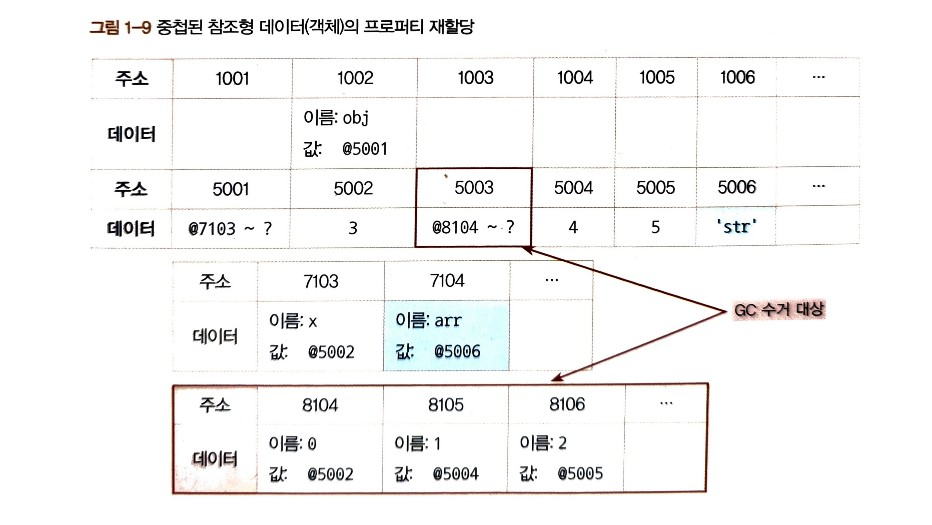
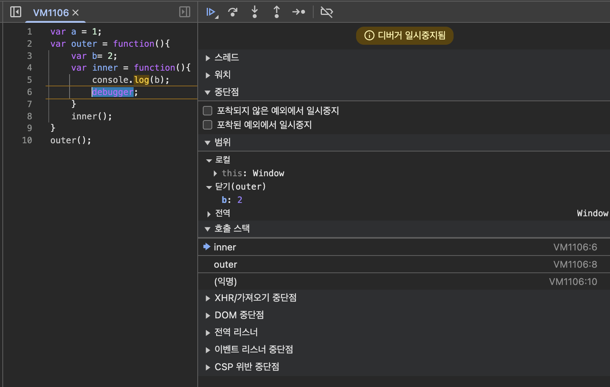

기본적인 자바스크립트 지식은 있기 때문에 새롭게 알게되었거나 중요하다고 생각하는 부분만 정리합니다.

# 1. 데이터 타입

자바스크립트의 데이터 타입

- 기본형(원시형, primitive): number, string, boolean, null, undefined
- 참조형(reference): object > array, function, date, RegExp, Map, WeakMap, Set, WeakSet

메모리 용량이 월등히 커진 상황에서 자바스크립트가 생성되었다. 그래서 숫자의 경우 정수형, 부동소수형을 구분하지 않고 64비트(8바이트)를 확보한다.(자바,C 등의 언어는 메모리 낭비를 막기 위해 비트별로 나눔)

---

용어 정리

- 변수(variable): 변할 수 있는 수(무언가)
- 식별자(identifier): 어떤 데이터를 식별하는데 사용하는 이름. 변수명
- 변수(variable)와 상수(constant)를 구분하는 성질은 '변경 가능성'이다.
- 불변값과 상수는 다르다.

  - 변수와 상수를 구분 짓는 변경 가능성의 대상은 **변수 영역** 메모리다.(let vs const)
  - 불변성 여부를 구분할 때의 변경 가능성의 대상은 **데이터 영역** 메모리다.(primitive vs reference)

---

데이터 할당

- 변수 영역과 데이터 영역으로 나누어지고 각각의 영역은 주소와 데이터 영역을 가진다.
- 같은 primitive를 여러 변수에 할당한다면 하나의 데이터 영역에 있는 주소와 데이터를 공유해서 사용한다. 즉 변수 영역은 여러개지만 데이터 영역은 하나다.
- 변수의 primitive가 변경되면 새로운 데이터 영역의 주소에 데이터를 할당하고 변수 영역의 데이터 값에서 참조하는 주소가 변경된다.
- reference를 다룰때는 데이터 영역의 데이터에 값을 저장하지 않고 객체의 변수 영역을 가리킨다. 그리고 객체의 변수 영역에서는 데이터 영역을 가리킨다. 만약 중첩 객체라면 데이터 영역에서 다시 중첩 객체의 변수 영역을 가리킨다. (데이터 영역안의 데이터 영역 같은 느낌. 이게 immutable과 mutable의 본질적인 차이다.)
- 참조 카운트: 어떤 데이터에 대해 자신의 주소를 참조하는 변수의 개수
- 참조 카운트가 0인 메모리는 gc의 수거 대상이다. 런타임 환경에 따라 특정 시점이나 메모리 사용량이 포화 상태에 임박할 때마다 자동으로 수거한다. 연쇄적으로 사라지는 경우도 있다.
- primitive와 reference 변수를 복사할 때 복사 과정은 동일하지만 데이터 할당 과정에서 이미 차이가 있기 때문에 변수 복사 이후의 동작에도 큰 차이가 발생한다.
  - 변수 영역의 데이터의 값에서 참고하는 주소값이 동일하다. primitive는 이 참고한 데이터 영역의 데이터에 값이 들어가지만, reference는 객체x의 변수 영역을 가리킨다. 그렇기 때문에 복사한 변수에 값을 재할당할 때 큰 차이가 발생한다.
- 대부분 자바스크립트에서 '기본형은 값을 복사하고 참조형은 주솟값을 복사한다'고 설명하지만, 사실 자바스크립트의 모든 데이터 타입은 참조형 데이터다. 다만 기본형은 주솟값을 복사하는 과정이 한 번만 이뤄지고, 참조형은 한 단계를 더 거치게 된다는 차이가 있다.

ex)

```
var obj = {
  x: 3,
  arr: [3, 4, 5]
};

obj.arr = 'str';
```



---

undefined와 null

- 비어있는 요소(array empty)와 undefined를 할당한 요소는 출력 결과부터 다르다.
- 사용자가 명시적으로 부여한 경우와 비어있는 요소에 접근하려 했을 때 반환되는 두 가지 경우의 'undefined'의 의미가 다르다. 전자는 고유의 키값(프로퍼티 이름)이 실존하고 순회의 대상이 되지만, 후자는 키값 자체가 존재하지 않다.
- 헷갈린다면 직접 undefined를 할당하지 않으면 된다. '비어있음'을 명시적으로 나타내고 싶으면 null을 사용하자.
- typeof null이 object인 것은 자바스크립트 버그다.

---

`내 생각`

데이터 할당 부분은 꽤 흥미로웠다. 이미 두꺼운 책을 본적이 있어서 배울게 있나? 했었는데 그래도 배울게 좀 있을 것 같다. 책도 짧고 어렵거나 핵심적인 부분만 담은 것 같아서 끝까지 읽어봐야겠다.

---

# 2. 실행 컨텍스트

- 이전에 공부할때랑 비교해서 새롭게 알게된 사실은 없다.([github 링크](https://github.com/yoonminsang/js-study?tab=readme-ov-file#%EC%8B%A4%ED%96%89-%EC%BB%A8%ED%85%8D%EC%8A%A4%ED%8A%B8), [동영상](https://www.youtube.com/watch?v=vuEYJRXSIdk))
- debugger를 활용하면 실제 스코프체인과 this 정보를 확인할 수 잇다.
  - 

# 3. this

[기존 정리 링크](https://github.com/yoonminsang/js-study?tab=readme-ov-file#this)

## 상황에 따라 달라지는 this

1. 전역 공간에서의 this

- 전역객체를 가리킴.(브라우저 window, nodejs global)
- 전역변수를 선언하면 자바스크립트 엔진은 이를 전역객체의 프로퍼티로 할당한다.
- 즉, 대부분의 경우 var로 선언한 전역변수와 window로 선언한 전역변수의 차이가 없다.
  - 하지만 삭제할때는 조금 다르다. var로 선언한 전역변수는 delete가 동작하지 않는다. 이는 configurable 속성을 다르게해서 방어 전략을 세운 것이다.
  - 전역객체의 프로퍼티로 선언한 경우는 호이스팅도 일어나지 않는다.

2. 메서드로서 호출할 때 그 메서드 내부에서의 this

- this에는 호출한 주체에 대한 정보가 담김.
- 호출 주체는 바로 함수명(프로퍼티명) 앞의 객체.

3. 함수로서 호출할 때 그 함수 내부에서의 this

- this가 지정되지 않는다.
- 메서드 내부에서 this를 우회하기 위해서는 변수를 사용하거나 화살표 함수를 사용하면 된다.
- 화살표 함수 내부에는 this가 없으며 접근하고자 하면 스코프체인상 가장 가까운 this에 접근하게 된다.

4. 콜백 함수 호출 시 그 함수 내부에서의 this

- 콜백함수의 제어권을 가지는 함수(메서드)가 콜백 함수에서의 this를 무엇으로 할지를 결정하며, 특별히 정의하지 않은 경우에는 기본적으로 함수와 마찬가지로 전역객체를 바라본다.

```
setTimeout(function () {
  console.log(this); // 전역 객체
}, 300);
document.body.querySelector('#a').addEventListener('click', function (e) {
  console.log(this); // id가 a인 태그. 화살표함수로 정의하면 전역객체가 나옴.
});

// 브라우저 내부 가상 코드
function addEventListener(type, callback) {
  // ... 이벤트 발생 시 ...
  callback.call(this); // 여기서 this는 이벤트를 등록한 엘리먼트!
}
```

5. 생성자 함수 내부에서의 this

- 생성자 함수가 생성한 인스턴스를 가리킨다.

## 명시적으로 this를 바인딩하는 방법

- call: 첫번째 인자 this 바인딩, 이후 인자들을 호출할 함수의 매게변수로 호출
- apply: call과 거의 동일. 첫번째 인자 this 바인등, 2번째 인자 배열로 호출

### call/apply 메서드의 활용

#### 유사배열객체(array-like-object)에 배열 메서드를 적용

```
var obj = {
  0: 'a',
  1: 'b',
  2: 'c',
  length: 3,
};
Array.prototype.push.call(obj, 'd');
console.log(obj); // {0:'a',1:'b',2:'c',3:'d',length:4}

var arr = Array.prototype.slice.call(obj);
console.log(arr); // ['a','b','c','d'];

Array.prototype.slice.call({}) // []
Array.prototype.slice.call({0:1,length:1}); // [1]
```

```
function a() {
  var argv = Array.prototype.slice.call(arguments);
  argv.forEach(function (arg) {
    console.log(arg);
  });
}
a(1, 2, 3);

document.body.innerHTML = '<div>a</div><div>b</div><div>c</div>';
var nodeList = document.querySelectorAll('div');
var nodeArr = Array.prototype.slice.call(nodeList);
nodeArr.forEach(function (node) {
  console.log(node);
});
// 1 2 3 <div>a</div> <div>b</div> <div>c</div>
```

[Array from 링크](https://developer.mozilla.org/ko/docs/Web/JavaScript/Reference/Global_Objects/Array/from)

```
// 문자열에 배열 메서드를 적용하면서 형변환할 수 있지만 ES6에서는 Array.from을 지원한다.
var obj = {
  0: 'a',
  1: 'b',
  2: 'c',
  length: 3,
};
var arr = Array.from(obj);
console.log(arr);
```

#### 생성자 내부에서 다른 생성자를 호출

```
function Person(name, gender) {
  this.name = name;
  this.gender = gender;
}
function Student(name, gender, scholol) {
  Person.call(this, name, gender);
  this.scholol = scholol;
}
function Employee(name, gender, company) {
  Person.apply(this, [name, gender]);
  this.company = company;
}
var by = new Student('보영', 'female', '단국대');
var jn = new Employee('재난', 'male', '구골');
```

```
// ES6 버전(책에 없음)
class Person {
  constructor(name, gender) {
    this.name = name;
    this.gender = gender;
  }
}
class Student extends Person {
  constructor(name, gender, school) {
    // 부모 생성자 호출 (Person.call(this, ...))
    super(name, gender);
    this.school = school;
  }
}
class Employee extends Person {
  constructor(name, gender, company) {
    // 부모 생성자 호출
    super(name, gender);
    this.company = company;
  }
}
const by = new Student('보영', 'female', '단국대');
const jn = new Employee('재난', 'male', '구골');
```

#### 여러 인수를 묶어 하나의 배열로 전달하고 싶을 때 - apply 활용

```
// 요즘은 ES6의 spread 연산자 사용
const numbers = [10, 20, 3, 16, 45];
var max = Math.max.apply(null, numbers);
const max = Math.max(...numbers);
```

- bind: 호출하지 않고 넘겨받은 this 및 인수들을 바탕으로 새로운 함수를 반환하는 메서드.

#### name 프로퍼티

```
// bind를 사용하면 name 프로퍼티에 bind의 수동태인 'bound'라는 접두어가 붙는다.
var func = function (a, b, c, d) {
  console.log(this, a, b, c, d);
};
var bindFunc = func.bind({ x: 1 }, 4, 5);
console.log(func.name); // func
console.log(bindFunc.name); // bound func
```

### 상위 컨텍스트의 this를 내부함수나 콜백 함수에 전달하기

```
// call
var obj = {
  outer: function () {
    console.log(this);
    var innerFunc = function () {
      console.log(this);
    };
    innerFunc.call(this);
  },
};
obj.outer();

// bind
var obj = {
  outer: function () {
    console.log(this);
    var innerFunc = function () {
      console.log(this);
    }.bind(this);
    innerFunc(this);
  },
};
obj.outer();
```

### 화살표 함수의 예외사항

```
// arrow function
var obj = {
  outer: function () {
    var innerFunc = () => {
      console.log(this);
    };
    innerFunc();
  },
};
obj.outer();
```

### 별도의 인자로 this를 받는 경우(콜백 함수 내에서의 this)

```
var report = {
  sum: 0,
  count: 0,
  add: function () {
    var args = Array.prototype.slice.call(arguments);
    args.forEach(function (entry) {
      this.sum += entry;
      ++this.count;
    }, this);
  },
  average: function () {
    return this.sum / this.count;
  },
};
report.add(60, 85, 95);
console.log(report.sum, report.count, report.average());
// 콜백함수와 함께 thisArg를 인자로 받는 메서드
// forEach, map, filter, some, every, find, findIndex, flatMap, from
```
