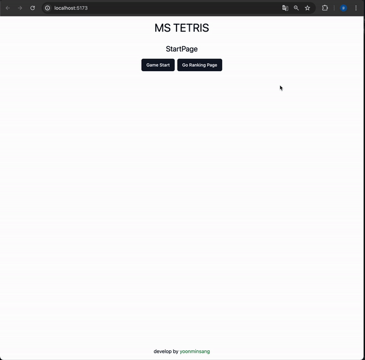

# 테트리스

- [PR목록보기](https://github.com/yoonminsang/TIL/pulls?q=is%3Apr+is%3Aclosed+label%3Atetris)
  

## 설계와 고민들

### 테트리스 페이지 나누기

- 테트리스를 다음과 같은 6개의 페이지로 나눈다. `type Page = 'start' | 'stage-intro' | 'play' | 'stage-clear' | 'dead' | 'ranking';`
- 일단 api를 연동하지 않기 때문에 새로고침해도 테트리스 게임 상태를 유지할 수 없다. 그렇기 때문에 일단은 react-router같은 라이브러리로 관리하지 않고 funnel 형태로 관리한다.
- 페이지 상태에 따라 페이지 컴포넌트를 렌더링하고, 페이지 상태를 변경하는 로직을 props로 넘겨주면 각각의 페이지 컴포넌트는 Page type에 대한 의존성이 제거된다.
- 과연 그럴까? 만약 funnel page 상태가 아니라 실제 페이지로 관리한다고 가정해보자. 그러면 결국 페이지에서 `push('/start')`같은 로직을 써야한다.
- 한번 더 생각해보면 하나의 페이지에서 상태 관리를 하는것과 페이지로 분리하는 것은 애초에 목적이 다르다. 페이지를 나눈다는 것은 새로고침했을 때 이전과 같은 UI를 보여준다는 것을 의미한다.
- 그렇기 때문에 page type에 대한 의존성주입을 적용한다.

### 게임외의 나머지 부분 생각하기

- 복잡한 게임은 가장 마지막에 고려한다.
- 게임로직외에 필요한 상태가 무엇인지 고려해보기
- 테트리스는 n번 stage를 clear하면 n+1번째 stage로 넘어가야한다. 즉 stage는 전역 상태로 관리해야한다.
- stage를 상태로 정의하고 play 페이지에서 clear한 경우와 dead한 경우를 테스트하기 위해서 임시로 버튼을 넣어서 테스트하자.
- 이로서 게임을 제외한 모든 부분은 작업을 완료할 수 있다.

### 게임 사전 작업

- UI와 이벤트는 처음부터 고려할필요가 없다. 처음에는 테트리스 게임을 관찰하고 필요한 데이터가 무엇인지 뽑아내는 작업이 필요하다. db 설계와 동일하게 생각하자.
- 게임과 관련없는 유틸 함수, 게임과 관련있는 코드, 상수, 타입등을 별도로 분리해서 생각하자.
- table과 block을 집중적으로 생각하자.
- 다음 블록은 항상 random으로 생성된다. random한 block을 얻는 함수를 만들어서 사용하자. 테스트코드에 의존성 주입을 하기 위해서 random한 값을 넘길 수 있는 인자를 넣자.
- table과 block을 하나의 UI로 결합해서 보여줘야한다. 또한 유저가 컨트롤하는 현재 position에 따라 block위치를 조절해야한다.
  - 한 단계 더 나누면 block과 position을 결합하는 코드가 필요하다.
  - 이건 코어한 게임로직이고 사용하는 쪽에서는 한단계 더 있는지 여부가 중요하지 않다. 노출할필요가 없는 코드는 노출하지 말자. R&R에 따라 자신의 역할을 명확히 하고 서로 전달하고 전달받는 부분만 신경쓰자.(단일책임원칙, 인터페이스 분리 원칙)
- block을 rotate하는 로직이 필요하다. 이건 결국 행렬의 90도 변환이다. 2x3행렬이 3x2행렬로 변할 수 있음도 고려하자.
  - 이런 독립적이고 복잡한 케이스는 TDD로 구현하면 좋다.

### 게임-1(UI 컴포넌트, useTetrisGame 훅 생성)

- 먼저 UI부터 생각하자
  - 게임이 진행되는 테이블과 다음 블록을 그려줘야한다.
  - 먼저 CellBlock 컴포넌트를 만들고 블록 타입에 따라 색을 정해줬다. 이렇게 하면 게임 코어 로직과 block UI를 구분할 수 있다. 예전에 강의에서는 block에서 색깔까지 지정해줬는데 나는 조금 더 역할분리를 하기 위해서 나눴다. 게임 코어 로직을 백엔드 그리는 부분을 프론트엔드라고 가정한다면 조금 더 납득이 될 것 같다. 백엔드에서는 UI색깔을 저장할필요가 없으니 말이다.
  - Renderer 컴포넌트에서는 table을 인자로 받아서 CellBlock을 적적히 렌더링시켜준다.
- 게임 사전 작업에서 오류 발견
  - combineBlockToTable가 제대로 렌더링되지 않는 문제를 발견했다. 굉장히 사소한 실수였는데 너무 간단한 코드라서 테스트코드를 안짜서 사전에 확인할 수 없었다. 간단하다고 테스트코드를 간과하지 말자.
  - combineBlockWithPosition에서도 버그가 있었다. 이것도 다시보니 바로 해결할 수 있을만큼 간단한 문제였는데 테스트코드를 조금만 더 꼼꼼히 짰으면 바로 잡을 수 있는 문제였다. 모든 경우를 테스트할 수는 없지만 가볍게 몇개의 케이스라도 짜좋는게 중요하다는 것을 느꼈다.
- 게임작업
  - 처음부터 모든 것을 고려하기는 어렵다. 그렇기 때문에 가볍게 전체적인 코드를 작성했다.
  - 코드가 어렵지 않은 부분은 바로바로 작성했고(적절한 위치의 파일에 코드 생성. 역할과 책임의 분리) 코드가 어려운 경우는 적절한 설명을 주석으로 달아놓고 이후에 작성했다.
  - getGameSpeed, useStopWatch, milliSecondsToTime, getBlockMaxSize, findCompletedLines, getGoalClearLine, isPossibleRender 생성
  - 1밀리세컨드마다 시간을 올려주는 기능을 넣다보니(useStopWatch) 1밀리 세컨드마다 모드 화면이 리렌더링되는 문제가 발생했다. 이 문제를 막기 위해서는 밀리세컨드를 페이지 전체가 아니라 작은 컴포넌트로 나누고 해당 컴포넌트에서 useStopWatch훅을 사용하면 된다. 그리고 만약 페이지에서 useStopWatch에 접근해야한다면 state끌어올리기를 적용하면 된다. 하지만 나는 지금 최적화를 고려하지 않는다. 최적화는 가장 마지막에 고려한다. 해결방법정도만 미리 알아두자.
    - 작업하다가 디버깅하기가 어려워져서 그냥 컴포넌트를 분리했다.(로그를 찍었는데 1ms마다 로그가 찍힘)
  - hash map을 이용해서 시간복잡도를 줄일 수 있는 부분이 있는데 굳이 array를 hash map으로 변경하지는 않았다. n이 많아야 20이하이기 때문에 가독성이 더 중요하다고 생각했다.
  - 원래 i 블록을 세로로 렌더링했는데 가로로 렌더링하게 변경했다. 왜냐하면 세로면 위에 4줄이 비어있어도 i블록이 나올경우 바로 죽기 때문이다.(UX 개선) 이와 유사하게 처음에 rotate를 시켜서 블록을 만들어줄수도 있는데 앞에서 얘기한 이유와 같은 이유로 적용하지 않았다.
  - useEffect의 사용은 최대한 지양하는게 좋다. 그렇기 때문에 useEffect를 최대한 사용하지 않다보니 if if if와 같은 문법이 나왔다. 가독성을 위해 early return 형태로 개선했다.
  - 아무리 역할과 책임으로 분리해도 리액트에서는 UI와 데이터를 다루는 로직이 섞이기 마련이다. 그래서 useTetrisGame으로 최대한 데이터를 다루는 부분을 추상화했다. 또한 UI를 다루는쪽에서 불필요한 코드는 외부로 노출시키지 않았다.

### 게임-2(기본적인 게임 형태 구현)

- combineBlockWithPosition에 오류가 있는것을 발견했다.
  - 이건 내가 잘못 생각한거라 테스트코드로도 방어할 수 없다.
  - 결국 이런 경우는 combineBlockWithPosition을 이용한 통합 테스트 or 유저테스트를 통해서 발견된다.
  - 잘못 생각하고 구현하면 테스트코드를 아무리 열심히 짜봐야 버그가 발생한다. 테스트코드도 중요하지만 결국 개인이 짜는 테스트코드라서 한계가 있다. 만약 다른 개발자가 짰다면 반드시 테스트케이스에서 걸렸겠지만 내가 구현하고 테스트케이스를 만들다보니 문제가 발생한다.
- useTetrisGame훅에 필요한 기능들과 버그를 하나씩 테스트하면서 진행했다.

  - 이 복잡한 훅을 어떻게 테스트해야되는지 약간 막막했다. 그 이유는 이 훅에 너무 많은 기능이 들어있기 때문이라는 생각이 들었다. 그래서 최대한 독립적인 코드를 helper에 분리하고 단위 테스트를 진행했다. 이 훅은 사실상 테트리스 게임의 모든 로직이 들어있기 때문에 단위테스트가 아니라 통합테스트다.
  - 이벤트 핸들러를 정의하지만 훅 입장에서는 왼쪽 키보드를 누르는 정보를 알 필요가 없다.(캡슐화, 관심사 분리) 기능을 명시하고 페이지에서 이벤트 핸들러를 정의한다. 나중에 키보드를 변경할 때 쉽게 대응할 수 있다. (ex. 기존의 왼쪽 화살표를 a키로 대체)
  - 아직은 이런 통합테스트 코드를 익숙하지 않다보니 일부만 작성하고 나머지는 모든 로직을 구현한 이후에 작성했다. TDD 방식으로 코드를 작성했다면 더 쉽게 버그를 발견하고 구현시간도 짧아졌을 것 같다. 통합테스트는 테스트 코드 작성이 필수적이라고 생각하지는 않지만 지금 케이스에는 테스트케이스(특히 TDD)가 의미가 있어보인다. 사실 TDD는 테스트케이스 작성능력도 중요하지만 개발외적인 요소도 중요한 것 같다. 개발자가 아니라 QA입장에서 생각을 했다면 description을 쉽게 작성할 수 있었을 것이다. 때로는 구현레벨 이전에 동작레벨부터 생각하는 것도 좋은 것 같다. 다음에 이런 경우가 있다면 TDD를 지금보다 적극적으로 사용해봐야겠다.
  - 통합테스트코드
    - 일단은 모든 코드를 완성한 이후에 통합테스트코드를 작성했다.
    - 그런데 통합테스트다보니 모킹이 꽤 많이 들어갔다. 최대한 모킹을 안하려고 노력은 했지만 어쩔수 없는 부분은 있는 것 같다.
    - 또한 테스트코드를 위해서 노출하고 싶은 코드가 있는데 실제로 필요없는 코드를 노출하기는 싫어서 조금 다른 방법으로 테스트를 했다. 테스트코드를 위해 캡슐화를 깨냐 마냐 얘기를 들어본적이 있는데 지금도 약간 비슷한 케이스다. 만약 현재 노출하고 있는 인터페이스에서 테스트가 불가능하다면 노출을 고려해보겠지만 어쨋든 테스트가 가능하니 일단은 넘어가자.
    - clearLine이 일정개수 이상이 되었을 때 다음 stage로 넘어가는 로직이 존재한다. 즉 clearLine모킹이 필요하다. 나는 훅 내부에서 state를 선언했는데 훅 내부를 변경하지 않고서는 테스트가 불가능하다.
      - 생각나는 방법으로는 setState를 훅의 인터페이스에 노출시키기, clearLine상태를 외부에서 주입받기가 있다. 둘다 별로 원하는 방식은 아니다...
      - getGoalClearLine이라는 함수를 만들었는데 이걸 모킹하면 훅의 변화없이도 가능하다는 것을 깨달았다! 이렇게 해야겠다.
    - 기본적인 테스트만 작성했는데 꽤 많은 테스트케이스가 나왔다. 엄청 어렵지는 않지만 엄청 쉽지도 않다. 연습이 필요할 것 같다.

### 게임-3(ux 개선)

- block row position이 음수일때도 가능하게 개선
  - 항상 i블록이 말썽이다.. i 블록 케이스를 대응하기 위해서 작업을 했는데 생각보다 시간이 많이 걸렸다.. 그래도 TDD 방식으로 개선하다보니 훨씬 수월했다.
  - i블록의 경우 rotate상태에 따라서 맨 왼쪽 혹은 맨 오른쪽으로 이동할 수 없는 문제가 존재했다. (row position이 0이여도 실제 ui는 맨 왼쪽에 있지 않기 때문에)
  ```
  [
    [false,false,true,false],
    [false,false,true,false],
    [false,false,true,false],
    [false,false,true,false],
  ]
  ```
- 블록 shape 변경
  - ux 개선 및 양끝에서 회전을 쉽게 구현하기 위해서 블록 shape를 변경했다.(https://tetr.io/, https://tetris.com/play-tetris 참고)
- 블록이 맨 왼쪽이나 오른쪽에 있을 때 회전되지 않는 문제 해결
  - 다른 테트리스 게임을 해보니 position을 변경시켜서 회전을 시켜주고 있었다. currentBlock.shape를 이용해서 변경할 position을 구하고 기존에 만들어둔 getIsPossibleRender을 이용해서 렌더링가능 여부를 확인한 후 position과 block을 동시에 변경시켰다.

### 게임4(그림자)

- ux가 크게 개선되는 그림자 작업을 추가했다.
- 기존에 handleChangeLastBottomPosition에서 하는 코드를 거의 그대로 옮긴거라서 작업은 어렵지 않다.

### 게임5(기타)

- space를 누르고 있을 때 여러번 이벤트가 발생하는 실수를 막는 기능 추가
- space를 누를 때 시간 delay를 초기화시키는 기능 추가
  - intervalcallback이 1초마다 실행된다고 가정했을 때 0.9초에 space를 누르면 0.1초후에 다음 블록이 내려오고 있었음. 다른 테트리스 게임으로 테스트를 해보고 delay를 초기화시키는 방법으로 변경함
- dead를 판단하는 시점 변경
  - intervalcallback에서 실행하면 계속 space를 누를때 영원히 intervalcallback이 실행되지 않아서 죽지 않는 현상 발생
  - crash가 발생했을 때 dead여부를 판단해주면 위와같은 버그도 사라지고 더 빠른 진행이 가능하다
- holdblock 기능 추가
- 시계반대방향 회전 이벤트 핸들러 추가(control)
- 블록에 대한 UI와 기능을 분리
  - 기존에는 훅에서 렌더링하기 위한 변환과정까지 끝내서 넘겨주고 있었는데 이렇게 하면 UI와 데이터가 결합되는 문제가 있다.
  - tableForRender는 현재 block과 table 두개를 결합해서 사용되고 훅 내부에서도 사용되기 때문에 일단은 훅 내부에서 관리함
- 테스트코드 오류 전부 수정

---

# React + TypeScript + Vite

This template provides a minimal setup to get React working in Vite with HMR and some ESLint rules.

Currently, two official plugins are available:

- [@vitejs/plugin-react](https://github.com/vitejs/vite-plugin-react/blob/main/packages/plugin-react/README.md) uses [Babel](https://babeljs.io/) for Fast Refresh
- [@vitejs/plugin-react-swc](https://github.com/vitejs/vite-plugin-react-swc) uses [SWC](https://swc.rs/) for Fast Refresh

## Expanding the ESLint configuration

If you are developing a production application, we recommend updating the configuration to enable type aware lint rules:

- Configure the top-level `parserOptions` property like this:

```js
export default {
  // other rules...
  parserOptions: {
    ecmaVersion: 'latest',
    sourceType: 'module',
    project: ['./tsconfig.json', './tsconfig.node.json'],
    tsconfigRootDir: __dirname,
  },
};
```

- Replace `plugin:@typescript-eslint/recommended` to `plugin:@typescript-eslint/recommended-type-checked` or `plugin:@typescript-eslint/strict-type-checked`
- Optionally add `plugin:@typescript-eslint/stylistic-type-checked`
- Install [eslint-plugin-react](https://github.com/jsx-eslint/eslint-plugin-react) and add `plugin:react/recommended` & `plugin:react/jsx-runtime` to the `extends` list
