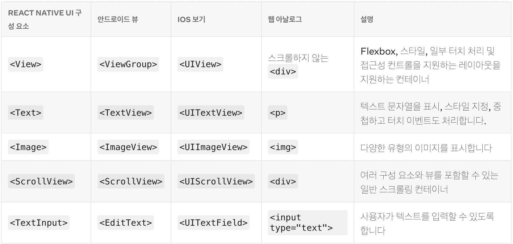

## [공식문서](https://reactnative.dev/docs/getting-started)

### The Basics



### Using List Views

- 데이터가 많을때는 ScrollView를 사용하면 안됌. 앱은 성능이 중요하니까 웹에서 대용량 데이터를 다룰 때 가상스크롤을 다룬 다고 생각하자.

FlatList

- 모든 요소를 한 번에 렌더링 하지 않는다. data, renderItem props를 가진다.

```
const FlatListBasics = () => {
  return (
    <View style={styles.container}>
      <FlatList
        data={[
          {key: 'Devin'},
          {key: 'Dan'},
          {key: 'Dominic'},
          {key: 'Jackson'},
          {key: 'James'},
          {key: 'Joel'},
          {key: 'John'},
          {key: 'Jillian'},
          {key: 'Jimmy'},
          {key: 'Julie'},
        ]}
        renderItem={({item}) => <Text style={styles.item}>{item.key}</Text>}
      />
    </View>
  );
};
```

SectionList

- 헤더와 함께 렌더링하는 경우 사용한다.

```
const SectionListBasics = () => {
  return (
    <View style={styles.container}>
      <SectionList
        sections={[
          {title: 'D', data: ['Devin', 'Dan', 'Dominic']},
          {
            title: 'J',
            data: [
              'Jackson',
              'James',
              'Jillian',
              'Jimmy',
              'Joel',
              'John',
              'Julie',
            ],
          },
        ]}
        renderItem={({item}) => <Text style={styles.item}>{item}</Text>}
        renderSectionHeader={({section}) => (
          <Text style={styles.sectionHeader}>{section.title}</Text>
        )}
        keyExtractor={item => `basicListEntry-${item}`}
      />
    </View>
  );
};
```
