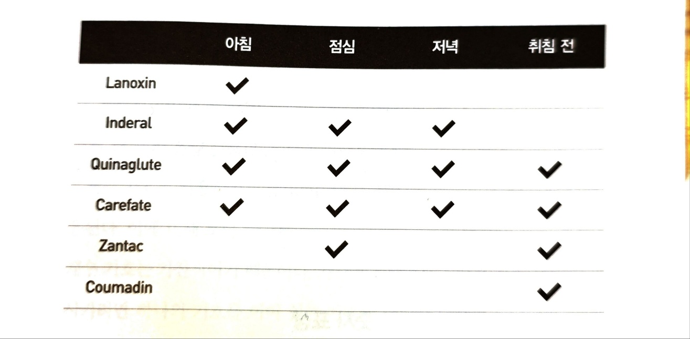

# 서문

> 우리는 기계중심적 관점을 유보하고 그것을 인간중심적 관점으로, 즉 기술이 인간을 섬기는 것으로 전환해야 한다.

인지심리학

# 제1장. 인간 중심의 기술

과학의 발전으로 인한 장단점이 존재한다. 그리고 몇몇 사람들은 인공물 중에서 어떤 것은 이익이, 어떤 것은 해롭다고 생각한다. 이것은 과학기술이 우연히 발전되었기 때문이다.

1993년 시카고에서 열린 만국박람회에서는 "과학은 발견하고, 산업은 응용하며, 인간은 이를 수용한다."라는 표어를 만들었다. 이런 기계중심적 인간관은 잘못되었다. 인간중심적 관점이 반영되지 않은 과학기술은 실수하게 마련인 인간을 보조할 수도, 그 실수의 여파도 최소화하지 못한다. 효율적이고 반복적인 작업 공정은 기계에는 적합할지 모르지만 인간의 신체 조건에는 적합하지 않다.

```
최근에는 AI가 떠오르면서 이와 비슷한 말이 다시금 나오고 있다. 아직까지는 사람이 주도권을 가지지만 언젠가는 인간이 이를 수용할지도 모르는 미래가 다가오고 있다.
```

## 인지의 두가지 종류

### 체험적 양식

주변의 사건들을 효율적, 자동적으로 지각하고 반응하도록 한다.

### 반성적 양식

사물들을 서로 비교하거나 대조할 때, 그리고 깊이 생각하거나 의사 결정할 때 주로 활용된다.

적절한 정도로 반성을 유지해야한다.

# 제2장. 세상을 경험하기

박물관은 개발자들은 왜 체험적 인지만 제공하고 반성적 인지를 제공하지 못할까? 관객들이 재미없는 과학 얘기를 선호하지 않기 때문에 체험적 양식으로 동기부여만 주는 것도 좋다. 하지만 게임처럼 반성적 양식을 제공할 수는 없을까?

비행 조종사는 특정 상황에 직면하는 적절한 반응을 해야한다. 이는 체험적 사고다.
폭풍우가 탐지된 경우에는 체험적 사고만으로는 한계가 있다. 반성적 사고가 필요하다.

```
누군가는 개발에서 반복된 패턴을 학습하고 반복해야 된다고 한다. 이건 체험적 양식에 가까운 행동이다. 전문가가 되기 위해서는 자연스럽게 이런 지식을 가지고 있어야한다. 더 나아가면 체계화된 문서, SKILL을 만들 수 있다.
동시에 개발자는 반복 업무만 하는 사람이 아니다. 한번도 해보지 않은 경험도 해야만 한다. 그리고 이걸 하기 위해서는 이전에 학습한 체험적 인지(CS, 경험)가 사용된다.
반복적인 상황에는 체험적 인지가, 그렇지 않은 경우에는 반성적 인지가 필요하다.
```

현재 과학 기술의 많은 부분이 우리를 체험적 사고나 반성적 사고 중의 한쪽 극단으로만 몰고 가는 것처럼 보이기 때문에, 우리는 적절한 인공물을 통해 각 양식의 능력을 향상시킬 수 있다.

위험한 경우

- 반성적 양식을 필요로 하는 체험적 양식의 행동을 위한 도구
  - 사용하기 어려운 카메라, 작동하기 어려운 자동차
- 비교, 탐구, 그리고 문제 해결을 지지해주지 못하는 반성을 위한 도구
  - 제한된 화면의 쓰기와 그리기
- **반성을 해야할 때 체험하기**
  - 이게 제일 심각하다. 체험적 형태의 사고가 나중에는 이성과 반성을 대신한다고 믿게 되기도 한다.
- 체험을 해야할 때 반성하기

일만하면, 삶에서 어떤 보상도 얻을 수 없다. 반대로 놀기만 하면 인간의 생존과 진보를 보장하지 못한다. 정신세계에서는 놀이와 일의 관계과 체험적 인지와 반성적 인지의 두 가지 양식으로 나타난다.

## 두 종류의 인지와 세 종류의 학습

### 축적

사실의 누적.

### 조정

초심자의 초보적인 수행과 전문가의 숙련되고 자연스러운 수행 사이에는 수많은 연습시간 만큼의 차이가 있다.
조정은 서서히 일어나고 최소한 5천 시간(약 2년)이 걸린다. 이게 충분하지 않을수도 있다.
우리는 이따금 숙련된 행동이 아무런 노력 없이 쉽게 획득될 수 있다고 믿고 있는 것처럼 보인다. 먹기, 걷기, 말하기, 읽기, 쓰기 등의 가장 근본적인 활동조차도 익숙해지기까지 수년 동안의 조정과 학습, 그리고 연습이 있었다.

### 구조조정

축적과 조정이 주로 체험적 양식이라면 재구조화는 반성적 양식이다.
재구조화 과정에서 새로운 개념적 기술을 익히지만, 이는 매우 어렵다.
핵심은 학생들로 하여금 골치 아픈 반성적 사고를 하고 싶도록 만드는 일이다.

```
개발로 한정했을 때 나는 지금 어느 단계에 있을까?
기본적인 지식은 이미 축적되었다. 요구사항을 받았을 때 대부분의 경우는 바로 어떻게 해야하는지 알고 있다. 즉 조정도 된 상태다.
때때로 배우지 않은, 경험하지 않은 요구사항을 받을 때가 있다. 그리고 회사에서 풀어야하는 꽤 많은 문제들은 베스트 프렉티스가 없는 문제들이다. 이때는 구조조정이 필요하다. 머리싸매고 고민하는 것들. AI만으로는 풀 수 없는 것들.
```

동기야말로 인지적 변수보다 훨씬 더 강력한 변수로 판명된 것이다.
엔터테인먼트 매체는 거의 전적으로 동기만을 취급한다. 체험적 형태를 취한다. 그럼에도 불구하고 오락물은 반성적 사고를 하게 하는 자극이나 원동력을 제공할 수는 있다.

```
동기유발. 이게 진짜 중요하다.
다른게 다 좋아도 이게 안되면 아무 소용없다. 좋은 조건 다 버리고 하고 싶은 일을 찾아 떠나는 사람들을 본적이 있을 것이다. 반대로 동기부여때문에 좋지 못한 환경에 계속 있는 사람도 보인다.
```

## 최적의 몰입

최적의 몰입을 이끌어내는 것이 무엇인지에 관해 두 종류의 연구
브렌다 로럴의 '1인칭 경험', 수잔 뷔드커의 '인간 활동 접근'

방해란 외부에서만 오는 것이 아니다. 가끔 과제를 위해 사용하는 도구 때문에 방해를 받기도 한다. 전문가들은 적절하게 고안된 도구를 자동적으로, 그리고 무의식적으로 사용한다. 도구와 사람, 그리고 과제는 구분 없이 하나로 통합되어야 한다.

```
지금도 가끔 도구 때문에 방해를 받는건 여전하다. 프론트엔드의 새로운 기술, AI, 하네스와 거버넌스 등등..
이렇게 말하면 내가 이런 기술들을 싫어하는 것 같은데 나는 관심있게 보고 있는 사람 중 한명이다.
다만, 가끔 방해를 받는건 사실이다.
```

최적의 경험을 유도하는 환경

- 강도 높은 상호작용과 피드백을 제공해야 한다.
- 구체적인 목표와 확고한 절차가 있어야 한다.
- 동기를 유발해야 한다.
- 지속적인 도전 의식을 제공해야 한다. 너무 쉬워서 지루해서도 안 되고, 너무 어려워서 절망감이나 좌절감을 느끼게 해서도 안 된다.
- 직접적인 참여 의식을 느낄 수 있도록 해야 한다. 상황을 직접 경험하고 있다는 느낌과 과제를 직접 수행하고 있다는 느낌을 주어야 한다.
- 사용자에게 잘 맞는 적합한 도구를 제공하되 사용자의 주의를 분산시키지 않고 과제수행에 적절해야 한다.
- 주관적인 경험을 방해하고 주의를 분산시키는 장애물들은 피해야 한다.

게임은 사건 중심적인 활동이기 때문에 자극적 요소가 다분하며 사람을 가만 두지 않는다. 또 게임은 새로운 자극을 계속해서 제시하여 사용자의 주의를 유지시키고 새로운 도전 의식을 심어준다.

교사는 무엇을 가르쳐야 할지 잘 알지만, 학습에 열중하게 하는 방법을 파악하는 데는 대단히 서툴다. 반면 오란 분야는 관심과 흥분을 일으키는 방법을 알기 때문에 정보와 이미지를 효율적으로 조작할 수 있지만, 무엇을 가르쳐야 하는지 모른다.
이 기술을 통합해야 한다.

```
교육 스타트업에 있어봤다. 저자의 말처럼 동기유발이 핵심이라는 건 공감하지만, 그걸 사업으로 성공시키는 건 정말 어렵다.
```

교실은 동기를 제공해주고, 나중의 반성적 사고에 필요한 정보를 제공해주는 이상적인 환경이어야 한다.

# 제3장. 표상의 힘

소크라테스는 책이 사고를 해친다고 주장했다. 오히려 대화가 중요하고, 이를 통해 다른 사람의 생각을 파악하면서 의문을 제기할 수 있다고 생각했다. 그런데 책 속에는 저자가 없으니 대답할 수 없다. 이 점이 소크라테스를 괴롭혔다.
중세시대에는 독자의 마음속에서 정교화되지 않거나 소리 내어 읽은 후 집단적 토론과 논쟁을 거치지 않는다면 완전하다고 생각하지 않았다. 한 문장을 읽고 의문을 제시했다. 이건 소크라테스가 불가능하다고 주장한 그 방식이다.
그러나 오늘날 우리의 독서는 소크라테스의 염려만큼 퇴행한 것 같다. 우리는 저자의 생각에 의문을 제기하지 않고 그냥 신속히 읽기만 한다.
독자들이 자료에 대해 반성적으로 사고하고 추론하는 방법을 알지 못하는 한, 책은 반성적 사고의 도구가 될 수 없다.

```
내가 평소에 엄청 많이 하는 생각이다. 책을 빨리 많이 읽어봐야 아무 소용없다. 그래서 나는 책 한권을 읽는데 굉장히 많은 시간이 걸린다.
내 이전 경험을 되돌아보면서 칭찬하거나 반성기도 하고, 저자의 의견에 반박하기도 한다. 때로는 명확하지 않은 정답이 없는 다양한 관점의 글을 쓰기도 한다.
```

## 인지적 인공물

인지의 힘은 추상화와 표상으로부터 비롯된다. 지각, 경험, 사고 등에서 불필요한 세부 사항을 추려내고(즉 추상하고) 다른 수단으로 나타내는(즉 표상하는) 능력이 바로 지능의 핵심이다. 왜냐하면, 표상 과정이 정확하면 새로운 경험, 통찰력, 창조물이 나타날 수 있기 때문이다.

중요한 것만을 표상하면 사람들이 부적절한 자극에 방해를 받지 않고 본질에 집중할 수 있다.

체험적인 인공물은 마음과 세상을 매개하는 것이다.
반면 반성적 인공물은 현실 세계를 무시하고 인공적으로 '표상하는' 세상에만 집중중할 수 있도록 한다. 이는 새로운 발견을 할 수 있지만, 표상을 잘못 판단할 때는 위험하다.
표상에 드러나지 않더라도 중요할 수 있다. 하지만 우리는 측정되거나, 표상할 수 있는 것만을 중요시하며, 그것들은 잊혀진다.

```
개발하면 추상화를 빼놓을 수 없다. 이젠 여기저기서 추상화 얘기가 나오면 나도 모르게 정신이 번뜩한다. 특히 개발서적이 아닌 경우에.
```

## 과제에 적합한 표상 연결하기

어떤 문제를 해결한다는 것은, 해답이 분명하도록 표상을 형성하는 것을 의미한다.

사람은 공간적 표상인 세목놀이가 쉽지만, 컴퓨터는 연산 문제가 더 쉽다.

비행기 노선 안내서는 과제(상황)에 따라 좋은 표상이 다르다.

```
비행기 표상은 정말 좋은 예시다. 이것 때문에 많은 디자이너, 프론트 개발자가 고통받는다.
그렇다고 모든 케이스를 다 대응할수는 없다. B2B에서는 이런 다양한 케이스들을 모두 대응해야만 하는 경우가 있다. 그 결과 앱은 복잡해져서 좋은 UX와는 거리가 멀어진다. 이 툴을 배우기 위해 많은 시간을 써야한다. B2C에서는 한가지 경우만 대응하기도 하고, 몇개만 대응하기도 하고, 다양한 케이스를 모두 대응하기도 한다. 앱마다 이런 결정이 다른건 과제에 따라 좋은 표상이 다르기 때문이다. 결국 표상으로 시작해서 표상으로 끝난다. 이런 정답이 없는 문제를 해결하는게 반성적 인지다.
```

## 어떻게 표상이 정보에 대한 접근과 판단을 도와주는가

### 의료 처방전

10~30%의 사람들은 정해진 시간에 얼마나 약을 복용해야 하는지 결정하지 못한다.
동네 약국은 '약 정리함'으로 주, 날, 시간별로 이름을 붙여 상자별로 나누어 놓았다. 하지만, 약을 배분하는 문제는 여전히 남았다.

문제 중 하나는 처방이 환자의 관점에서 작성된 것이 아니라는 것이다.

```
Inderal - 한 정씩 하루에 세 번
Lanoxin - 한 정씩 매일 아침
Carafate - 식전과 취침 시 한정
Zantac - 매 12시간마다(하루에 두 번) 한 정
Quinagulte - 하루에 네 번 한정
Coumadin - 하루에 한 정
```

이런 질문에 답변하기 어렵다.

```
1. 점심시간(12시)이다. 어떤 약을 먹어야 할까?
2. 점심 때 집을 떠나 다음날 아침까지 돌아오지 않을 것이다. 어떤 종류의 약을 얼마나 챙겨가야 할까?
```

문제는 처방을 따르는 것이 체험적 과제가 되어야 하는데 반성적 과제로 이루어졌다는 데 있다.
행렬으로 만들면 된다.



---

더하기는 아라비아 숫자보다 로마 숫자가 더 쉽다. (너가 놀라는건 로마 숫자 기호를 배우지 않아서 그렇다. 물론 곱셉과 나눗셈을 배우기 전까지만..)

---

자연스러움의 원리: 표상의 특징이 표상되어지는 대상의 특징과 맞아 떨어질 때 체험적 인지가 쉽다.

지각적, 공간적 표상이 더 자연스럽다. 단, 표상과 표상이 나타내는 것 간의 대응이 매끄러울때만.

아라비아 숫자의 비교는 어렵다. 아라비아 숫자는 반성적 사고를 요구한다. 과거에는 아라비아 교육을 많이 받은 사람만 사용할 수 있었고, 사용 여부 자체가 논쟁거리이고 사용이 금지되기도 했다. 물론 연산 등의 숫자 조작이 필요한 경우는 아라비아 표기법이 우수하다.

표상을 적절하게만 선택한다면, 어려운 과제도 쉽게 해결할 수 있다.

```
대상에 따라, 관점에 따라 추상화, 표상이 달라야한다. 이걸 놓치고 있는 경우가 너무 많다. 쉬운데 놓치는게 아니다. 어려운 일이다. 그러니까 내가 과거에도 지금도 학습, 회고를 지속하고 있는거겠지.
```

# 제4장. 인공물을 사람에게 맞추기

기억하기 위해 적어두는 것은 현명한 일이다. 그러나 기록해둔다고 해서 실제 기억이 변하는 것은 아니다. 인공물은 인간의 인지능력을 변화시키는 것이 아니라 우리가 해야 할 일을 바꾸어줄 뿐이다.

---

인지적 인공물에 대한 두가지 견해

1. 개인적인 관점

인공물은 과제를 변화시킨다.

2. 시스템적 관점

사람 + 인공물은 어느 한 쪽만 있을 때보다 더 현명하다.

인공물을 배우기 위해서는 학습이 피룡하다. 읽기, 쓰기, 계산능력은 가장 강력한 인지 기술이지만, 이런 정신적인 인공물을 배우는 데는 수년이 걸린다.

---

표면 표상과 내적 표상

인공물은 가시상에 따라 표면 인공물과 내적 인공물의 두 범주로 나눌 수 있다.

표면 인공물: 보이는 것이 전부
내적 인공물: 정보의 일부가 인공물 내부에 표상되어 사용자에게는 보이지 않는다.

---

우리가 순간적인 판단을 할 때는 수학적이거나 상징적인 논리로서 계산하지 않는다. 지각적 과정을 통해 반응한다.

---

가장 좋은 인공물은 과제가 인공물과 완전히 융합되어 있으면서도 눈으로 보이지 않는 것이다. 이렇게 만들어진 것들은 사용하기 즐겁다.

디자인인팀은 인공물로 사용의 도움을 주려는 과제와 그것을 사용할 사람들을 고려하는 것에서부터 출발해야 한다. 이것을 달성하기 위해 디자인팀은 인간의 인지, 사회적 상호작용, 지원되어야 할 과제 및 사용될 기술에 대한 전문 지식을 망라해야만 한다.

전화 음성 메세지 시스템
"여러분의 시간이 고객들의 시간보다 더 가치 있다는 셈이군"라고 말하며 이 시스템을 폐지한 경우가 있다.
전화 시스템에서 이득은 회사에, 부담은 사용자들에게 떨어졌다.

그루딘의 법칙: 이득을 얻는 사람들이 그 일을 하는 사람들이 아닐 때, 그 기술은 실패하거나 최소한 사라질 것이다.

# 제5장. 인간의 마음

뇌는 매우 복잡하다. 논리적 분석은 측정 가능한 정보에만 적용되는 한계가 있다. 퍼지 논리 같은 접근도 수치화할 수 없는 중요한 요소들은 다루지 못한다. 인간의 마음은 단순한 논리 연산기가 아니다.

# 제6장. 분산 인지

인지는 개인의 머릿속에만 있는 게 아니다. 도구, 환경, 다른 사람들과 함께 분산되어 있다. 현실 세계는 불가능한 것을 불가능하게 만드는 제약을 제공한다. 시뮬레이션이나 시스템 설계 시 이 현실 제약을 반영해야 한다.

# 제7장. 모든 것에는 적절한 자리가 있고, 모든 것을 제자리에 놓아야 한다.

정보 조직 방식의 역사를 추적한다. 파일 캐비닛, 알파벳 사전 등이 정보 분류 문제를 해결해왔다. 컴퓨터는 조직 구조에 관계없이 빠른 검색을 가능하게 해서 정보 접근 방식을 근본적으로 바꿨다.

# 제8장. 미래를 예측하기

복잡한 기술 변화를 정확히 예측할 방법은 없다. 그럼에도 합리적인 시나리오를 개발하는 것이 중요하다. 노먼이 공통적으로 예측한 것들: 디지털 정보의 증가, 고용량 통신망의 보편화, 더 강력하고 저렴한 컴퓨팅, 몸의 움직임과 연동된 몰입형 3D 경험.

# 제9장. 소프트 기술과 하드 기술

인간은 창의성·언어·예술·적응력에서 뛰어나고, 기계는 정밀성·논리에서 강하다. 계산기나 책처럼 인간의 능력을 지원하는 기술이 "소프트(부드러운)" 기술이다. 인간 중심 관점 vs 기계 중심 관점의 대립을 다룬다.

# 제10장. 기술은 중립적이지 않다.

기술은 어떤 행동은 쉽게, 어떤 행동은 어렵게 만드는 고유한 특성이 있다. 맥루한의 "미디어는 중립적 전달자"라는 주장에 반박한다 — 매체 자체가 사용 방식과 사회적 영향을 결정한다. 반성적 사고를 위해서는 종이와 연필 같은 구성적 매체와 충분한 시간이 필요하다.
