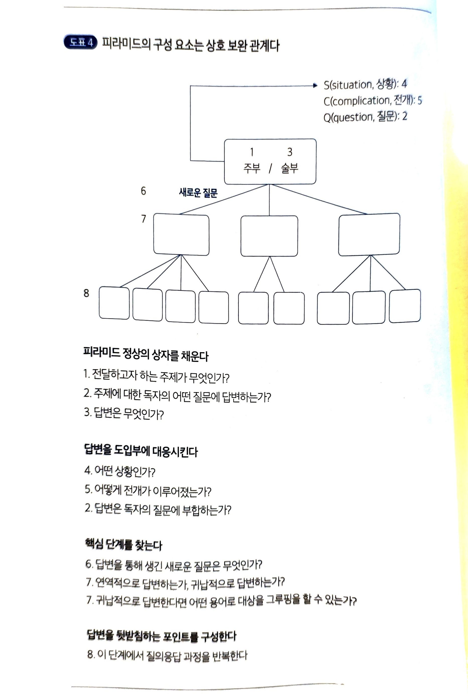

글이란 본래 생각을 전달하는 도구.

## 1부 논리적으로 글쓰기

문체를 바꾸는 것은 쉽지 않다. 글의 구성은 고치기도 쉽고 효과도 더 좋다.
글의 구성에 피라미드 원칙을 사용해라.
맨 위에 주요하고 핵심적인 한 가지 생각. 구체적이고 세부적인 생각의 그룹이 떠받히는 형태
피라미드 내부는 수평과 수직으로 연결

### 1장 왜 피라미드 구조인가

함께 표현된 생각을 그룹으로 인식하여 논리적 유형을 부여한다. 이 논리적 유형은 항상 피라미드 구조를 취한다.
왜냐하면 피라미드 구조는 '뇌의 요구'를 충족하기 때문이다.

**뇌의 구조**

1. 마법의 숫자 7에서 멈춘다.

한 번에 최대 7개만 기억 가능.
아내가 남편한테 이것자것 다 사오라고 하면 남편은 기억하지 못한다.

2. 관련성의 논리를 명확하게 밝힌다.

아무렇게나 그루핑해서는 안 된다.

```
예전에 코드스피츠 객체지향에서 공부한 카테고라이징, 그루핑을 생각해보자.
```

글을 쓸 때는 자신이 전달하고자 하는 내용을 상대의 뇌 피라미드 구조에 맞게 잘 정리해야 한다.

```
내 피라미드 구조가 아니라 상대의 뇌 피라미드 구조다. 내 피라미드 구조로 만들어서 전달하는 것도 어려울 때가 있는데, 상대의 뇌 피라미드 구조로 전달하려면 역량이 필요하다.
```

---

**위에서 아래로 배열하기**

핵심을 먼저 말한 뒤 부수적인 사항을 거론하라. 부수적인 사항부터 얘기하면 핵심을 파악하기가 어렵다.

---

**아래에서 위로 생각하기**

규칙1. 어떤 계층에 있는 메세지든 하위 계층의 메세지를 요약해야 한다.
규칙2. 그룹 내의 메세지는 항상 동일한 종류여야 한다.
(복수명사로 묶을 수 있는지 확인)

규칙3. 그룹 내의 메시지는 항상 논리적 순서로 배열되어야 한다.

- 연역적 순서(대전제, 소전제, 결론)
- 시간적 순서(첫 번째, 두 번째, 세 번째)
- 구조적 순서(보스턴, 뉴욕, 워싱턴 등)
- 비교적 순서(첫 번째 중요한 점, 두 번째 중요한 점 등)

(이외의 다른 방법으로는 글의 순서를 정할 수 없다.)

### 2장 피라미드 내부 구조 살펴보기

글을 쓰기 전에 자신이 무엇을 말하고자 하는지 명확하게 알고 있으면 비교적 쉽게 적절한 피라미드를 만들 수 있다.
그러나 글르 쓰기 전에 이걸 명확히 알고 있는 사람은 거의 없다.

2장,3장에서는 먼저 자기 머릿속을 정리하는 방법을 소개한다.

**피라미드 내부 구조**

- 핵심 포인트와 보조 포인트 간의 수직적 관계
- 보조 포인트 간의 수평적 관계
- 도입부의 흐름

**수직적 관계**

수직적 관계를 통해 질의응답 형식으로 대화가 진행되면, 독자는 메시지에 논리적으로 대응할 수 있으므로 글에 흥미

```
나는 가끔 예상질문 답변을 글에 적을때가 있다. 해당 케이스를 생각해보면 좋을듯
```

---

**수평적 관계**

귀납적 추론 or 연역적 추론 중 한 가지를 선택하여 논리적으로 답변해야 한다. 두가지가 전부다.
귀납적: 개별적이고 구체적인 관찰과 사실들을 바탕으로 보편적인 법칙이나 일반적인 결론을 도출하는 논리적 사고 과정
연역적: 이미 알고 있는 보편적인 사실이나 법칙(전제)을 바탕으로 특정한 결론을 이끌어내는 논리적 사고 과정

연역적

모든 인간은 죽는다.
소크라테스튼 인간이다.
그러므로 소크라테스는 죽는다.

=> "그러므로"로 시작되는 결론 도출

귀납적

프랑스 군대의 탱크가 폴란드 국경에 배치되었다.
독일 군대의 탱크가 폴란드 국경에 배치되었다.
러시아 군대의 탱크가 폴란드 국경에 배치되었다.

=> 그룹 내의 생각은 논리적으로 동일, 동일한 내용을 나타내는 항목으로 구성

피라미드의 핵심 메시지는 독자의 모든 질문에 답변해야 한다.

---

**도입부의 흐름**

도입부에서 독자와 관련이 없는 내용을 담고 있다면 흥미 유발 불가능.
=> 독자의 마음에 직접적으로 답하는 진술로 도입부를 시작해야한다.

독자가 이미 알고 있거나 혹은 알고 있다고 생각되는 내용을 스토리 형식으로 구성하여 독자가 이미 가지고 있는 질문을 상기시킨다.
=> '상황' 설정, 그 안에서 '전개'가 이루어짐, '질문'이 생기고, 본문에서 질문에 '답변'을 하는 형태로 스토리가 전개

### 3장 피라미드 구조는 어떻게 만드는가

**위에서 아래로 내려가는 접근법**



1단계: 네모난 상자를 하나 그린다.
피라미드 정상에 그리고 주제를 적어라. 모르면 2단계로 넘어간다.

2단계: 질문을 결정한다.
독자를 상상하라. 독자의 어떤 질문에 답변하기를 바라는가.
질문을 알면 적고, 모르면 4단계로 넘어간다.

```
내가 질문해보니 "왜 하나요?"라는 생각이 들었다. 스마트브레비티에서도 왜 중요한가를 엄청 강조했다. 그렇게 핵심만 요약해서 적는 글에도 꼭 들어가는만큼 왜는 여기서도 자주 사용될 것 같다. 그것말고 다른 선택지를 선택하지 않은 이유를 궁금해할 것 같기도 하다.
```

3단계: 답변을 적는다.
알면 적고, 답변을 모른다면 답변할 수 있다고 메모해둔다.(모르면 이후 단계에서 발굴한다)

4단계: 상황을 명확하게 파악한다.
독자의 질문과 답변 파악.
독자가 쉽게 납득할 수 있는 것 부터 기술.
이건 이미 알고 있거나 과거 사례, 쉽게 확인하여 공감할 수 있는 것 중 하나다.

5단계: 전개를 기술한다.
독자를 설정하고 모의로 질의응답하기.
그래서요? 라고 묻는다면 왜 이런일이 발생했는지 확인.

6단게: 질문과 답변을 다시 확인한다.
전개의 진술은 즉각적으로 독자에게 당신이 이미 써놓은 질문을 유발해야한다.

**아래에서 위로 내려가는 접근법**

자기 생각을 제대로 파악하지 못하면 피라미드의 정상을 완성할 수 없다.
글의 주제가 무엇인지 확실하게 결정하지 못했거나, 질문이 명확하지 않은 경우. 독자가 무엇을 알고, 무엇을 알지 못하는지 정확하게 파악하지 못한 경우.

- 말하고자 하는 포인트를 모두 적는다.
- 포인트 사이에 어떤 관계가 있는지 파악한다.
- 이를 통해 결론을 도출한다.

제목에는 분류가 아니라 메시지의 핵심이 포함되어야 한다.
'조사 결과', '결론' 등과 같은 소제목은 절대로 붙여서는 안된다.
고쳐 쓴 문서가 이해하기 쉬운 이유는 독자의 생각을 피라미드 구졸조 배열했기 때문이다. 문장 형식을 바꿨기 때문이 아니다.

**초보자를 위한 충고**

- 글을 쓰기 전에 먼저 생각을 정리하라
- 도입부를 쓸 때는 상황 설명에서부터 시작하라
- 도입부를 구상하는 절차를 생략하지 마라
- 과거의 사건은 항상 도입부에 적어라
  - 본문에서는 과거의 일을 기술해서는 안 된다. '생각', 독자로 하여금 질문을 던지도록 만드는 새로운 메시지만 담아야하며, 그 생각은 논리적으로 관련되어 있어야 한다.
- 도입부에는 독자가 사실이라고 인정하는 내용만 담아라
  - 만약 확신할 수 없다면, 제삼자에게 물어봐라.
- 선택할 수 있다면 핵심 단계에서는 연역법보다 귀납법을 사용하라

### 4장 도입부는 어떻게 구성하는가

**스토리 형식**

'상황' 설정, 그 안에서 '전개'가 이루어짐, '질문'이 생기고, 본문에서 질문에 '답변'을 하는 형태로 스토리가 전개

결말 부분을 궁금하게 만드는 이야기를 들려주고 유인하기
심리학적 > 본문에서 독자와 의견을 달리할지도 모르는 내용을 전달하기 전에 공감할 만한 내용부터 말해주면서 접근하기. 이러면 세세한 부분에 사로잡혀 한 발자국도 앞으로 나아갈 수 없는 사태를 막을 수 있다.

```
예전부터 스토리 형식으로 글을 쓰고 싶었다. 도입부는 스토리 형식으로 써보는 시도를 해봐야겠다. 흥미를 느낄 정도의 스토리, 피라미드 구조를 통한 구조화, 스마트브레비티 원칙에 따른 간결한 문장. 잘 생각해보면 충돌하지 않는다. 모두 적절히 섞어쓸 수 있다. 최소한 이 두 책은 몇 번씩 다시 읽고 내 껄로 만드는게 필요하다. 그리고 스킬로도 만들어서 활용해볼 예정이다.
```

전개: 긴장감을 유발하여 독자에게 질문을 던지도록 만드는 역할

대부분의 문서는 네 가지 질문 중 하나에 답변한다.

| 상황 (주제에 관해 확인된 사실) | 전개 (그다음에 일어나서 질문을 유도한 사항) | 질문                                    |
| ------------------------------ | ------------------------------------------- | --------------------------------------- |
| 해야 할 일이 있다.             | 그 일을 방해하는 무언가가 일어난다.         | 어떻게 해야 하는가?                     |
| 문제가 있다.                   | 해결책을 알고 있다.                         | 해결책을 실행하려면 어떻게 해야 하는가? |
| 문제가 있다.                   | 해결책이 제시되었다.                        | 올바른 해결책인가?                      |
| 행동을 취했다.                 | 그 행동이 효과가 없었다.                    | 왜 효과가 없는가?                       |

도입부는 반드시 '상황-전개-해결'의 순서로 배열되어야 하낟. 메시지의 배열 순서는 글의 어조에 따라 바뀔 수 있다.
직접형: 해결-상황-전개
개념형: 전개-상황-해결
적극형: 질문-상황-전개

피라미드의 핵심 단계는 핵심 포인트에서 발생한 새로운 질문에 답변하고 글의 내용을 명확하게 해주는 역할을 한다.
길이가 긴 글은 포인트를 나타내는 제목을 붙이자.

짧은 글에서는 핵심 단계 포인트와 동일하게 제목을 붙여서는 안된다. 그런 경우 밑줄을 긋자.

핵심 단계 포인트에서는 메시지가 들어나야 한다. 단순 포인트 나열은 의미없다.

'배경'이나 '도입'을 별도의 장으로 분리해서는 안된다.

핵심 단계 포인트에도 도입부가 필요하다.

도입부를 잘 쓰는 요령

1. 도입부는 정보를 전달하기보다는 상기시켜야 한다.
2. 도입부에는 항상 스토리의 세 가지 요소가 포함되어야 한다.
3. 도입부의 길이는 독자의 요구와 문서의 주제에 따라 다르다.

**일반 문서의 도입부 유형**

일반적으로 문서는 당므의 네 가지 질문 중 하나에 답변한다.

- 우리는 무엇을 해야 하는가?
- 우리는 그것을 어떻게 해야 하는가?(혹은 어떻게 할 것인가? 혹은 어떻게 했는가?)
- 우리는 그것을 해야 하는가?
- 왜 그런 일이 일어났는가?

**컨설팅 문서의 도입부 유형**

### 5장 연역법과 귀납법은 어떻게 다른가

**연역법의 함정**

연역법(삼단논법)은 논리가 명확하지만 피라미드에서 자주 쓰면 위험하다. 앞 전제를 반박하면 전체가 무너지고, 단계가 길어질수록 독자가 따라가기 어려워진다.

피라미드에서 연역법 요약은 마지막 결론만 담아야 한다.
- 잘못된 요약: "X이고 Y이므로, 우리는 A와 B를 알고 있습니다"
- 올바른 요약: "따라서 Z를 해야 합니다"

**귀납법이 강력한 이유**

병렬 증거들이 하나의 결론을 지지하는 구조라, 개별 항목 하나가 흔들려도 전체 논지가 유지된다. 설득이 필요한 상황에서는 귀납법이 더 자연스럽게 상대를 끌어온다.

**선택 기준**

- "A이므로 B, 따라서 C" → 연역
- "A, B, C 각각이 같은 결론을 가리킨다" → 귀납
- 핵심 단계에서는 가능하면 귀납 권장

## 2부 논리적으로 생각하기

### 6장 논리적 순서를 부여하는 방법

그룹 내 항목에 순서를 매기는 방법은 세 가지뿐이다.

**1. 시간적 순서**

행동이나 사건의 발생 순서. "첫째, 둘째, 셋째"로 연결되는 절차나 과정. 인과 관계가 있을 때 사용.

**2. 구조적 순서**

전체를 부분으로 나누는 방식. 지도, 조직도, 재무제표처럼 공간적·계층적 관계. 이때 MECE 원칙이 핵심이다.
- **MECE**: Mutually Exclusive, Collectively Exhaustive (중복 없이, 빠짐없이)
- 항목이 겹치거나 빠진 게 있으면 구조가 무너짐

**3. 비교적 순서**

같은 종류의 항목을 중요도/크기/우선순위로 배열. 가장 중요한 것부터.

잘못된 순서의 신호: 항목이 임의적으로 나열된 느낌, 같은 종류가 아닌 항목이 섞임.

### 7장 귀납적 추론에서 핵심 포인트는 어떻게 요약하는가

**나쁜 요약의 패턴**

```
세 가지 문제가 있습니다:
1. A
2. B
3. C
```

이건 요약이 아니라 나열이다. 독자에게 아무 통찰도 주지 않는다.

**좋은 요약의 패턴**

- 항목들 간의 **공통점/패턴**을 찾는다
- 그 패턴이 의미하는 바를 **새로운 진술**로 표현한다

```
A, B, C 세 현상은 모두 X가 근본 원인임을 가리킨다.
```

**행동 유도형 vs 상황 설명형**

| 유형 | 예시 | 쓸 때 |
|------|------|--------|
| 행동 유도형 | "X를 해야 한다" | 제안, 추천 |
| 상황 설명형 | "X는 Y이다" | 사실 전달, 분석 |

**귀납적 도약의 두 단계**

1. 그룹 내 항목들이 진짜 같은 종류인지 확인
2. 그 공통점이 의미하는 새로운 결론 도출 ("그래서 이게 의미하는 바는?")

### 8장 더욱 효율적으로 생각하는 방법

**생각을 정리하는 순서**

```
1. 말하고 싶은 포인트를 모두 꺼내놓는다 (브레인덤프)
2. 항목 간 관계를 파악한다
3. 그룹화하고 핵심 포인트를 도출한다
```

순서를 어기면(구조 없이 쓰기 시작하면) 논리 구조가 글 안에서 뒤엉긴다.

**"그래서?" 테스트**

모든 그룹의 요약 포인트에 "그래서?"를 물어본다. 더 이상 올라갈 게 없을 때가 피라미드 정상이다. 반대로 아래에서 "왜?"를 물으면 하위 포인트가 나온다.

## 3부 문제 해결의 논리

### 9장 구조 분석을 통해 문제를 정의하는 방법

**문제의 구조**

| 개념 | 의미 |
|------|------|
| R1 (현재 상태) | 지금 어떤 상황인가 |
| R2 (원하는 상태) | 어떤 결과를 원하는가 |
| 방해 요소 | 왜 R1에서 R2로 못 가는가 |

문제가 불명확한 이유 대부분은 R1이나 R2 중 하나가 흐릿하기 때문이다.

**문제 유형 4가지**

1. 원하는 결과를 달성하는 방법 (방법 모름)
2. 원하지 않는 결과를 회피하는 방법 (위험 인식)
3. 기대와 다른 결과가 나온 이유 (원인 분석)
4. 선택지 중 최선을 고르는 방법 (의사결정)

### 10장 문제의 구조를 설계하는 방법

**이슈 트리 (Issue Tree / Logic Tree)**

문제를 MECE하게 하위 이슈로 분해한다.

```
핵심 문제
├── 이슈 A
│   ├── 하위 이슈 A-1
│   └── 하위 이슈 A-2
├── 이슈 B
└── 이슈 C
```

각 가지를 독립적으로 분석한 뒤, 결론을 위로 올려 최종 답변을 도출한다.

**진단 프레임워크**

원인을 찾을 때:
- 원인과 증상을 구분한다 (증상만 고치면 재발)
- 가설을 먼저 세우고 데이터로 검증한다
- 데이터를 모아놓고 그다음에 결론을 내리는 건 비효율

**데이터 분석을 피라미드로 표현하기**

나쁜 예:

```
"1분기 매출은 X억입니다. 2분기는 Y억입니다. 3분기는 Z억입니다."
→ 데이터 나열 (인사이트 없음)
```

좋은 예:

```
"매출이 3분기 연속 하락했습니다." (핵심 메시지)
├── 1분기 X → 2분기 Y: 10% 감소
├── 2분기 Y → 3분기 Z: 15% 감소
└── 고객 이탈이 주 원인 (세부 분석)
```

데이터는 핵심 메시지를 뒷받침하는 증거로 쓰여야 한다. 데이터 자체가 메시지가 되어선 안 된다.
